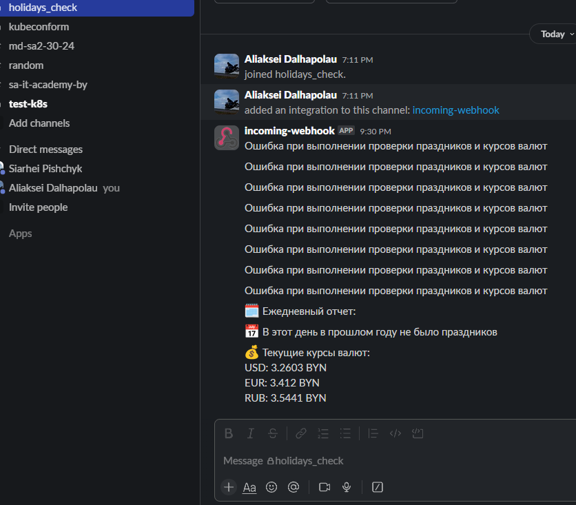

# 19. Jenkins. Start
## Homework Assignment 1: Deploy Jenkins

```bash
[repo](https://github.com/Alex-AGD/holiday_checker)
```
### Jenkinsfile
```text
pipeline {
    agent any
    triggers {
        cron('0 9 * * *')
    }
    environment {
        HOLIDAY_API_KEY = credentials('HOLIDAY_API_KEY')
        SLACK_WEBHOOK_URL = credentials('SLACK_WEBHOOK_URL')
        PATH = "$PATH:/var/lib/jenkins/node/bin"
    }
    stages {
        stage('Setup') {
            steps {
                sh '''
                    if ! command -v node &> /dev/null; then
                        mkdir -p /var/lib/jenkins/node
                        curl -fsSL https://nodejs.org/dist/v16.20.2/node-v16.20.2-linux-x64.tar.gz | tar -xz -C /var/lib/jenkins/node --strip-components=1
                        /var/lib/jenkins/node/bin/node --version
                        /var/lib/jenkins/node/bin/npm --version
                    fi
                    cd $WORKSPACE
                    /var/lib/jenkins/node/bin/npm install
                '''
            }
        }
        stage('Run Holiday Check') {
            steps {
                sh '''
                    cd $WORKSPACE
                    /var/lib/jenkins/node/bin/node holiday_rates_checker.js
                '''
            }
        }
    }
    post {
        failure {
            script {
                sh """
                    curl -X POST -H 'Content-type: application/json' --data '{"text":"Ошибка при выполнении проверки праздников и курсов валют"}' ${SLACK_WEBHOOK_URL}
                """
            }
        }
    }
}
```
