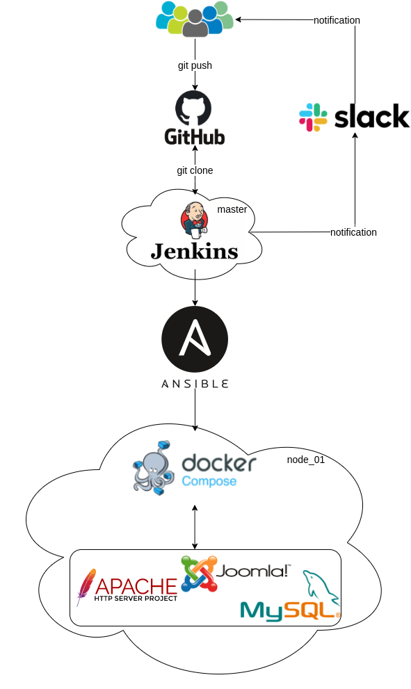

# Project report

## Project's reporter: Alex, Kolyago

## Group number: m-sa2-17-21
------

### Description of application for deployment

Name of application: Joomla

Programming language: PHP and JavaScript

BD: MySQL

[Website](www.joomla.org)

[Joomla Git](https://github.com/joomla/joomla-cms)

------
## Pipeline. High Level Design

------
## Technologies which were used in project

Orchestration: Jenkins

Automation tools: Ansible

SCM: GitHub

CI description: by schedule (every day in 6:00 am)

Other: Vagrant, Docker, Mysql

------
## Deployment flows short description:

Users push code to Github. After that, Jenkins launches a pipeline. Ansible deploys all infrastructure to run containers, makes backups of databases and applications.

------
## Rollback flow description and implementation:

If update was unsuccessful, Ansible stops and deletes the current container, restores the database and application files from the backup, starts the previous container. Sends notification to slack.

------
## Links

[GitHub](https://github.com/AlexKolyago/project)