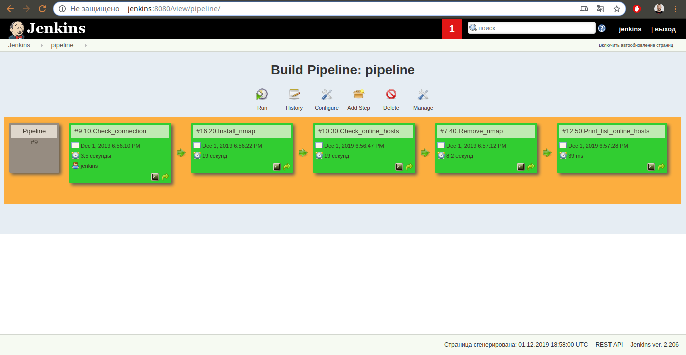

## 11.Jenkins_routine.md

### Andrei Lukashonak

### List of tasks

1. Check connection to the hosts
2. Install nmap
3. Checks all online hosts
4. Remove nmap
5. Print list of collected hosts

### Build Pipeline view



### 1. Check connection to the hosts
```
Started by user jenkins
Running as SYSTEM
Building in workspace /var/lib/jenkins/workspace/10.Check_connection
[10.Check_connection] $ /bin/sh -xe /tmp/jenkins1292150080221630496.sh
+ ping -c 4 8.8.8.8
PING 8.8.8.8 (8.8.8.8) 56(84) bytes of data.
64 bytes from 8.8.8.8: icmp_seq=1 ttl=63 time=28.9 ms
64 bytes from 8.8.8.8: icmp_seq=2 ttl=63 time=37.2 ms
64 bytes from 8.8.8.8: icmp_seq=3 ttl=63 time=28.6 ms
64 bytes from 8.8.8.8: icmp_seq=4 ttl=63 time=35.1 ms

--- 8.8.8.8 ping statistics ---
4 packets transmitted, 4 received, 0% packet loss, time 3002ms
rtt min/avg/max/mdev = 28.674/32.505/37.283/3.795 ms
Triggering a new build of 60.Pipeline #2
Triggering a new build of 20.Install_nmap
Finished: SUCCESS
```

### 2. Install nmap
```
Started by upstream project "10.Check_connection" build number 9
originally caused by:
 Started by user jenkins
Running as SYSTEM
Building in workspace /var/lib/jenkins/workspace/20.Install_nmap
[20.Install_nmap] $ /bin/sh -xe /tmp/jenkins4058880156385233730.sh
+ sudo yum install nmap -y
Loaded plugins: fastestmirror
Loading mirror speeds from cached hostfile
 * base: mirror.datacenter.by
 * epel: mirror.datacenter.by
 * extras: mirror.datacenter.by
 * updates: mirror.datacenter.by
Resolving Dependencies
--> Running transaction check
---> Package nmap.x86_64 2:6.40-19.el7 will be installed
--> Finished Dependency Resolution

Dependencies Resolved

================================================================================
 Package        Arch             Version                   Repository      Size
================================================================================
Installing:
 nmap           x86_64           2:6.40-19.el7             base           3.9 M

Transaction Summary
================================================================================
Install  1 Package

Total download size: 3.9 M
Installed size: 16 M
Downloading packages:
Running transaction check
Running transaction test
Transaction test succeeded
Running transaction
  Installing : 2:nmap-6.40-19.el7.x86_64                                    1/1 
  Verifying  : 2:nmap-6.40-19.el7.x86_64                                    1/1 

Installed:
  nmap.x86_64 2:6.40-19.el7                                                     

Complete!
Triggering a new build of 30.Check_online_hosts
Finished: SUCCESS
```

### 3. Checks all online hosts
```
Started by upstream project "20.Install_nmap" build number 16
originally caused by:
 Started by upstream project "10.Check_connection" build number 9
 originally caused by:
  Started by user jenkins
Running as SYSTEM
Building in workspace /var/lib/jenkins/workspace/30.Check_online_hosts
[30.Check_online_hosts] $ /bin/sh -xe /tmp/jenkins2206221830951982721.sh
+ nmap -T4 -F 192.168.0.1-254
Triggering a new build of 40.Remove_nmap
Finished: SUCCESS
```

### 4. Remove nmap
```
Started by upstream project "30.Check_online_hosts" build number 10
originally caused by:
 Started by upstream project "20.Install_nmap" build number 16
 originally caused by:
  Started by upstream project "10.Check_connection" build number 9
  originally caused by:
   Started by user jenkins
Running as SYSTEM
Building in workspace /var/lib/jenkins/workspace/40.Remove_nmap
[40.Remove_nmap] $ /bin/sh -xe /tmp/jenkins4875248994985582260.sh
+ sudo yum remove nmap -y
Loaded plugins: fastestmirror
Resolving Dependencies
--> Running transaction check
---> Package nmap.x86_64 2:6.40-19.el7 will be erased
--> Finished Dependency Resolution

Dependencies Resolved

================================================================================
 Package        Arch             Version                  Repository       Size
================================================================================
Removing:
 nmap           x86_64           2:6.40-19.el7            @base            16 M

Transaction Summary
================================================================================
Remove  1 Package

Installed size: 16 M
Downloading packages:
Running transaction check
Running transaction test
Transaction test succeeded
Running transaction
  Erasing    : 2:nmap-6.40-19.el7.x86_64                                    1/1 
  Verifying  : 2:nmap-6.40-19.el7.x86_64                                    1/1 

Removed:
  nmap.x86_64 2:6.40-19.el7                                                     

Complete!
Triggering a new build of 50.Print_list_online_hosts
Finished: SUCCESS
```

### 5. Print list of collected hosts
```
Started by upstream project "40.Remove_nmap" build number 7
originally caused by:
 Started by upstream project "30.Check_online_hosts" build number 10
 originally caused by:
  Started by upstream project "20.Install_nmap" build number 16
  originally caused by:
   Started by upstream project "10.Check_connection" build number 9
   originally caused by:
    Started by user jenkins
Running as SYSTEM
Building in workspace /var/lib/jenkins/workspace/50.Print_list_online_hosts
[50.Print_list_online_hosts] $ /bin/sh -xe /tmp/jenkins1409138943777494401.sh
+ cat /tmp/online_hosts

Starting Nmap 6.40 ( http://nmap.org ) at 2019-12-01 18:56 UTC
Nmap scan report for 192.168.0.1
Host is up (0.0024s latency).
Not shown: 97 closed ports
PORT     STATE SERVICE
22/tcp   open  ssh
80/tcp   open  http
1900/tcp open  upnp

Nmap scan report for jenkins (192.168.0.19)
Host is up (0.0020s latency).
Not shown: 97 closed ports
PORT     STATE SERVICE
22/tcp   open  ssh
111/tcp  open  rpcbind
8080/tcp open  http-proxy

Nmap scan report for 192.168.0.100
Host is up (0.65s latency).
All 100 scanned ports on 192.168.0.100 are closed

Nmap scan report for 192.168.0.101
Host is up (0.0022s latency).
Not shown: 99 closed ports
PORT   STATE SERVICE
22/tcp open  ssh

Nmap scan report for 192.168.0.103
Host is up (0.0036s latency).
All 100 scanned ports on 192.168.0.103 are closed

Nmap scan report for 192.168.0.104
Host is up (0.0038s latency).
All 100 scanned ports on 192.168.0.104 are closed

Nmap done: 254 IP addresses (6 hosts up) scanned in 19.68 seconds
Triggering a new build of 60.Pipeline #3
Finished: SUCCESS
```
