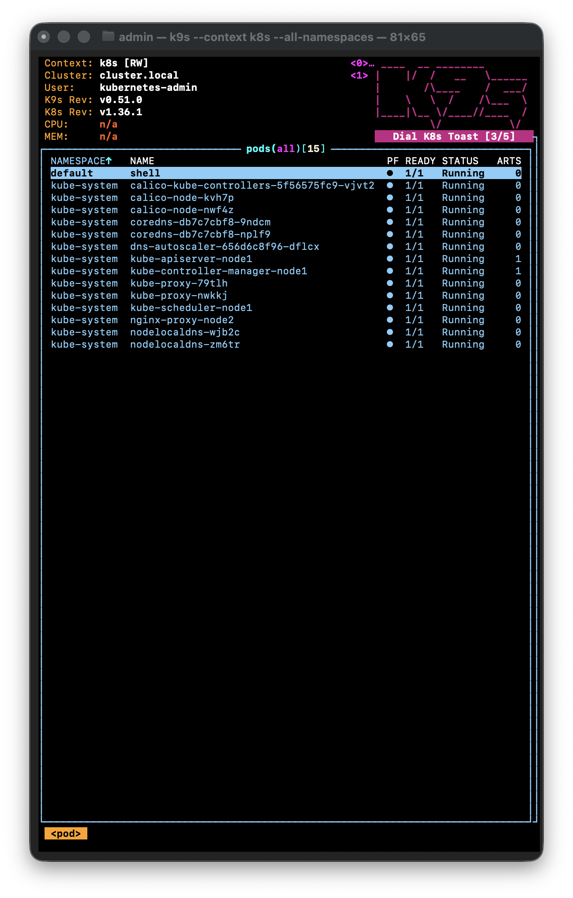

# 10. Kubernetes installation and setup

## Result

The workshop environment contains two operational Kubernetes clusters:

| Context | Distribution | Nodes | Version | API tunnel |
| --- | --- | ---: | --- | --- |
| `k8s` | Kubespray | 2 | v1.36.1 | `127.0.0.1:6443` |
| `k3s` | k3s | 1 | v1.36.2+k3s1 | `127.0.0.1:6444` |

Local `kubectl`, `k9s` and `kubectx` are installed. Kubeconfig credentials are
kept outside the repository with file mode `0600`; SSH tunnels provide access
without exposing either API server publicly.

## k3s

k3s was installed on the assigned Debian 12 host `192.168.203.2`. Bundled
Traefik and ServiceLB were disabled as required by the workshop. The service is
active, the node is Ready, and CoreDNS, local-path-provisioner and metrics-server
are Running.

```text
NAME       STATUS   ROLES           VERSION
debian12   Ready    control-plane   v1.36.2+k3s1
```

## Internal shell pod

`shell-pod.yaml` creates an unprivileged BusyBox pod with explicit resource
requests and limits in the Kubespray cluster's `default` namespace.

```text
NAME    READY   STATUS    NODE    IP
shell   1/1     Running   node2   10.233.75.5
```

An internal lookup of `kubernetes.default.svc.cluster.local` returned service
address `10.233.0.1`, confirming pod networking and cluster DNS.

## Cluster monitoring

- Repository workflow: <https://github.com/antonzhdanko/kubernetes-homework/blob/main/.github/workflows/monitor.yml>
- Successful run: <https://github.com/antonzhdanko/kubernetes-homework/actions/runs/29263210306>

The workflow runs every six hours and on manual dispatch. It uses a dedicated
SSH key and kubeconfig stored in GitHub Actions secrets, opens a temporary tunnel
through the academy bastion, logs all nodes and pods, and fails if it detects:

- pod phase `Failed`;
- `CrashLoopBackOff`;
- `Error`;
- `ImagePullBackOff`;
- `ErrImagePull`.

The successful validation run connected to the real Kubespray cluster and found
both nodes Ready with no unhealthy pod states. The tunnel is closed in an
`always()` cleanup step.

## k9s screenshot

The screenshot below must show pods from all namespaces in the `k8s` context:



## Security

No passwords, SSH private keys, webhook URLs or kubeconfig certificates are
stored in this folder. The public repository contains only manifests, workflow
logic, command history and non-secret validation results.
