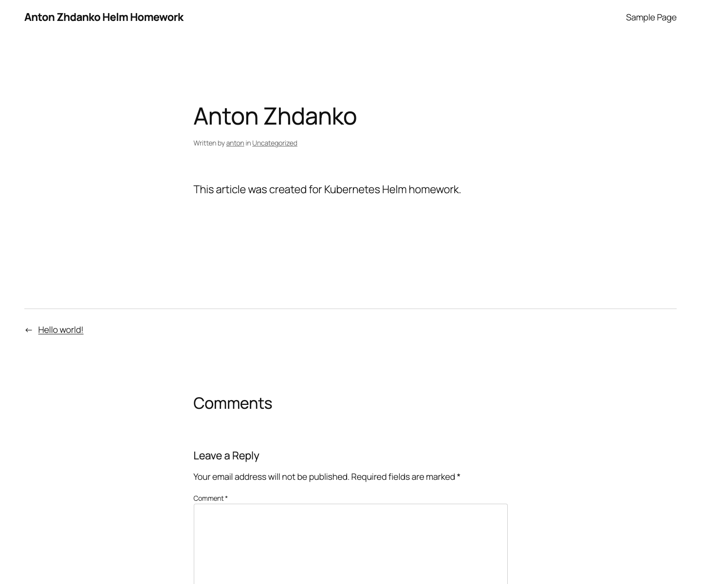
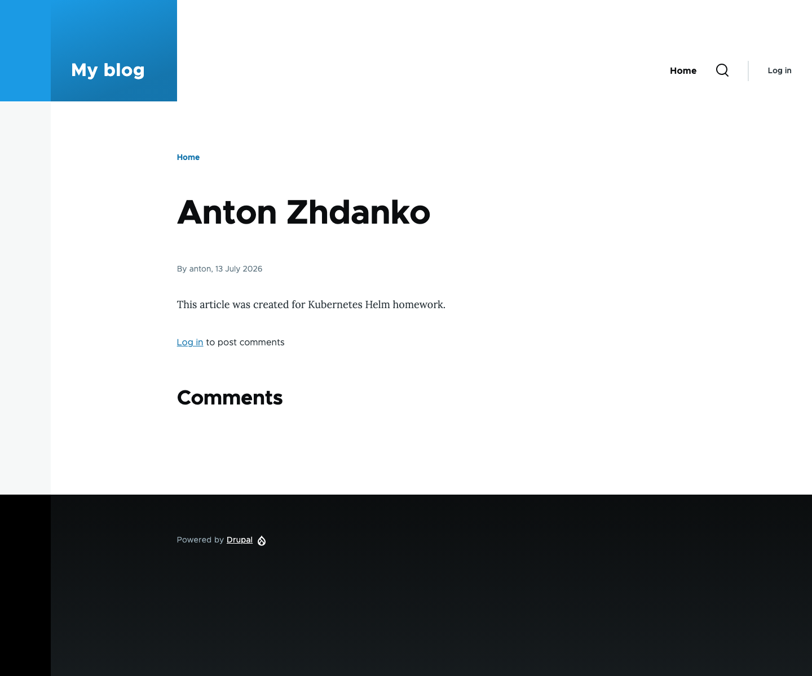

# 13. Kubernetes Helm

## Result

WordPress and Drupal were deployed to the Kubespray cluster from public Bitnami
OCI Helm charts. Both applications use their own MariaDB release dependency and
persistent volumes.

| Application | Chart | App | Address | Article |
| --- | --- | --- | --- | --- |
| WordPress | `wordpress-32.1.12` | `7.0.1` | <http://wordpress.k8s-3.sa> | <http://wordpress.k8s-3.sa/2026/07/13/anton-zhdanko/> |
| Drupal | `drupal-23.0.0` | `11.2.3` | <http://drupal.k8s-3.sa> | <http://drupal.k8s-3.sa/node/1> |

The same routes also accept the second cluster node suffix, `k8s-4.sa`.

## Deployment

Helm `v4.2.3` was installed locally. The cluster did not initially contain a
StorageClass, so the official Rancher local-path provisioner `v0.0.36` was
installed. Each application and each database received a separate 2 GiB PVC;
all four claims are Bound.

The releases were installed in namespace `homework-13` with the values files in
this directory. Istio Gateway and VirtualService resources expose the two
ClusterIP services through the academy ingress gateway on NodePort `30001`.

```text
NAME        STATUS     CHART               APP VERSION
wordpress   deployed   wordpress-32.1.12   7.0.1
drupal      deployed   drupal-23.0.0       11.2.3
```

The charts generate application and database passwords and store them in
Kubernetes Secrets. Passwords are not present in values files, command history,
screenshots or Git.

## Login and articles

The administrator username for both applications is `anton`. Authentication was
validated through the real HTTP login forms:

```text
WordPress final login URL: /wp-admin/          pass
Drupal final login URL:    /user/1             pass
```

A published article with title `Anton Zhdanko` and body
`This article was created for Kubernetes Helm homework.` was created in each
application using its bundled administrative CLI (`wp-cli` and Drush).

Public validation after the WordPress Helm upgrade returned:

```text
wordpress article=200
drupal article=200
```

### WordPress article



### Drupal article



## Files

- `wordpress-values.yaml` — non-secret WordPress chart configuration;
- `drupal-values.yaml` — non-secret Drupal chart configuration;
- `namespace.yaml` — isolated application namespace;
- `istio-routing.yaml` — external host routing;
- `commands.md` — Helm installation and validation command history;
- `screenshots/` — public article evidence.
