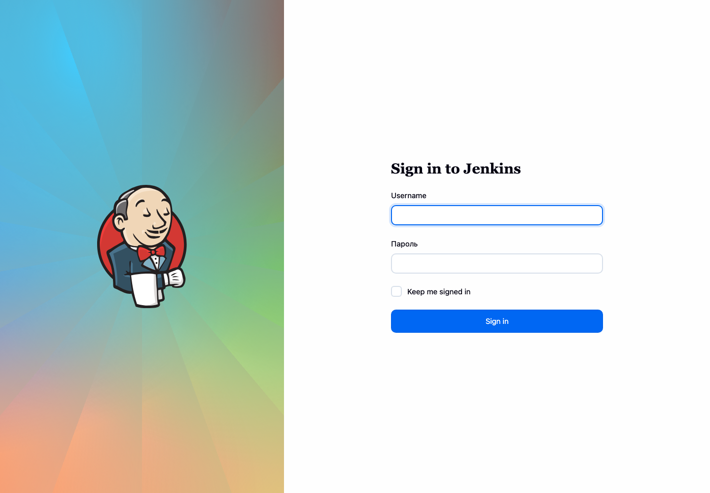

# Homework 14. Kubernetes application deployment

## Result

I built a custom Jenkins controller image, published it to the Academy JFrog
registry and deployed Jenkins to the Kubernetes cluster with my own Helm chart.

- image: `jfrog.it-academy.by/public/jenkins-ci:antonzhdanko`
- source repository: <https://github.com/antonzhdanko/sa2-35-26-jenkins>
- successful image build: <https://github.com/antonzhdanko/sa2-35-26-jenkins/actions/runs/29280016619>
- Helm repository: <https://antonzhdanko.github.io/sa2-35-26-jenkins/>
- chart: `anton-jenkins/jenkins-homework`, version `0.1.0`
- Jenkins URL: <http://jenkins.k8s-3.sa/>

The JFrog password is stored as the `JFROG_PASS` GitHub Actions secret. The
Jenkins administrator password is stored only in the `jenkins-admin` Kubernetes
Secret. No passwords, private keys or kubeconfig data are committed.

## Helm chart

The chart source is in [`jenkins-homework`](jenkins-homework), and the packaged
chart is [`jenkins-homework-0.1.0.tgz`](jenkins-homework-0.1.0.tgz).

All deployment settings are defined in `values.yaml` and can be overridden:

- custom Jenkins image and tag;
- administrator name and existing Secret reference;
- Jenkins URL, executor count and Kubernetes cloud settings;
- Service ports;
- persistent volume class and size;
- CPU and memory requests/limits;
- Istio hosts and gateway selector;
- pod security context and scheduling settings.

Jenkins Configuration as Code creates the local administrator, enables
authentication, configures two executors and adds the Kubernetes cloud. The
chart also creates a ServiceAccount and namespace-scoped RBAC instead of giving
Jenkins cluster-admin permissions.

## Installation

The complete commands are recorded in [`commands.md`](commands.md). The short
installation sequence is:

```bash
helm repo add anton-jenkins https://antonzhdanko.github.io/sa2-35-26-jenkins/
helm repo update anton-jenkins

helm upgrade --install jenkins anton-jenkins/jenkins-homework \
  --version 0.1.0 \
  --namespace ci-cd \
  --create-namespace \
  --wait --timeout 15m
```

## Verification

The release was installed successfully on the `k8s` context:

```text
NAME                           READY   STATUS    RESTARTS
jenkins-84fb67d67d-x2cb7      1/1     Running   0

NAME      STATUS   CAPACITY   ACCESS MODES   STORAGECLASS
jenkins   Bound    5Gi        RWO            local-path
```

The external `/login` endpoint returned HTTP 200. An authenticated request to
`/api/json` also returned HTTP 200 and reported:

```text
mode=NORMAL
numExecutors=2
useSecurity=true
```



