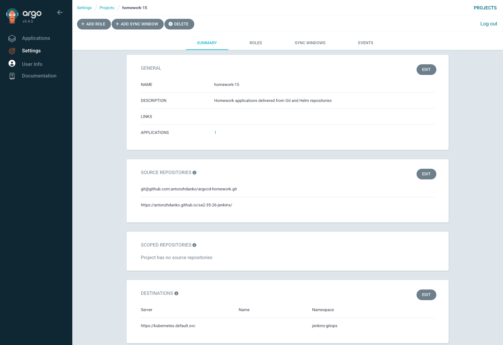

# Homework 15. Kubernetes CI/CD with Argo CD

## Result

I installed Argo CD in the assigned Kubernetes cluster and configured a GitOps
deployment from a separate repository.

- GitOps repository: <https://github.com/antonzhdanko/argocd-homework>
- Jenkins Helm repository: <https://antonzhdanko.github.io/sa2-35-26-jenkins/>
- Argo CD URL: <http://argocd.k8s-3.sa/>
- GitOps Jenkins URL: <http://jenkins-gitops.k8s-3.sa/>
- Argo CD chart: `argo/argo-cd` version `10.1.3`
- Argo CD application version: `v3.4.5`

## GitOps structure

The separate repository contains:

- `bootstrap/root-application.yaml` — app-of-apps bootstrap;
- `manifests/10-project.yaml` — the `homework-15` AppProject;
- `manifests/20-jenkins-application.yaml` — Jenkins Application using the
  published Helm package;
- `manifests/05-repository-sealedsecret.yaml` — encrypted SSH repository
  credential;
- `manifests/15-jenkins-admin-sealedsecret.yaml` — encrypted Jenkins password;
- `infrastructure/argocd-values.yaml` — reproducible Argo CD installation
  values.

A copy of the GitOps manifests is included in [`gitops`](gitops) for review.

## Security

The GitOps repository uses a dedicated read-only SSH deploy key. The private
key and Jenkins administrator password were encrypted by the cluster's Sealed
Secrets controller. Only `SealedSecret` resources are stored in Git.

No GitHub access token, plain-text password, SSH private key or kubeconfig is
committed.

## Verification

Both Argo CD applications are synchronized and healthy:

```text
NAME               PROJECT       SYNC     HEALTH
homework-15-root   default       Synced   Healthy
jenkins-homework   homework-15   Synced   Healthy
```

The `homework-15` project contains both required sources:

```text
git@github.com:antonzhdanko/argocd-homework.git
https://antonzhdanko.github.io/sa2-35-26-jenkins/
```

Jenkins was created by Argo CD in the `jenkins-gitops` namespace. Its pod is
Ready, the 5 Gi PVC is Bound, and both the external login page and authenticated
API return HTTP 200.



Installation and verification commands are recorded in
[`commands.md`](commands.md).
