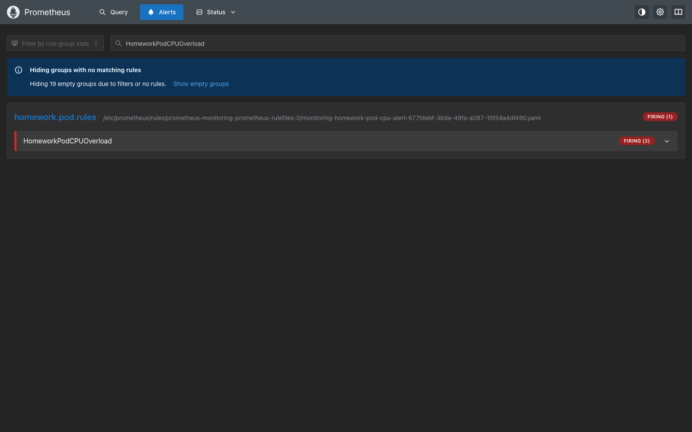
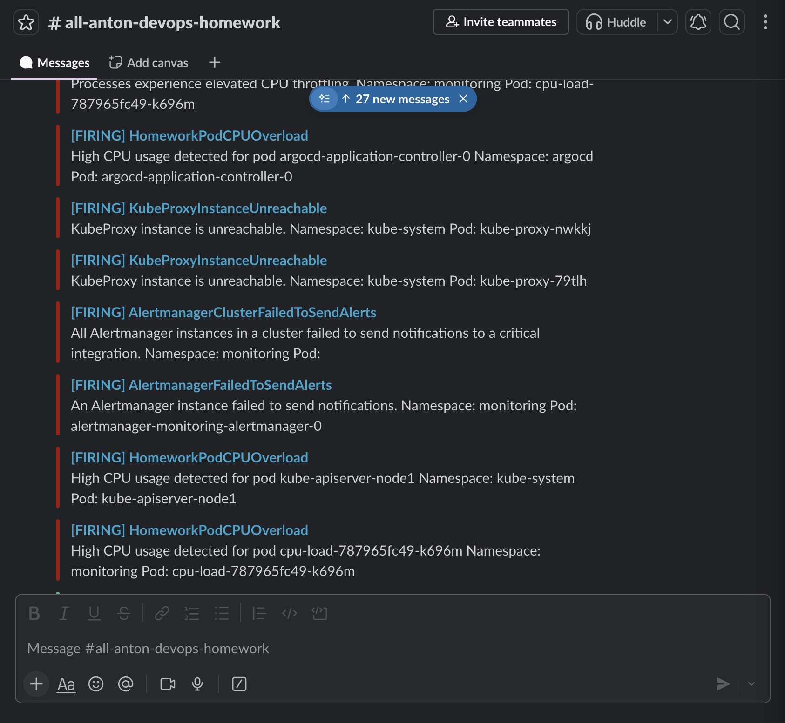
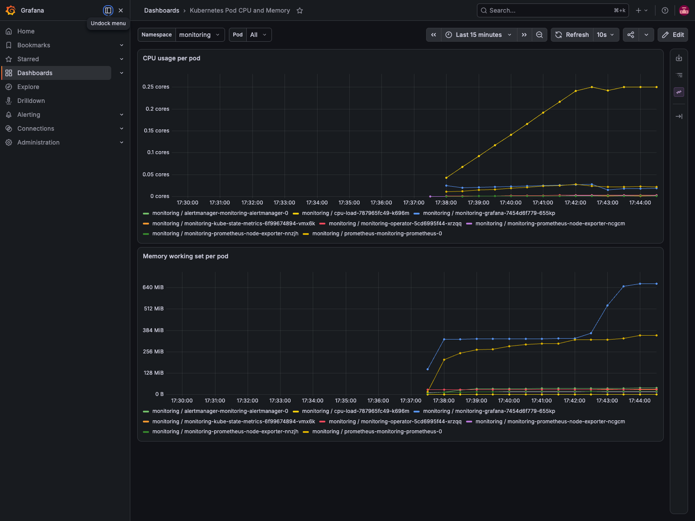

# Homework 16. Technical and service monitoring

## Result

I deployed Prometheus, Alertmanager and Grafana with the
`kube-prometheus-stack` Helm chart managed by Argo CD.

- GitOps repository: <https://github.com/antonzhdanko/argocd-homework>
- chart: `prometheus-community/kube-prometheus-stack` version `87.15.2`
- Prometheus: <http://prometheus.k8s-3.sa/>
- Grafana: <http://grafana.k8s-3.sa/>
- Argo CD application: `monitoring` — `Synced / Healthy`

All manifests used for the deployment are included in [`manifests`](manifests).

## Prometheus and Alertmanager

The custom `HomeworkPodCPUOverload` rule calculates CPU usage for every pod:

```promql
sum by (namespace, pod) (
  rate(container_cpu_usage_seconds_total{container!="", image!=""}[1m])
) > 0.05
```

The alert becomes active after 30 seconds. A resource-limited `cpu-load`
Deployment provides reproducible load for the test. During verification it
used approximately `0.25` CPU cores and the alert changed to `firing`.

Alertmanager routes this alert to Slack. The webhook is mounted from the
`alertmanager-slack-webhook` Secret and referenced with `api_url_file`. Only an
encrypted SealedSecret is stored in Git.

Verification counters after the test:

```text
alertmanager_notifications_total{integration="slack"} = 8
alertmanager_notifications_failed_total{integration="slack"} = 0
```





## Grafana

Prometheus is provisioned automatically as the default Grafana data source.
The custom `Kubernetes Pod CPU and Memory` dashboard contains:

- CPU usage per pod;
- memory working set per pod;
- namespace and pod filters;
- automatic refresh every 10 seconds.

The Grafana administrator password is also stored only as a SealedSecret.



## Security

No Slack webhook, password, access token, private key or kubeconfig data is
committed. Both sensitive values are encrypted by the cluster Sealed Secrets
controller before they are written to Git.

Installation and verification commands are recorded in
[`commands.md`](commands.md).

