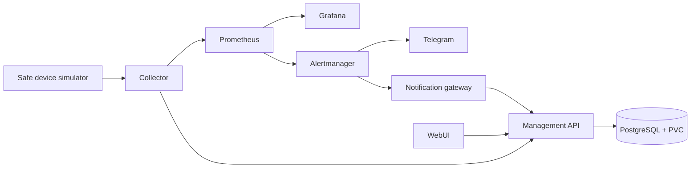
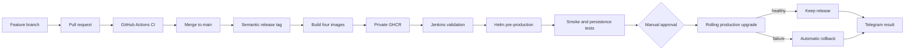

# Course Project Report: Compute Device Monitor

- **Project reporter:** Anton Zhdanko
- **Group:** md-sa2-35-26
- **Application:** Compute Device Monitor
- **Application repository:** <https://github.com/antonzhdanko/compute-device-monitor>
- **Release:** `v0.7.0`
- **Language:** Python
- **Database:** PostgreSQL

## 1. Application description

Compute Device Monitor is a monitoring and safe automation platform for
CGMiner-compatible compute devices. It collects temperature, fan speed,
hashrate, and device availability; provides a WebUI for inventory and threshold
management; stores user data and event history; visualizes telemetry; and sends
operational notifications.

The course demonstration uses a deterministic simulator. Real device addresses,
credentials, pool information, wallet information, and private network
configuration are not stored in Git.

The application consists of:

- a CGMiner-compatible simulator for reproducible tests and demonstrations;
- a read-only collector that converts device telemetry to Prometheus metrics;
- a FastAPI Management API and dependency-free WebUI;
- PostgreSQL for device configuration, thresholds, and event history;
- Prometheus and Grafana for time-series monitoring;
- Alertmanager and Telegram for operational notifications;
- a notification gateway that stores alert state in the application history.

PostgreSQL is deployed with the application and uses persistent storage. User
data therefore remains available when application pods are replaced or upgraded.

## 2. High-level architecture



The system has two main data flows:

1. **Telemetry:** simulator → collector → Prometheus →
   Grafana/Alertmanager.
2. **User data and events:** WebUI/collector/notification gateway →
   Management API → PostgreSQL.

Prometheus stores numeric time-series data. PostgreSQL stores application
inventory, user-defined thresholds, notes, and event history.

## 3. CI/CD pipeline



### Branching and versioning

- `main` is the protected integration and release branch.
- Work is performed in short `feature/*`, `fix/*`, or `docs/*` branches.
- Changes are integrated through pull requests after CI succeeds.
- Releases use semantic tags such as `v0.7.0`.
- The application version is checked across `pyproject.toml`, the Helm chart,
  and the Jenkins release parameter.

### Continuous Integration

GitHub Actions runs on pushes and pull requests. The CI pipeline performs:

- Ruff lint and formatting validation;
- Python unit, integration, and functional tests;
- Docker Compose configuration validation;
- Hadolint checks for Dockerfiles;
- Helm linting and template rendering;
- kubeconform validation of Kubernetes manifests;
- Prometheus and Alertmanager configuration validation;
- PostgreSQL API integration smoke tests;
- four independent container builds.

The current project contains 48 automated Python tests. A failed check prevents
the change from being treated as ready.

### Container publication

An annotated semantic tag starts the image publication workflow. It publishes
four versioned images to private GHCR:

- simulator;
- collector;
- Management API and WebUI;
- notification gateway.

The workflow also publishes an SBOM and build provenance. The same already
tested version is promoted to pre-production and production; Jenkins does not
rebuild different production images.

### Continuous Delivery

Jenkins receives the exact release version as a parameter and:

1. repeats repository and release validation;
2. records synthetic device and event data before the upgrade;
3. deploys the release to pre-production with Helm;
4. runs in-cluster API and collector smoke tests;
5. verifies that the synthetic PostgreSQL records survived;
6. requests manual approval before production;
7. performs a rolling production upgrade;
8. runs dedicated production smoke tests;
9. sends the final result through Telegram or Slack.

The Jenkins pipeline has timestamps, a global 45-minute timeout, and disabled
concurrent deployments. GitHub Actions and Jenkins retain the duration and
result of each run for pipeline performance and stability analysis.

## 4. Green deployment and persistence

Production uses two replicas for the Management API and two replicas for the
notification gateway. Kubernetes replaces replicas in a rolling update.
Readiness probes keep unready pods out of Services, while liveness probes detect
failed containers.

Persistent Volume Claims are used for:

- PostgreSQL;
- Prometheus;
- Grafana;
- Alertmanager.

Before a pre-production upgrade, Jenkins creates a synthetic device and event
through the API. After the upgrade, it reads the same records. The pipeline
fails if either record is missing.

## 5. Rollback

Helm upgrades use:

```text
--rollback-on-failure --wait
```

If the new workloads do not become ready within the timeout, Helm restores the
last healthy release.

The rollback was verified in pre-production with an intentionally missing image:

- revision 3 failed because the new simulator image could not start;
- Helm created revision 4 with `Rollback to 2`;
- all eight pre-production workloads returned to `Running`;
- the PostgreSQL persistence marker remained available;
- production was not intentionally disrupted.

## 6. Monitoring and notifications

The observability flow is:

```text
Collector → Prometheus → Grafana
                     └→ Alertmanager → Telegram
```

Prometheus records device availability, temperature, fan speed, hashrate, and
collector health. Grafana provides the overview dashboard. Alertmanager groups
and deduplicates alerts and sends `ALERT` and `RESOLVED` notifications through
the Telegram Bot API.

Jenkins separately sends the final `SUCCESS` or `FAILURE` result to Telegram.
Bot tokens, chat IDs, database passwords, kubeconfig contents, and registry
credentials are supplied at runtime through Jenkins Credentials and Kubernetes
Secrets. Their values are not committed to Git.

## 7. Verified demonstration

The final production rehearsal used release `0.7.0` and Jenkins build `#8`.
It passed manual approval, deployed production revision 2, ran the production
smoke-test stage, and finished with `SUCCESS`.

Verified state:

- nine ready production pods;
- two API replicas;
- two notification gateway replicas;
- four bound production PVCs;
- healthy API, collector, Grafana, Prometheus, and Alertmanager endpoints;
- successful GitHub Actions CI;
- automatic pre-production rollback evidence;
- demonstration duration below ten minutes.

## 8. Course requirements checklist

| Requirement | Implementation / evidence |
|---|---|
| High-level pipeline diagram | Mermaid diagrams in this report and project documentation |
| Pipeline repository | GitHub Actions workflows, root `Jenkinsfile`, Helm chart |
| Functioning pipeline | Successful GitHub Actions CI and Jenkins build `#8` |
| Demo not longer than 10 minutes | Prepared 8–9 minute presentation and runbook |
| Application versioning | Semantic release `v0.7.0` and versioned images |
| Database and user data | PostgreSQL with devices, thresholds, notes, and events |
| Branching strategy | `main` plus short feature/fix/docs branches and pull requests |
| README documentation | Application README, development guide, Jenkins guide, defense runbook |
| Lint and formatting | Ruff in GitHub Actions and Jenkins |
| Automated tests | 48 unit, integration, and functional Python tests |
| Container build | Four validated and versioned Docker images |
| Green deployment | Multiple production replicas, rolling update, readiness probes |
| Upgrade with preserved data | PVCs and Jenkins persistence smoke test |
| Rollback | Helm `--rollback-on-failure`; verified revisions 3 → 4 |
| Notifications | Alertmanager and Jenkins results through Telegram |
| Pipeline performance | Timestamps, run duration, timeout, and retained run history |

## 9. References

- [Application and pipeline repository](https://github.com/antonzhdanko/compute-device-monitor)
- [Latest successful CI for the final project](https://github.com/antonzhdanko/compute-device-monitor/actions/runs/29728784122)
- [Project README](https://github.com/antonzhdanko/compute-device-monitor/blob/main/README.md)
- [Course project report in the application repository](https://github.com/antonzhdanko/compute-device-monitor/blob/main/docs/project-report.md)
- [Jenkins delivery documentation](https://github.com/antonzhdanko/compute-device-monitor/blob/main/docs/jenkins.md)
- [Russian defense notes](https://github.com/antonzhdanko/compute-device-monitor/blob/main/docs/defense-ru.md)
- [Course project requirements](https://github.com/pluhin/sa.it-academy.by/wiki/Project-plan)

