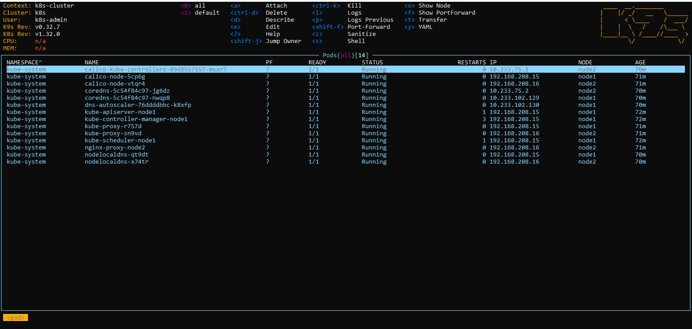
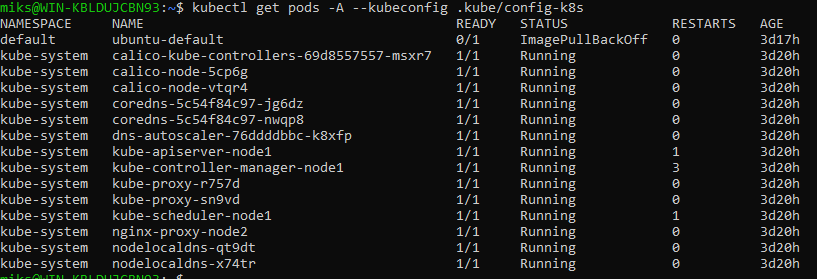
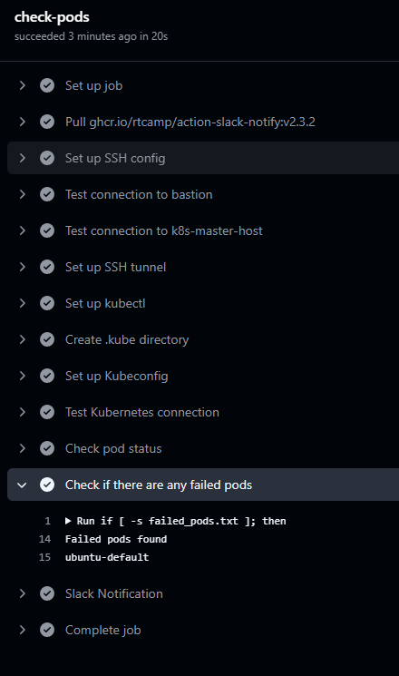
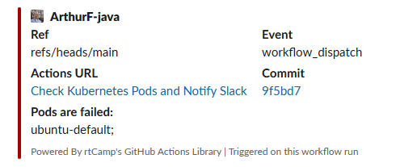

# 10.Kubernetes installation

## Install kubectl

### Script:
```bash
  137  apt install curl
  138  curl -LO "https://dl.k8s.io/release/$(curl -L -s https://dl.k8s.io/release/stable.txt)/bin/linux/amd64/kubectl"
  142  sudo install -o root -g root -m 0755 kubectl /usr/local/bin/kubectl
  143  kubectl get pods -A
  144  mkdir .kube
  149  scp root@192.168.208.15:/root/.kube/config /root/.kube/config-k8s
  155  vim .kube/config-k8s
  156  export KUBECONFIG=$HOME/.kube/config-k8s
  160  kubectl get pods -A
  162  scp root@192.168.203.8:/etc/rancher/k3s/k3s.yaml /root/.kube/config-k3s
  164  vim .bashrc
  165  source .bashrc
  172  kubectl get pods -A --context k8s-cluster
  173  kubectl get pods -A --context k3s
```

### Output:
```bash
root@sa-15:~# kubectl get pods -A --context k8s-cluster
NAMESPACE     NAME                                       READY   STATUS    RESTARTS   AGE
kube-system   calico-kube-controllers-69d8557557-msxr7   1/1     Running   0          52m
kube-system   calico-node-5cp6g                          1/1     Running   0          52m
kube-system   calico-node-vtqr4                          1/1     Running   0          52m
kube-system   coredns-5c54f84c97-jg6dz                   1/1     Running   0          52m
kube-system   coredns-5c54f84c97-nwqp8                   1/1     Running   0          52m
kube-system   dns-autoscaler-76ddddbbc-k8xfp             1/1     Running   0          52m
kube-system   kube-apiserver-node1                       1/1     Running   1          53m
kube-system   kube-controller-manager-node1              1/1     Running   3          53m
kube-system   kube-proxy-r757d                           1/1     Running   0          53m
kube-system   kube-proxy-sn9vd                           1/1     Running   0          53m
kube-system   kube-scheduler-node1                       1/1     Running   1          53m
kube-system   nginx-proxy-node2                          1/1     Running   0          53m
kube-system   nodelocaldns-qt9dt                         1/1     Running   0          52m
kube-system   nodelocaldns-x74tr                         1/1     Running   0          52m
root@sa-15:~# kubectl get pods -A --context k3s
NAMESPACE     NAME                                      READY   STATUS    RESTARTS   AGE
kube-system   coredns-ccb96694c-vztx5                   1/1     Running   0          2d1h
kube-system   local-path-provisioner-5cf85fd84d-mzl6k   1/1     Running   0          2d1h
kube-system   metrics-server-5985cbc9d7-r74kb           1/1     Running   0          2d1h
```


## Install k9s

### Script:
```bash
  185  wget  https://github.com/derailed/k9s/releases/download/v0.32.7/k9s_linux_amd64.deb
  186  dpkg -i k9s_linux_amd64.deb
  187  k9s
```

### K9s all pods img:



## Monitoring of cluster

### Existing pods:


### Deployment.yml:
```yaml
name: Check Kubernetes Pods and Notify Slack

on:
  workflow_dispatch:

jobs:
  check-pods:
    runs-on: ubuntu-latest

    steps:

      - name: Set up SSH config
        run: |
          mkdir -p $HOME/.ssh
          echo "${{ secrets.SSH_PRIVATE_KEY }}" | tr -d '\r' > $HOME/.ssh/id_rsa
          chmod 600 $HOME/.ssh/id_rsa
          echo "Host ec_bastion
                HostName ${{ secrets.BASTION_HOST }}
                User ${{ secrets.BASTION_USER }}
                Port ${{ secrets.BASTION_PORT }}
                IdentityFile $HOME/.ssh/id_rsa
                StrictHostKeyChecking no

                Host k8s-master-host
                HostName ${{ secrets.K8S_MASTER_IP }}
                User root
                ProxyJump ec_bastion
                IdentityFile $HOME/.ssh/id_rsa
                StrictHostKeyChecking no" > $HOME/.ssh/config
          chmod 600 $HOME/.ssh/config

      - name: Test connection to bastion
        run: ssh ec_bastion echo "Connected to bastion!"

      - name: Test connection to k8s-master-host
        run: ssh k8s-master-host echo "Connected to k8s-master-host!"

      - name: Set up SSH tunnel
        run: ssh -f -N -L 6443:127.0.0.1:6443 k8s-master-host

      - name: Set up kubectl
        uses: azure/setup-kubectl@v4
        id: kubectl

      - name: Create .kube directory
        run: mkdir -p $HOME/.kube

      - name: Set up Kubeconfig
        run: echo "${{ secrets.KUBECONFIG }}" > $HOME/.kube/config

      - name: Test Kubernetes connection
        run: kubectl cluster-info

      - name: Check pod status
        id: pod-status
        run: |
          kubectl get pods --all-namespaces -o json | jq -r '.items[] | select(all(.status.containerStatuses[]?.state; has("running") | not)) | "\(.metadata.name)"' > failed_pods.txt

      - name: Check if there are any failed pods
        run: |
          if [ -s failed_pods.txt ]; then
            echo "Failed pods found"
            echo "status=failed" >> $GITHUB_ENV
            cat failed_pods.txt
            FILE_CONTENT=$(cat failed_pods.txt | tr '\n' '\0' | sed 's/\x0/; /g')
            echo "DATA=$FILE_CONTENT" >> $GITHUB_ENV
          else
            echo "No failed pods"
            echo "status=success" >> $GITHUB_ENV
          fi

      - name: Slack Notification
        if: env.status == 'failed'
        uses: rtCamp/action-slack-notify@v2
        env:
          SLACK_CHANNEL: afon-check
          SLACK_COLOR: failure
          SLACK_ICON: https://github.com/rtCamp.png?size=48
          SLACK_MESSAGE: '${{ env.DATA }}'
          SLACK_TITLE: 'Pods are failed:'
          SLACK_USERNAME: fonichkin
          SLACK_WEBHOOK: ${{ secrets.SLACK_WEBHOOK }}
```

### Deploy result:


### Slack notification:
