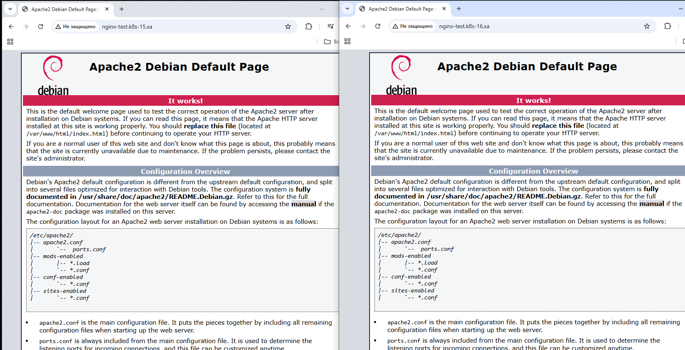

# 10.Kubernetes. Basic Objects

## Task 1

### Deployment:
```yaml
apiVersion: apps/v1
kind: Deployment
metadata:
  name: webserver
spec:
  replicas: 4
  selector:
    matchLabels:
      app: simple-web
  strategy:
    type: RollingUpdate
    rollingUpdate:
      maxUnavailable: 2
      maxSurge: 2
  template:
    metadata:
      labels:
        app: simple-web
    spec:
      containers:
        - name: php-apache
          image: eboraas/apache-php
          ports:
            - containerPort: 80
          resources:
            requests:
              memory: 50Mi
              cpu: 50m
            limits:
              memory: 100Mi
              cpu: 100m
---
apiVersion: v1
kind: Service
metadata:
  name: simple-web-service
spec:
  selector:
    app: simple-web
  ports:
    - protocol: TCP
      port: 80
---
apiVersion: networking.k8s.io/v1
kind: Ingress
metadata:
  name: ingress-sa
  annotations:
    nginx.ingress.kubernetes.io/server-alias: "nginx-test.k8s-16.sa"
spec:
  ingressClassName: nginx
  rules:
    - host: nginx-test.k8s-15.sa
      http:
        paths:
          - path: /
            pathType: Prefix
            backend:
              service:
                name: simple-web-service
                port:
                  number: 80
```

### hosts file:
```hosts
178.124.206.53	nginx-test.k8s-15.sa nginx-test.k8s-16.sa
```

### Browser response:
