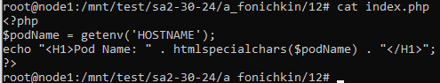
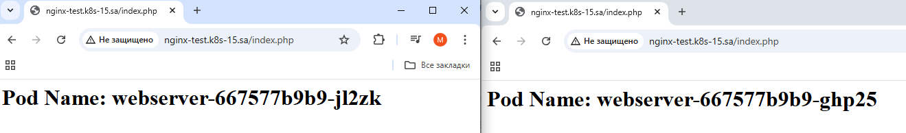
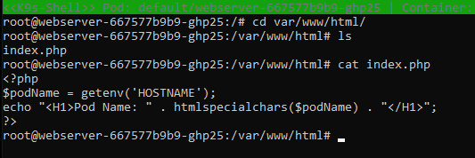
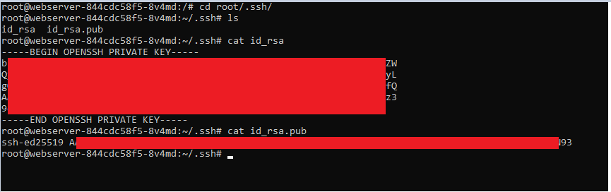

# 12.Kubernetes. Data. Security


## Add index.php

### File in nfs server:


### Browser response:


### Info from pod:



### App deployment:
```yaml
---
apiVersion: v1
kind: PersistentVolumeClaim
metadata:
  name: app04-pv-claim
  labels:
    app: simple-web
  annotations:
    nfs.io/storage-path: "12"
spec:
  accessModes:
    - ReadWriteMany
  storageClassName: nfs-app4
  resources:
    requests:
      storage: 1Gi
---
apiVersion: v1
kind: ConfigMap
metadata:
  name: configtest
data:
  test.txt: Hello-test
  test2.txt: Hello-test2
---
apiVersion: apps/v1
kind: Deployment
metadata:
  name: webserver
spec:
  replicas: 2
  selector:
    matchLabels:
      app: simple-web
  strategy:
    type: RollingUpdate
    rollingUpdate:
      maxUnavailable: 2
      maxSurge: 0
  template:
    metadata:
      labels:
        app: simple-web
    spec:
      containers:
        - name: php-apache
          image: eboraas/apache-php
          ports:
            - containerPort: 80
          resources:
            requests:
              memory: 50Mi
              cpu: 50m
            limits:
              memory: 100Mi
              cpu: 100m
          volumeMounts:
          - name: test-config-mount
            mountPath: /tmp/test.txt
            subPath: test.txt
          - name: test-config-mount
            mountPath: /tmp/test2.txt
            subPath: test2.txt
          - name: persistent-storage-app
            mountPath: "/var/www/html"
      volumes:
      - name: persistent-storage-app
        persistentVolumeClaim:
            claimName: app04-pv-claim
      - name: test-config-mount
        configMap:
          name: configtest

---
apiVersion: v1
kind: Service
metadata:
  name: simple-web-service
spec:
  selector:
    app: simple-web
  ports:
    - protocol: TCP
      port: 80
---
apiVersion: networking.k8s.io/v1
kind: Ingress
metadata:
  name: ingress-sa
  annotations:
    nginx.ingress.kubernetes.io/server-alias: "nginx-test.k8s-16.sa"
spec:
  ingressClassName: nginx
  rules:
    - host: nginx-test.k8s-15.sa
      http:
        paths:
          - path: /
            pathType: Prefix
            backend:
              service:
                name: simple-web-service
                port:
                  number: 80
```

### NFS patch:
```yaml
---
apiVersion: apps/v1
kind: Deployment
metadata:
  labels:
    app: nfs-client-provisioner
  name: nfs-client-provisioner
spec:
  template:
    spec:
      containers:
        - name: nfs-client-provisioner
          env:
            - name: NFS_SERVER
              value: 192.168.37.105
            - name: NFS_PATH
              value: /mnt/IT-Academy/nfs-data/sa2-30-24/a_fonichkin
      volumes:
        - name: nfs-client-root
          nfs:
            server: 192.168.37.105
            path: /mnt/IT-Academy/nfs-data/sa2-30-24/a_fonichkin
```

### Storage class:
```yaml
---
apiVersion: storage.k8s.io/v1
kind: StorageClass
metadata:
  name: nfs-app4
provisioner: k8s-sigs.io/nfs-subdir-external-provisioner
parameters:
  onDelete: "retain"
  pathPattern: "${.PVC.annotations.nfs.io/storage-path}"
```


## Add secret ssh:

### Set up Sealed-secret:
```bash
  550  kubectl apply -f https://github.com/bitnami-labs/sealed-secrets/releases/download/v0.28.0/controller.yaml
  551  curl -OL "https://github.com/bitnami-labs/sealed-secrets/releases/download/v0.28.0/kubeseal-0.28.0-linux-amd64.tar.gz"
  552  tar -xvzf kubeseal-0.28.0-linux-amd64.tar.gz kubeseal
  553  sudo install -m 755 kubeseal /usr/local/bin/kubeseal
```

### Create sealed-secret:
```bash
  555  cat secret.yaml | kubeseal --format yaml > sealed_secret.yaml
```

### Sealed secret yaml:
```yaml
apiVersion: bitnami.com/v1alpha1
kind: SealedSecret
metadata:
  creationTimestamp: null
  name: ssh-keys
  namespace: default
spec:
  encryptedData:
    id_rsa: AgBNB2/V/4U1LOmlyeLs+SQDOspKenkiWeE+pmMv6snYNovm1KL/+Fe5yziyZE4LAV/J5jqnumF6iIWWJNlE+JPr0UzTUQ3dxF0twOHwBnx7chVH9Rv4dXClQBTCV0Go04Xl4ezm9tYjjAtjiYdkktfdTaqdtiQdfBZK0D96m44yy2DJn3DKgYp9zSxaJIDXUKTP0FJNsxP9jxkSq03LGtBGlg56/sYnnuniXPz/0zWIlkr6mR00168Jma5a4ryV6CH5sh5xVGndMJEFravS6oAdj909FkFfmHwqlyjARh2jXv2Lu136nzhsKRKEqYLIhxWmsv4UFMtLlOimfZ8dKK+96Fjx5bTlBso2cVJzeV/DYcI4lr6kfGoXZhXD3q30RdIpIkrxZ2WTi2nHQQS50QzUTsYIVELCESpFuUhjgIJUmtqB7EXSQPjzQZV/YWITOfubrnS1ZiWhb8HTSOsNn7Hx8T372CilO8uNWfXhskPjyIfRRxu9D/UVDhed677MjgRUJUnr9UVt8SKBwshHMGspJ8PWWc6LCwsevkyiR02jgVtC4/DZrv7D2FvOwt/4E6NAhQ1UrkarU1W2EwB4mkuoMStdyobzyqnK5kc0lK6YPwV7KrNfM7HyvJEy+0JF5yfBCDPmFeuFXguxSQpRcg4G79t5fOb3d1G/p1FvVWtaMidy29+Dw6CNm4K7ycOXK/hqhjyFX6jaFpModfr9aupT9qaoJrTWKQPzb2I2IF6QHufODfMwkqNNI4v6a9oe2xv/A8azUONOyTHADMfCgWgEwARDYYgMZFUksurQghcNYQmxHeLyCpuRofjq2DBs9w0jv2Gk+rOZy+D6koBE8qiXkyKHMhcPKilSSsC7exryGaKo0dlKbyyruD9XkdWaQ8nCwk7ao00HBk3NGwf4C9TSGztYUFxqShKSVJVFSpmrknuL2ERJCMVJFFLiumpBc4gIXTREyoo3o9hGM7XutBxEUGhYlpJZBu5ajf6CPV8T5ddhrBmXBhsEvz2ETCC6Z0HAnt03ekqjjempbk1LCsrAt765A2jPLqbNzLdXQmp1k3w033B7mL17adMxDA+8m12wgQr4SkVHeY+OJKA/92vT0CB70QRcCliZlXsIhS3rwHekucRwahk0cOX5GsvEdan+EEhPNjUBqgOApHDBJxLAg6abX/jgxmUSSu2ram0txewC3xRHkCjFoeHoqcv11sCevdRrxI74IqkqFal+eUNacwOCv5RoRTBkCeM=
    id_rsa.pub: AgABATrcrOc44htR5hOpek/vtNjxu0AxJtczkgMWWwkk4PTucfd9haDmr3GnKZBOF3Vzd8rBZgS7HMrkeCZl9gn8rhPtjvUG+KaBElqobjwS3cxCZXlLjnEJ/2lyecDyrV+RYZk+c0sDm9tOE3HUNIJUTsMbkKXNnGXaUrhCkFKToI7YLaRwox73gOjLTGYZRPf49WpzkrTq6uwYBsArd3xq3mmjyffazpQ6iV3njRQmIKrDxL0vMqdAtyrJMbvBAfaNt5j6759dUslNHw64If2Of1fP4Ma8FwSNV0V3vISSoHW037XU32U9m4Rr5rGUjbMIGHQrZGfZQaYxBmWxdvnrLaPZseYtKMsVgGiTd8mZxM/aVBr5N6WXFYghtTOQXywEP14QskQNQEL7lGB8074P3mJTOWnVpsGoom3NPnR1w4i+eqC2mQxzxftLfKamixr+pspKNl697pz50xhgBEYhKpwGeFZty9eC2SszdbhcchnbK13nXEVO6MZ2P892lekKepRUwH54qz7V2AcB1nypudbsa+xb+mdBJNfz1JQI/qa6md/e6TllWH0uikfiZ5LjXnpP0r1Qptuld3NyqQBcfLS6wUi4qOt7Rws89GouDkPpCuiwcaVdK6tjwm12GrB86zdvm7RNkjUf7qCEQUUXgqIbb3CFrfp/Dn85gTLDgSjIy2G8TisNATC+SozF3TlYznQ6UKTyqqIhXxbZIV/QQsA8IEzScFYchF8MUU//tyoIrjbN5oFipiDbOeyHkLgJw85YV3p9w72p0g/vb6LLFfBJCPP4W+48ZwfrADfAtP2yYWKCG10WdyEgtz8a0yLfbQsRoX8=
  template:
    metadata:
      creationTimestamp: null
      name: ssh-keys
      namespace: default
    type: Opaque
```

### Updates in app.yaml:
```yaml
          - name: ssh-keys-mount
            mountPath: /root/.ssh
            readOnly: true

      - name: ssh-keys-mount
        secret:
          secretName: ssh-keys
```

### Output from pod:

