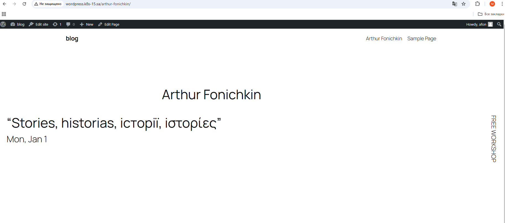
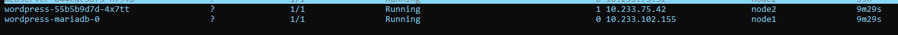
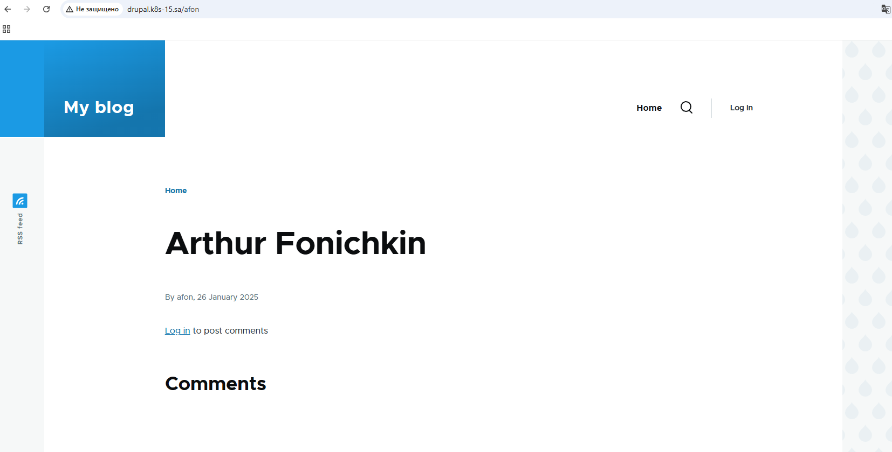
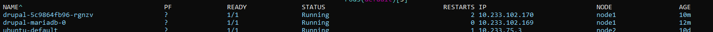

# 13. Kubernetes. Helm

## Wordpress install

### Helm command:
```bash
  673  helm install wordpress --set global.defaultStorageClass=nfs-client,wordpressUsername=afon,wordpressPassword=password123,wordpressBlogName=blog,ingress.enabled=true,ingress.ingressClassName=nginx,ingress.hostname=wordpress.k8s-15.sa,mariadb.primary.persistence.size=2Gi,mariadb.primary.persistence.storageClass=nfs-app5,persistence.size=1Gi   oci://registry-1.docker.io/bitnamicharts/wordpress
```

### Site output:


### K9s output:



## Drupal install

### Helm command:
```bash
  723  helm install drupal --set global.defaultStorageClass=nfs-client,drupalUsername=afon,drupalPassword=password123,ingress.enabled=true,ingress.ingressClassName=nginx,ingress.hostname=drupal.k8s-15.sa,mariadb.auth.rootPassword=secretpassword,persistence.size=3Gi  oci://registry-1.docker.io/bitnamicharts/drupal
```

### Site output




### K9s output:
