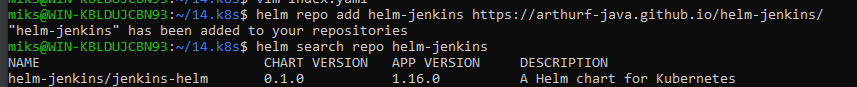
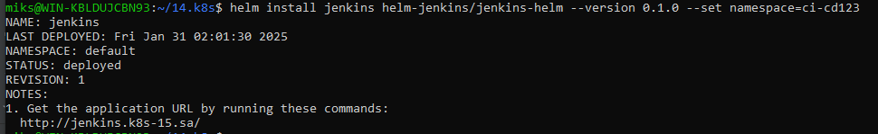
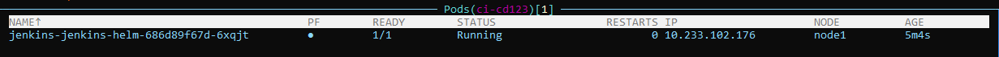
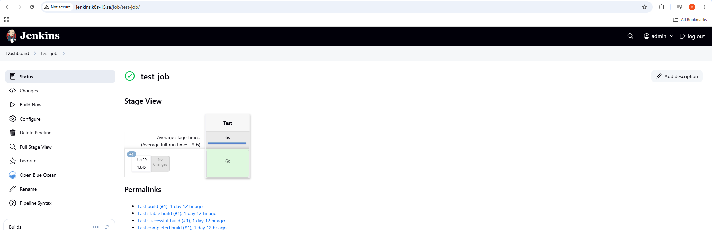

# 13. Kubernetes. Application deployment

## Helm repository:
https://github.com/ArthurF-java/helm-jenkins

## Helm repository page:
https://arthurf-java.github.io/helm-jenkins/helm-sources/jenkins-helm/

## Screenshots from console:



## K9s screenshots:


## Jenkins screenshot:


## Install --dry-run --debug output:
```
miks@WIN-KBLDUJCBN93:~/14.k8s$ helm install jenkins helm-jenkins/jenkins-helm --version 0.1.0 --set namespace=ci-cd123 --dry-run --debug
install.go:225: 2025-01-31 02:10:02.731609993 +0300 MSK m=+0.152708642 [debug] Original chart version: "0.1.0"
install.go:242: 2025-01-31 02:10:02.857596938 +0300 MSK m=+0.278695587 [debug] CHART PATH: /home/miks/.cache/helm/repository/jenkins-helm-0.1.0.tgz

NAME: jenkins
LAST DEPLOYED: Fri Jan 31 02:10:03 2025
NAMESPACE: default
STATUS: pending-install
REVISION: 1
USER-SUPPLIED VALUES:
namespace: ci-cd123

COMPUTED VALUES:
affinity: {}
autoscaling:
  enabled: false
  maxReplicas: 100
  minReplicas: 1
  targetCPUUtilizationPercentage: 80
fullnameOverride: ""
image:
  pullPolicy: IfNotPresent
  repository: jfrog.it-academy.by/public/jenkins-ci:spishchyk_30
  tag: ""
imagePullSecrets: []
ingress:
  annotations: {}
  className: nginx
  enabled: true
  hosts:
  - host: jenkins.k8s-15.sa
    paths:
    - path: /
      pathType: Prefix
  tls: []
livenessProbe:
  httpGet:
    path: /
    port: http
nameOverride: ""
namespace: ci-cd123
nodeSelector: {}
nsf:
  path: /mnt/IT-Academy/nfs-data/sa2-30-24/a_fonichkin/jenkins
  server: 192.168.37.105
podAnnotations: {}
podLabels: {}
podSecurityContext: {}
readinessProbe:
  httpGet:
    path: /
    port: http
replicaCount: 1
resources:
  limits:
    cpu: 2
    memory: 3Gi
  requests:
    cpu: 2
    memory: 2Gi
securityContext: {}
service:
  port: 8080
  testport: 50000
  type: ClusterIP
serviceAccount:
  annotations: {}
  automount: true
  create: true
  name: ""
tolerations: []
volumeMounts:
- mountPath: /var/jenkins_home/init.groovy.d/basic-security.groovy
  name: jenkins-auth-config
  subPath: basic-security.groovy
- mountPath: /var/jenkins_home/casc_configs/jenkins.yaml
  name: jenkins-config-yaml
  subPath: jenkins.yaml
- mountPath: /var/jenkins_home
  name: jenkins-config
volumes:
- configMap:
    name: basic-security
  name: jenkins-auth-config
- configMap:
    name: jenkins-config
  name: jenkins-config-yaml
- name: jenkins-config

HOOKS:
---
# Source: jenkins-helm/templates/Namespace.yaml
apiVersion: v1
kind: Namespace
metadata:
  name: ci-cd123
  annotations:
    "helm.sh/hook": pre-install
    "helm.sh/hook-weight": "0"
---
# Source: jenkins-helm/templates/jenkins-secret.yaml
apiVersion: v1
kind: Secret
metadata:
  name: jenkins-secret
  namespace: ci-cd123
  annotations:
    "helm.sh/hook": pre-install
    "helm.sh/hook-weight": "1"
type: Opaque
data:
  password: cXdlcnR5MTIz
---
# Source: jenkins-helm/templates/basic-security.yaml
apiVersion: v1
kind: ConfigMap
metadata:
  name: basic-security
  namespace: ci-cd123
  annotations:
    "helm.sh/hook": pre-install
    "helm.sh/hook-weight": "1"
data:
  basic-security.groovy: |
    #!groovy
    import jenkins.model.*
    import hudson.security.*
    def instance = Jenkins.getInstance()
    println "--> creating local user 'admin'"
    def password = System.getenv("PASS")
    def hudsonRealm = new HudsonPrivateSecurityRealm(false)
    hudsonRealm.createAccount('admin', password)
    instance.setSecurityRealm(hudsonRealm)
    def strategy = new FullControlOnceLoggedInAuthorizationStrategy()
    strategy.setAllowAnonymousRead(true)
    instance.setAuthorizationStrategy(strategy)
    instance.save()
---
# Source: jenkins-helm/templates/jenkins-config.yaml
apiVersion: v1
kind: ConfigMap
metadata:
  name: jenkins-config
  namespace: ci-cd123
  annotations:
    "helm.sh/hook": pre-install
    "helm.sh/hook-weight": "1"
data:
  jenkins.yaml: |
        jenkins:
          numExecutors: 2
          clouds:
          - kubernetes:
              containerCapStr: "10"
              maxRequestsPerHostStr: "32"
              jenkinsUrl: "http://jenkins:8080"
              name: "kubernetes"
              namespace: "ci-cd"
              skipTlsVerify: true
        credentials:
          system:
            domainCredentials:
            - credentials:
              - usernamePassword:
                  description: "Githubuser"
                  id: "some_randome"
                  password: "XXXXXXXXXXX"
                  scope: GLOBAL
                  username: "git_hub_user"
        unclassified:
          location:
            adminAddress: "pluhin@gmail.com"
            url: "http://jenkins.k8s-XX.sa/"
          shell:
            shell: "/bin/bash"
---
# Source: jenkins-helm/templates/tests/test-connection.yaml
apiVersion: v1
kind: Pod
metadata:
  name: "jenkins-jenkins-helm-test-connection"
  labels:
    helm.sh/chart: jenkins-helm-0.1.0
    app.kubernetes.io/name: jenkins-helm
    app.kubernetes.io/instance: jenkins
    app.kubernetes.io/version: "1.16.0"
    app.kubernetes.io/managed-by: Helm
  annotations:
    "helm.sh/hook": test
spec:
  containers:
    - name: wget
      image: busybox
      command: ['wget']
      args: ['jenkins-jenkins-helm:8080']
  restartPolicy: Never
---
# Source: jenkins-helm/templates/ingress.yaml
apiVersion: networking.k8s.io/v1
kind: Ingress
metadata:
  name: jenkins-jenkins-helm
  namespace: ci-cd123
  annotations:
    "helm.sh/hook": pre-install
    "helm.sh/hook-weight": "1"
  labels:
    helm.sh/chart: jenkins-helm-0.1.0
    app.kubernetes.io/name: jenkins-helm
    app.kubernetes.io/instance: jenkins
    app.kubernetes.io/version: "1.16.0"
    app.kubernetes.io/managed-by: Helm
spec:
  ingressClassName: nginx
  rules:
    - host: jenkins.k8s-15.sa
      http:
        paths:
          - path: /
            pathType: Prefix
            backend:
              service:
                name: jenkins-jenkins-helm
                port:
                  number: 8080
MANIFEST:
---
# Source: jenkins-helm/templates/serviceaccount.yaml
apiVersion: v1
kind: ServiceAccount
metadata:
  name: jenkins-jenkins-helm
  namespace: ci-cd123
  labels:
    helm.sh/chart: jenkins-helm-0.1.0
    app.kubernetes.io/name: jenkins-helm
    app.kubernetes.io/instance: jenkins
    app.kubernetes.io/version: "1.16.0"
    app.kubernetes.io/managed-by: Helm
automountServiceAccountToken: true
---
# Source: jenkins-helm/templates/ClusterRoleBinding.yaml
apiVersion: rbac.authorization.k8s.io/v1
kind: ClusterRoleBinding
metadata:
  name: jenkins-jenkins-helm
  namespace: ci-cd123
  labels:
    app.kubernetes.io/managed-by: Helm
  annotations:
    meta.helm.sh/release-name: jenkins-jenkins-helm
    meta.helm.sh/release-namespace: ci-cd123
roleRef:
  apiGroup: rbac.authorization.k8s.io
  kind: ClusterRole
  name: cluster-admin
subjects:
- kind: ServiceAccount
  name: jenkins-jenkins-helm
  namespace: ci-cd123
---
# Source: jenkins-helm/templates/service.yaml
apiVersion: v1
kind: Service
metadata:
  name: jenkins-jenkins-helm
  namespace: ci-cd123
  labels:
    helm.sh/chart: jenkins-helm-0.1.0
    app.kubernetes.io/name: jenkins-helm
    app.kubernetes.io/instance: jenkins
    app.kubernetes.io/version: "1.16.0"
    app.kubernetes.io/managed-by: Helm
spec:
  type: ClusterIP
  ports:
    - name: master
      port: 8080
      targetPort: 8080
    - name: slave
      port: 50000
      targetPort: 50000
  selector:
    app.kubernetes.io/name: jenkins-helm
    app.kubernetes.io/instance: jenkins
---
# Source: jenkins-helm/templates/deployment.yaml
apiVersion: apps/v1
kind: Deployment
metadata:
  name: jenkins-jenkins-helm
  namespace: ci-cd123
  labels:
    helm.sh/chart: jenkins-helm-0.1.0
    app.kubernetes.io/name: jenkins-helm
    app.kubernetes.io/instance: jenkins
    app.kubernetes.io/version: "1.16.0"
    app.kubernetes.io/managed-by: Helm
spec:
  replicas: 1
  selector:
    matchLabels:
      app.kubernetes.io/name: jenkins-helm
      app.kubernetes.io/instance: jenkins
  template:
    metadata:
      labels:
        helm.sh/chart: jenkins-helm-0.1.0
        app.kubernetes.io/name: jenkins-helm
        app.kubernetes.io/instance: jenkins
        app.kubernetes.io/version: "1.16.0"
        app.kubernetes.io/managed-by: Helm
    spec:
      serviceAccountName: jenkins-jenkins-helm
      containers:
        - name: jenkins-helm
          image: "jfrog.it-academy.by/public/jenkins-ci:spishchyk_30"
          imagePullPolicy: IfNotPresent
          env:
            - name: PASS
              valueFrom:
                secretKeyRef:
                  name: jenkins-secret
                  key: password
            - name: JAVA_OPTS
              value: "-Djenkins.install.runSetupWizard=false"
            - name: CASC_JENKINS_CONFIG
              value: /var/jenkins_home/casc_configs/jenkins.yaml
          ports:
            - name: http
              containerPort: 8080
              protocol: TCP
            - name: jnlp-port
              containerPort: 50000
          resources:
            limits:
              cpu: 2
              memory: 3Gi
            requests:
              cpu: 2
              memory: 2Gi
          volumeMounts:
            - name: jenkins-auth-config
              mountPath: /var/jenkins_home/init.groovy.d/basic-security.groovy
              subPath: basic-security.groovy
            - name: jenkins-config-yaml
              mountPath: /var/jenkins_home/casc_configs/jenkins.yaml
              subPath: jenkins.yaml
            - name: jenkins-config
              mountPath: /var/jenkins_home
      volumes:
        - name: jenkins-auth-config
          configMap:
            name: basic-security
        - name: jenkins-config-yaml
          configMap:
            name: jenkins-config
        - name: jenkins-config
          nfs:
            server: 192.168.37.105
            path: /mnt/IT-Academy/nfs-data/sa2-30-24/a_fonichkin/jenkins
```