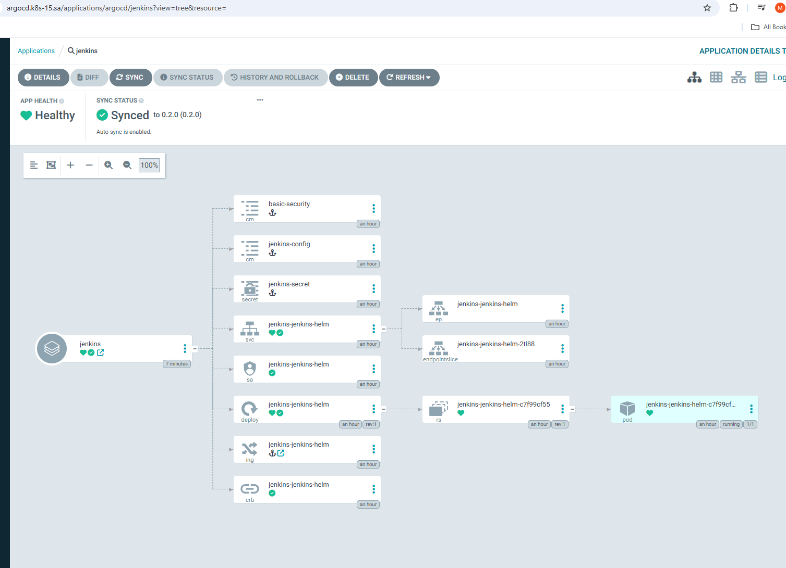
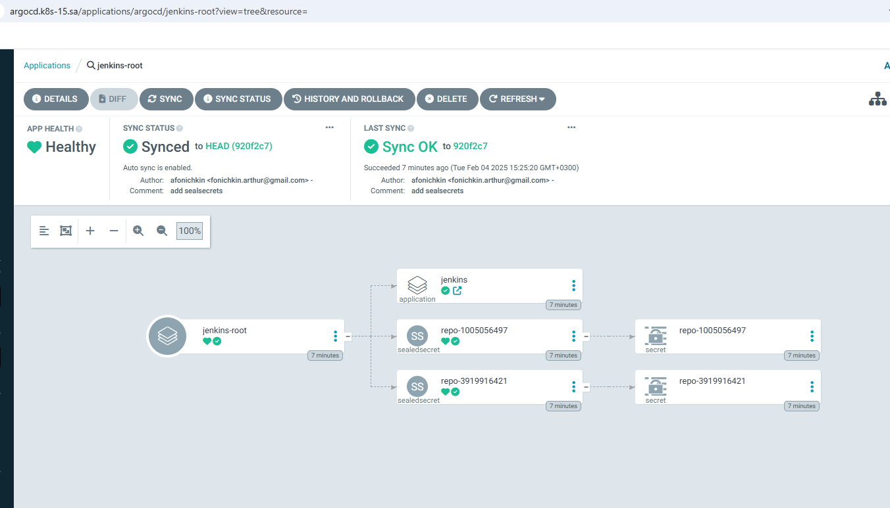
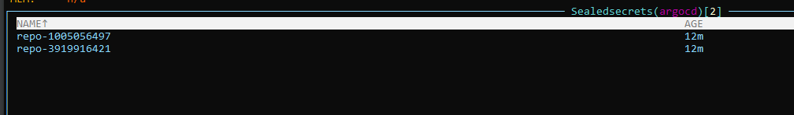
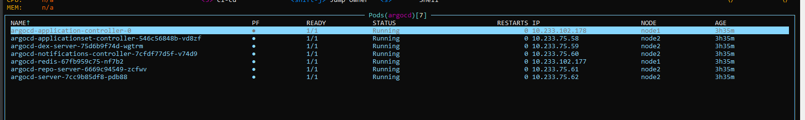
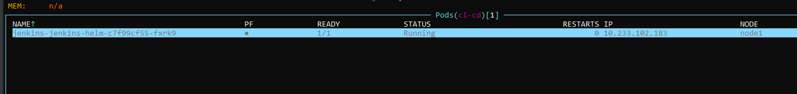

# 15. Kubernetes. CI-CD 

ArgoCD repo:
https://github.com/ArthurF-java/argo-cd

### Jenkins:
```yaml
apiVersion: argoproj.io/v1alpha1
kind: Application
metadata:
  name: jenkins
  namespace: argocd
spec:
  destination:
    namespace: ci-cd
    server: https://kubernetes.default.svc
  project: default
  source:
    chart: jenkins-helm
    repoURL: https://arthurf-java.github.io/helm-jenkins
    targetRevision: 0.2.0
  syncPolicy:
    automated: {}
    syncOptions:
    - CreateNamespace=true
```

### git repo seal-secret:
```yaml
---
apiVersion: bitnami.com/v1alpha1
kind: SealedSecret
metadata:
  creationTimestamp: null
  name: repo-1005056497
  namespace: argocd
spec:
  encryptedData:
    project: AgABRFEfh0V4ST/oDaM+Ul//Wb76bZ2dz78Rv2ovpI2K2RqTz5cpVjYtCwpdFgnuKJv68YMauWujyOiQ89Rr+uADAiJtX4BLghgiuk+jsTCUT2Y5brD9EiMBA2PZdecapTHZ1k1p0RepvAeW71V+BvqiM1qR4btufZaM/dFcFpHDGMHv5zlqjWFz9TPag88OpmzqdA8usVyHwvtSqJiJ1VdVXmq4tzXQxAcMoxAOa+b/f/sgR0etEoWmhuXZkbQLUtVMs1pg1yd1spa5lBxVre/ALYYTkhnWuzNBG8kiVIuKGBralbneOU2AZL9wa/5VnGFT/JEb99OMc+2GXqjC6qW40id9jYvF3j/llkWzo2SarrETWBV5lqOjnBYccRUG0rabFKpyxQfpuTWoCnUXusMx3hfr01Q9EhMNPjMEe5qodsOwODsn32QP/E2yxTzlnalF/5c0oJHedJwua6Wq0yJsLKMRj/UoCG63MCcb48TYIW6GZLaLfKaC3F9Yan9MLu/r2w8p+4mmmiN/F2DAd+oFx00EF9HlG3Bf8MbOEK60xqnJP4MISflEAP2CklRSh8KIRFF9KSuBFQNjGgyiTV63kh0CbWkcdLoxFH1Z1HIuO0sDqrJxvAS01N1IFGuF6EYrt9BZJ2i2hRhIWPyCkexxNyS1LGI8il+RlU24Gl75L5pEMS+txgVe6ind92M8GmMTjQ2maDrN
    type: AgB/Uxspx1PQLG+3CbQ47RfQneSAS2muT/h6wVKKdQajRgMuwujCme/FWwVnxCKBkAYr+97c4X/IQyKoqulOdpMagRVpcYiXoP/08AFXjSC57DECFlIw9LEP7pdosb+tKMKXm/eAcbikAJUNvdWcJSYSzqTAGnHWBRxGhQShYI965Zf164lRpaX27+Igm6yZRsoKKW5k/VzsNc76MelBCjKbOk1gLhI5oqrLO8JdwA/tJJ7o4qyvOpYQc2qTDZCPvyaUSnDI+jzV14cXnJFhRlnAb1lG6GXL8UUbkcIJjQzzFDP/3IP5Hwyb+8xsfL4m2/YslL3S1FJ9CbS/dPK3fIFl5Wy+kMvf/RrV1bopMuFWe+Wz27hxrZROsPIndlci56AysJWALnd1B5RswvEhXeiprjWaAIIVPWD0Um0w3iGjnh/1HjmG8JTFbQ8E+KlBxKujKg2IWyxFufxLkpO0rm6UviqvmsaJtKUWlvEqsAuFC/o3kkUkaaR/yh/rm9zpFtLx2iWCN7NCRtEYorUMnDG1tq1Y4HtlQvDXdH5piXYmacd+N1BhfRZOwr6zfYswO8Q8gP0QN3/2SWcKolSm98xMNAKuGXrpqWMGY9tplTQ7NYdKcRbElBEUzrbFjQMni39URvM3VA/SOVq9Wa7+m1RgG1U+VeaGdzWEepQ5Uk4ejJhNav5JFSlwF2QePopqcyEn1hs=
    url: AgC+GHUBy/DvQO3jGIs+nXLH1g+K3HVxz3Zu77ixiwVbDtmZzbSWEhAFzjqyXFNoOwA4oiQdXGR6fUa6Q4SPWGEG8nn0P+aLryqpDgRYNubakuslKZ8AkQxTv60XM5lSYR66CT+QHeilKp9mZBFbU19YTcyJXH3H7smZwPZHb9KkHu1K5J2PgtbTJNGDeYqI73qxtiW3EpCTMrgdF6W0Ke7bE8IvPbDNoYYohnIYzVA2IFRAfVdBbXqPsRq+4BqhE4GQbLrprygjvd06JkjP63N9lremHKw3e6gO8pHvr5HmFnF1anmnMuKvgg8F8+XZ47VmLw+H1JJpOQxUbcc4nVsb1JF/n+3EIJeGHyrkYnjrnuKCAuD8h2jNDMnPZMy50KVQ8tSAuZb3jb7KYcPEI3PhBRhVs0ptftkbxEHc4COjarQU0qzKmoTxgTb91ltCh5t1KIu20xO9Df/m9sxcKDJZ+05Xp6WRvUkUEBMJJU3GgQdhPlsqSEkcXWvjHpESoly8WKDEU4dd2DWIbdbA8TWqRZPaPVe51Iq64BoxgPgLop1akpCLZN9oVrqWKF/tnxvJiFrAKLM9UAH/XcLg2DqLZyqFN/jaFrXbWYsw/5N8z6LWBul6M4ZAOmatCsS97WtzsvnYoEPnaWYEEnY56OXTtYjSQTkxwh2oj7ruLiJGDPsGLujhIkxCbmn2CHTs9hlS/Vcys9MppPo4V6VUeNt2tpDlcTAPrkbBBIvTBWKpT8o+nf1hSIysYF1i
  template:
    metadata:
      annotations:
        managed-by: argocd.argoproj.io
      creationTimestamp: null
      labels:
        argocd.argoproj.io/secret-type: repository
      name: repo-1005056497
      namespace: argocd
    type: Opaque
```

### helm repo seal-secret:
```yaml
---
apiVersion: bitnami.com/v1alpha1
kind: SealedSecret
metadata:
  creationTimestamp: null
  name: repo-3919916421
  namespace: argocd
spec:
  encryptedData:
    name: AgAk/YbyBYRjHsZYtIIEi9zWCL62U9N7kE9PbgEUYmeV9iC+cysuoaVwfr7YLt1xiWH7EEX9O1nCnItY0ibrpfZdeCmufHbrj1pBlZK5yEUeAiTRewu5dnFDK+5g0tVCs45kEKY1+T7gqKg4Fhy0GINND4+1VDbzzuXFouGN/9551m/WJIoa4i10WU0gBFjVM9f9keS/MYU4Iic67l9MG8Z0NGzJj1djy/nMuvsj9WfPCIoj1sRPgbCWtYJuf85fdJqKLdopmrMXHUlr96sPdp0/TEjO3zbooNfRIUSh6uuhtZBRNnhGUTHdFc0KEwh2oQ9HO5faK25B0BjNwTPSvM7Af6oVOkWl0dDcq9wRG7jB0T7Wbz95ly8eGK0pdnzgyKqSQWBFbRw6m+qAX6W9Ni1+xfZTSpu4x18PgR1dhkoo9mzG33yCqCXM0rN7pTERsuV6jB06Q8UeLtclg3fG3DOZ3CoQT3tef9XwXrqZrNDfWn8vSdegRm42F6+HtL+l4pqLTleOCwXq+FMF2JmfR69rYnuoO/aGCCZjHhqE+PBQecI3CnYKNgVMHm8h4o2Z+m/pYzn+ofNty+c/1Mn0QlYedqesUjg6qmwNfeTDVLC6y9gusKluZiQrmizagV8I2UF20pCFPo+DAhN9Oi8uAPNnMrATaXZWq4hvBoFiNNMX1WCv7S5z+maTFokXP+pQVE0cWIxmkZvc
    project: AgAuFOboNtJnUQo9l0vgBiGyMpJXVlTbXK/+0UfYsLk3yxc6mTa5fIurz4rtm4zG2d2giNLEX3mZgXi2qERS+MHGFe2KNt/rShfI8BRrWO3pWYOJn71E0M0oZW4Lh95aqWnfrCa/JdDxFn9pQxAeTSWnRkZ6OdxFbc0iAoxAeen2WvK1SxiwTiV8iHj9rREBrwjJ/xDDuhj8kN/0j/gJPvu34nFzLd2092FIXFxy+PbF40p00jKPbfwxtTf5w4DcQFOe4E1iWoNf1tg3n0+JPCLMF1zaDyxH2cJlMU/WISYcXXcDD5TnQt13UjLvxKWWvK90F34ZrM8R9h6aG/QrL6JIooHGQoWKy9piZRlu1LrD8nDP//Hn1Rd+Hm4fDSs3tygsoQsur6KB8ciG+C2iwitqH/eHf24DoessU/zUEpuV4Ov3d59D1RM3bXDxRZFFbU2XnTjYxQbqBCj56l5ytSONzV47ouA1pKuU8FQwDeVfOmk/o3ZRwams5IEGKurB234J5Nl9vS3MUtqAgRzNYLFlVhhDR2XI4XC3GOE82frJlvQbiKXMNdF2NjNmFakqebQ6iJi0fYYEz2ND0SkbDLFMoFUjJbtF3lN6UZq/VQu7CxGxVz1T4Sccb6F8UU1plRZfrT3P5qNPCJidS6hOETf6L431Q5IBPLdTj2Z/txhtmQcDnwJRD9d40BLhDm4RDyaIRWfh1dqj
    type: AgAqt7G3VF0D1EIbu0M8oPkRStYwzFp0gj0BzX8Tx6YpHEe/R/2EVfSy8tWUsuH/KSc87kO8GuNecC9dv54DqXpusUq42V9lp1dKUl+Ak9I7jleCnZmh9CixNoV3u7gdoHg9p5iDODNERelh2IywcoTOmm4Ot4NJGmhWWTDq/AugDEgO0l4ZYLQL7gcFuOiFe2JQjiv8i75/M+qmdzUadxlA6/VsOSGl1OvCcLIC27pFd7AcXQydpeOQgCX7RhXJ7AFNrdIKNd1E+dwQck46EG6+xirHuNTIdkPZYvhAnIAG2s+Q6CkzeF7B1BmUia1MStvXofPmfE2qRXKbmk6yQRJabzldumx97ZPzkaW4W3wjiiZ05wvqBx/z4ChL7Govqf4DEwnp0kLCq5x/fkAMFVY6QveYoQEeVSQAQ+hzm2LnSedkWIEBok6H+3rGDqq65jFW4RKXgENCMWmIwIkTxu0MtR6Nk2e3uGLt1D2ECpvz/YXm/VbvNg7AKXzT6y60u2alCERZ9Je9JTs1g/WhHa2K/0aVhWR1ijWJu4XPOLaW2I7Oh79uLROjSgzpbuWWyOABNLtS7bkwDOmvgPYscs+GMGMM+dz/vswsl/2xuUUK02lZUKpA82T/WkpHP2NaQ92Uyb7qEEaXPb9eL9QDu5WgUnoZg5kzEV6bNbMcrut3+oOkPcDfcwmotUq7ja1Vq5z7TwO9
    url: AgBEMF9bEbdydob3A21I9Kcbq1DbIS3xlbPJeSTVgDQbIgD/9pW/Pn9NwjOJP0rvAfBRHeloQyBl9rB7sOvjFHK1l+TVOTVPR9KZ8okUEPDesTKD9EnGKW6a6Ep9/aXNjww1bJNmqpotpqp479u8VBV5mb1q4poAOJpaPbxE33gDFZGJZpIUNCHCuv/Wkhw08/tYEv/UjqrsAblRSZM5/MmIQYfMIqmI2b1SaMd48+JEkZFLOJnGdxCyk3OSXoP5PGZb1Ji+bPfO9PfcapyO/c3V0btNXAQYR00a6z77nQMW0AkgHMbdzIUYpyO8Yq8S+3VbpQXTDdvw9VDgrodj965IDqPT5PojuESZZGtZ+2Z1rRxCpUpn68FSu7PVlaWA05bXc/rEN2dxb1VTdWzrPhuffB1K5nO8SZlnw74TmjDioJvmH6hGDz90HmJoYd4tkji6dSY0WfB+YEGBwoqUhstCO4+iNr/YqFSE7jgDW69xaoZW53BYGIfFeWEc7CqT9ydgZcwhjfTpNzF3QGzGnq8Aj+5tA6EFZlBZE7RfzhpBIgLwpRoHDdLOM4PWK+5T3u3fVhhQDqPWPrPUTsCd/Sux1mkdHA+HfpWXx5/N4fJqNLmwWv0UNkYs+e2m+3R6eyC3Bvsop0V9m2KRM4HaZSos/22E4oA55cEdlQvcf+Gsg5gPpXmZA2OUDmNteRV9qRK0CGlwiZvFEuhL0f6W4S/rwtiTJ4lrmIktGKM/3peeH+k5nC3lvYAsmhzS
  template:
    metadata:
      annotations:
        managed-by: argocd.argoproj.io
      creationTimestamp: null
      labels:
        argocd.argoproj.io/secret-type: repository
      name: repo-3919916421
      namespace: argocd
    type: Opaque
```


### Jenkins deploy screenshots:



### K9s screenshots:




