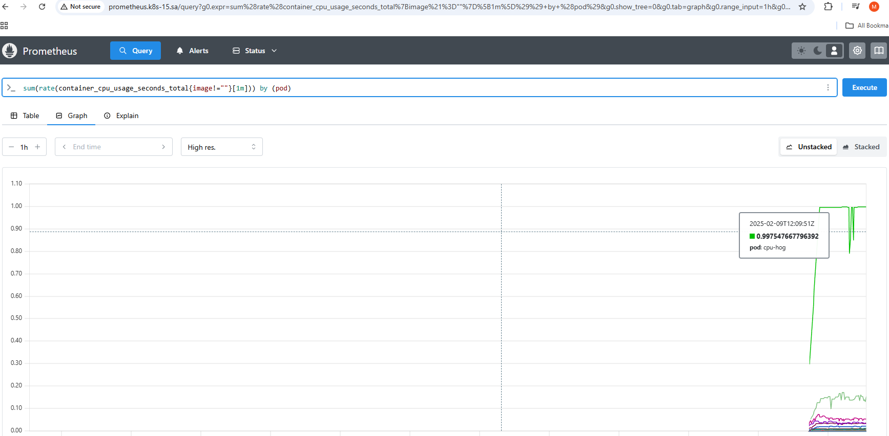
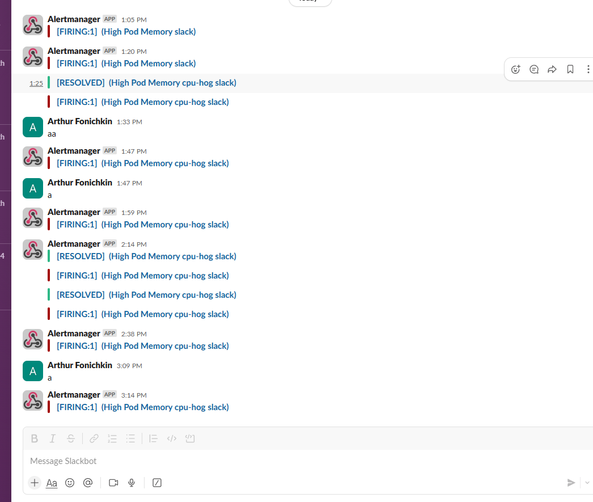
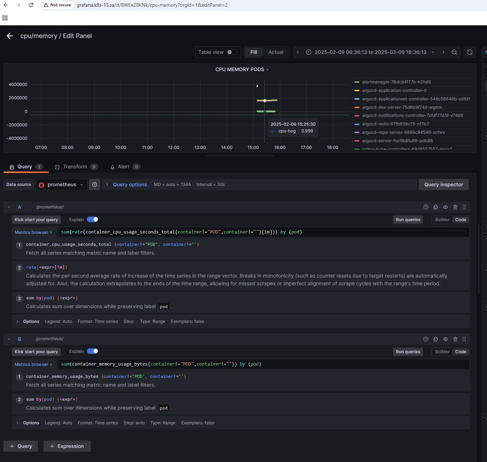

# 16. Technical and service monitoring

## TASK 1

### Flux repository:
https://github.com/ArthurF-java/flux-monitoring

### Flux install:
```bash
export GITHUB_TOKEN=XXXX

flux bootstrap github \
  --token-auth \
  --owner=ArthurF-java \
  --repository=flux-monitoring \
  --branch=main \
  --path=flux/ \
  --personal
```

### Prometheus-deployment.yaml:
```yaml
---
apiVersion: v1
kind: Namespace
metadata:
  name: monitoring
---
apiVersion: rbac.authorization.k8s.io/v1
kind: ClusterRole
metadata:
  name: prometheus
rules:
  - apiGroups: [""]
    resources:
      - nodes
      - nodes/proxy
      - services
      - endpoints
      - pods
    verbs: ["get", "list", "watch"]
  - apiGroups:
      - extensions
    resources:
      - ingresses
    verbs: ["get", "list", "watch"]
  - nonResourceURLs: ["/metrics"]
    verbs: ["get"]
---
apiVersion: rbac.authorization.k8s.io/v1
kind: ClusterRoleBinding
metadata:
  name: prometheus
roleRef:
  apiGroup: rbac.authorization.k8s.io
  kind: ClusterRole
  name: prometheus
subjects:
  - kind: ServiceAccount
    name: default
    namespace: monitoring

---
apiVersion: v1
kind: ConfigMap
metadata:
  name: prometheus-server-conf
  labels:
    name: prometheus-server-conf
  namespace: monitoring
data:
  prometheus.rules: |-
    groups:
    - name: devopscube demo alert
      rules:
      - alert: High Pod Memory
        expr: sum(rate(container_cpu_usage_seconds_total{image!=""}[1m])) by (pod) > 0.8
        for: 1m
        labels:
          severity: slack
        annotations:
          summary: High Memory Usage
  prometheus.yml: |-
    global:
      scrape_interval: 5s
      evaluation_interval: 5s
    rule_files:
      - /etc/prometheus/prometheus.rules
    alerting:
      alertmanagers:
      - scheme: http
        static_configs:
        - targets:
          - "alertmanager:9093"

    scrape_configs:
      - job_name: 'node-exporter'
        kubernetes_sd_configs:
          - role: endpoints
        relabel_configs:
        - source_labels: [__meta_kubernetes_endpoints_name]
          regex: 'node-exporter'
          action: keep
      - job_name: 'kubernetes-apiservers'
        kubernetes_sd_configs:
        - role: endpoints
        scheme: https

        tls_config:
          ca_file: /var/run/secrets/kubernetes.io/serviceaccount/ca.crt
        bearer_token_file: /var/run/secrets/kubernetes.io/serviceaccount/token

        relabel_configs:
        - source_labels: [__meta_kubernetes_namespace, __meta_kubernetes_service_name, __meta_kubernetes_endpoint_port_name]
          action: keep
          regex: default;kubernetes;https

      - job_name: 'kubernetes-nodes'

        scheme: https

        tls_config:
          ca_file: /var/run/secrets/kubernetes.io/serviceaccount/ca.crt
        bearer_token_file: /var/run/secrets/kubernetes.io/serviceaccount/token

        kubernetes_sd_configs:
        - role: node

        relabel_configs:
        - action: labelmap
          regex: __meta_kubernetes_node_label_(.+)
        - target_label: __address__
          replacement: kubernetes.default.svc:443
        - source_labels: [__meta_kubernetes_node_name]
          regex: (.+)
          target_label: __metrics_path__
          replacement: /api/v1/nodes/${1}/proxy/metrics


      - job_name: 'kubernetes-pods'

        kubernetes_sd_configs:
        - role: pod

        relabel_configs:
        - source_labels: [__meta_kubernetes_pod_annotation_prometheus_io_scrape]
          action: keep
          regex: true
        - source_labels: [__meta_kubernetes_pod_annotation_prometheus_io_path]
          action: replace
          target_label: __metrics_path__
          regex: (.+)
        - source_labels: [__address__, __meta_kubernetes_pod_annotation_prometheus_io_port]
          action: replace
          regex: ([^:]+)(?::\d+)?;(\d+)
          replacement: $1:$2
          target_label: __address__
        - action: labelmap
          regex: __meta_kubernetes_pod_label_(.+)
        - source_labels: [__meta_kubernetes_namespace]
          action: replace
          target_label: kubernetes_namespace
        - source_labels: [__meta_kubernetes_pod_name]
          action: replace
          target_label: kubernetes_pod_name

      - job_name: 'kube-state-metrics'
        static_configs:
          - targets: ['kube-state-metrics:8080']

      - job_name: 'kubernetes-cadvisor'

        scheme: https

        tls_config:
          ca_file: /var/run/secrets/kubernetes.io/serviceaccount/ca.crt
        bearer_token_file: /var/run/secrets/kubernetes.io/serviceaccount/token

        kubernetes_sd_configs:
        - role: node

        relabel_configs:
        - action: labelmap
          regex: __meta_kubernetes_node_label_(.+)
        - target_label: __address__
          replacement: kubernetes.default.svc:443
        - source_labels: [__meta_kubernetes_node_name]
          regex: (.+)
          target_label: __metrics_path__
          replacement: /api/v1/nodes/${1}/proxy/metrics/cadvisor

      - job_name: 'kubernetes-service-endpoints'

        kubernetes_sd_configs:
        - role: endpoints

        relabel_configs:
        - source_labels: [__meta_kubernetes_service_annotation_prometheus_io_scrape]
          action: keep
          regex: true
        - source_labels: [__meta_kubernetes_service_annotation_prometheus_io_scheme]
          action: replace
          target_label: __scheme__
          regex: (https?)
        - source_labels: [__meta_kubernetes_service_annotation_prometheus_io_path]
          action: replace
          target_label: __metrics_path__
          regex: (.+)
        - source_labels: [__address__, __meta_kubernetes_service_annotation_prometheus_io_port]
          action: replace
          target_label: __address__
          regex: ([^:]+)(?::\d+)?;(\d+)
          replacement: $1:$2
        - action: labelmap
          regex: __meta_kubernetes_service_label_(.+)
        - source_labels: [__meta_kubernetes_namespace]
          action: replace
          target_label: kubernetes_namespace
        - source_labels: [__meta_kubernetes_service_name]
          action: replace
          target_label: kubernetes_name
---
apiVersion: apps/v1
kind: Deployment
metadata:
  name: prometheus-deployment
  namespace: monitoring
  labels:
    app: prometheus-server
spec:
  replicas: 1
  selector:
    matchLabels:
      app: prometheus-server
  template:
    metadata:
      labels:
        app: prometheus-server
    spec:
      containers:
        - name: prometheus
          image: prom/prometheus
          args:
            - "--config.file=/etc/prometheus/prometheus.yml"
            - "--storage.tsdb.path=/prometheus/"
          ports:
            - containerPort: 9090
          volumeMounts:
            - name: prometheus-config-volume
              mountPath: /etc/prometheus/
            - name: prometheus-storage-volume
              mountPath: /prometheus/
      volumes:
        - name: prometheus-config-volume
          configMap:
            defaultMode: 420
            name: prometheus-server-conf

        - name: prometheus-storage-volume
          emptyDir: {}
---
apiVersion: v1
kind: Service
metadata:
  name: prometheus-service
  namespace: monitoring
  annotations:
    prometheus.io/scrape: 'true'
    prometheus.io/port:   '9090'
spec:
  selector:
    app: prometheus-server
  type: NodePort
  ports:
    - port: 8080
      targetPort: 9090
      nodePort: 30003
---
apiVersion: networking.k8s.io/v1
kind: Ingress
metadata:
  name: prometheus-ingress
  namespace: monitoring
spec:
  ingressClassName: nginx
  rules:
    - host: prometheus.k8s-15.sa
      http:
        paths:
          - path: /
            pathType: Prefix
            backend:
              service:
                name: prometheus-service
                port:
                  number: 8080
```

### alertmanager-deployment.yaml:
```yaml
---
apiVersion: apps/v1
kind: Deployment
metadata:
  name: alertmanager
  namespace: monitoring
spec:
  replicas: 1
  selector:
    matchLabels:
      app: alertmanager
  template:
    metadata:
      labels:
        app: alertmanager
    spec:
      containers:
        - name: alertmanager
          image: prom/alertmanager:latest
          args:
            - "--config.file=/etc/alertmanager/alertmanager.yml"
          ports:
            - containerPort: 9093
          volumeMounts:
            - name: alertmanager-config
              mountPath: /etc/alertmanager
      volumes:
        - name: alertmanager-config
          secret:
            secretName: alertmanager-config
---
apiVersion: v1
kind: Service
metadata:
  name: alertmanager
  namespace: monitoring
spec:
  selector:
    app: alertmanager
  ports:
    - port: 9093
      targetPort: 9093
  type: ClusterIP   
```

### alertmanager-config-seal.yaml
```yaml
---
apiVersion: bitnami.com/v1alpha1
kind: SealedSecret
metadata:
  creationTimestamp: null
  name: alertmanager-config
  namespace: monitoring
spec:
  encryptedData:
    alertmanager.yml: AgCNpfYGyKAa+vBVYG0698AIlya4ezXRB7YRtXDyTeoXw/R8URizzmNAp96U5PV2zdMTZYjLj9dmFck8uAbtPudKlq3eQbs0NBwg7awIDWw5HwbN7yfLUXisNJ8IBcNrlYO3EZji29hNfE0WBWL8xuu7gDaDLIEtyBzjTbn9j0czkxCiBDEtBB+c0JVeGakQjMMV1Dg9VYLzo4/Rm51FXNxe4O9Qtx4u4bcGDAHD4S0PckFxoqw15OHTTaXoy419vBcdAvM+2w8vbcDyaxJx1tEToWdWXky+O0ZdwD1g6Hstb1apDVopJwyR+D4NWW7aiscpCVRECWfqz/TSEnEGythfIVNmNogqUHpOnhKO+l5fEaH0c9IYWAdUYIL1uwlVUaaXSI4MgSyTXOXmjatmIdomegVxuANzHtExwxxS1cCedQwxK27FnweyB/D0KfWmSzNQoVJelTspdsjVK4QRxvo5wEz6Wkhz1jtoJDa2gUiXJ4c/UG0P45xGHD2VTp7P49M206h3zcvtCfmxbRVG4/PVtHtYQulXnjyROaGh/2l6B5KPZ+G/hFTgMPMHAdXVSDF71YAwEHf9ByOrWL45r7/5tlVS5uLiJbE/NSZ83prXu3hfdKw7a+8KH3XhzU+0m6M/Usx/rwAxMB9zzOoQz7hMhXsIjBA9VB5b58g6uNJvFnboOkB4NhJ2M0PAEQBpUDeq4TP9wpdiELK4EUxT/IuJY/blFwVpO9NYrZ+hSwTZZpKovwX0WSHz3Ep6Fi4namusnRKHRQ9XbQzyECe14trpWJ8sktUDJXMPM+7jVV6nrZi800TeFsv5WtF0b1/2o0tnQPG+LqzvZhr+6gps/xQShA4ROO91aMM/dNW1b0GT6gym+nueukL4SLDP8w30BXcSygZFvDlOgrd1I0usaJnDNj7zWB6QNEjTd+KOPG+wDcxxFfOGkyQEb99mDl4qzuytZT3vmRHDVwMPkYoIbPKeI+Nm8pD/fsNV1nl0gmzbof4PuvaA8V6G0HNb0+43P9KlwnwyLIJrZPSoBBBPLGraNCZv7/HDCA==
  template:
    metadata:
      creationTimestamp: null
      name: alertmanager-config
      namespace: monitoring
    type: Opaque
```

### high-cpu-pod.yaml:
```yaml
---
apiVersion: v1
kind: Pod
metadata:
  name: cpu-hog
  namespace: monitoring
spec:
  containers:
  - name: cpu-hog
    image: vish/stress
    resources:
      limits:
        cpu: "1"
    args:
    - -cpus
    - "1"
```

### prometheus screen:


### slack notifications:



## Task 2

### grafana.yaml
```yaml
---
apiVersion: v1
kind: ConfigMap
metadata:
  name: grafana-datasources
  namespace: monitoring
data:
  prometheus.yaml: |-
    {
        "apiVersion": 1,
        "datasources": [
            {
               "access":"proxy",
                "editable": true,
                "name": "prometheus",
                "orgId": 1,
                "type": "prometheus",
                "url": "http://prometheus-service:8080",
                "version": 1
            }
        ]
    }
---
apiVersion: apps/v1
kind: Deployment
metadata:
  name: grafana
  namespace: monitoring
spec:
  replicas: 1
  selector:
    matchLabels:
      app: grafana
  template:
    metadata:
      name: grafana
      labels:
        app: grafana
    spec:
      containers:
      - name: grafana
        image: grafana/grafana:9.4.0
        ports:
        - name: grafana
          containerPort: 3000
        resources:
          limits:
            memory: "1Gi"
            cpu: "500m"
          requests:
            memory: "1Gi"
            cpu: "500m"
        volumeMounts:
          - mountPath: /var/lib/grafana
            name: grafana-storage
          - mountPath: /etc/grafana/provisioning/datasources
            name: grafana-datasources
            readOnly: false
      volumes:
        - name: grafana-storage
          emptyDir: {}
        - name: grafana-datasources
          configMap:
              defaultMode: 420
              name: grafana-datasources
---
apiVersion: v1
kind: Service
metadata:
  name: grafana
  namespace: monitoring
  annotations:
      prometheus.io/scrape: 'true'
      prometheus.io/port:   '3000'
spec:
  selector:
    app: grafana
  type: NodePort
  ports:
    - port: 3000
      targetPort: 3000
---
apiVersion: networking.k8s.io/v1
kind: Ingress
metadata:
  name: ingress-grafana
  namespace: monitoring
spec:
  ingressClassName: nginx
  rules:
    - host: grafana.k8s-15.sa
      http:
        paths:
          - path: /
            pathType: Prefix
            backend:
              service:
                name: grafana
                port:
                  number: 3000
```

### grafana screenshot:
