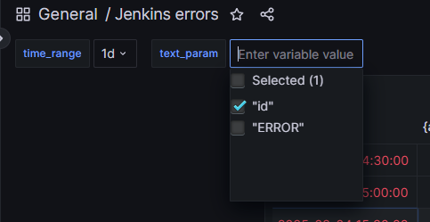
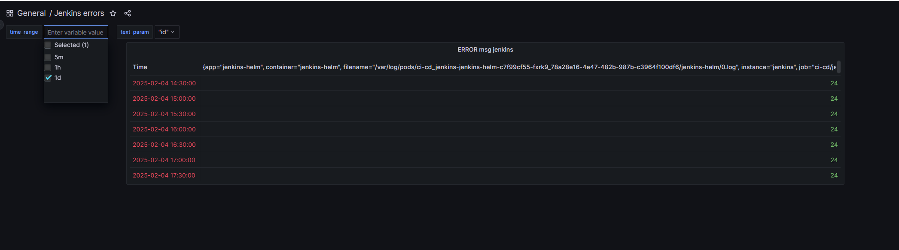

# 17. Log monitoring

### I`ve added additional param, because I don't have any errors in logs.


### dashboard json:
```json
{
  "annotations": {
    "list": [
      {
        "builtIn": 1,
        "datasource": {
          "type": "grafana",
          "uid": "-- Grafana --"
        },
        "enable": true,
        "hide": true,
        "iconColor": "rgba(0, 211, 255, 1)",
        "name": "Annotations & Alerts",
        "target": {
          "limit": 100,
          "matchAny": false,
          "tags": [],
          "type": "dashboard"
        },
        "type": "dashboard"
      }
    ]
  },
  "editable": true,
  "fiscalYearStartMonth": 0,
  "graphTooltip": 0,
  "id": 2,
  "links": [],
  "liveNow": false,
  "panels": [
    {
      "datasource": {
        "type": "loki",
        "uid": "dMaNsUKHk"
      },
      "fieldConfig": {
        "defaults": {
          "color": {
            "mode": "thresholds"
          },
          "custom": {
            "align": "auto",
            "cellOptions": {
              "type": "color-text"
            },
            "inspect": false,
            "minWidth": 50
          },
          "mappings": [],
          "thresholds": {
            "mode": "absolute",
            "steps": [
              {
                "color": "green",
                "value": null
              },
              {
                "color": "red",
                "value": 80
              }
            ]
          }
        },
        "overrides": [
          {
            "matcher": {
              "id": "byName",
              "options": "Line"
            },
            "properties": [
              {
                "id": "custom.width",
                "value": 2119
              }
            ]
          },
          {
            "matcher": {
              "id": "byName",
              "options": "Time"
            },
            "properties": [
              {
                "id": "custom.width",
                "value": 163
              }
            ]
          }
        ]
      },
      "gridPos": {
        "h": 9,
        "w": 12,
        "x": 2,
        "y": 0
      },
      "id": 2,
      "options": {
        "footer": {
          "countRows": false,
          "enablePagination": false,
          "fields": "",
          "reducer": [
            "sum"
          ],
          "show": false
        },
        "showHeader": true,
        "sortBy": []
      },
      "pluginVersion": "9.4.0",
      "targets": [
        {
          "datasource": {
            "type": "loki",
            "uid": "dMaNsUKHk"
          },
          "editorMode": "code",
          "expr": "count_over_time({app=\"jenkins-helm\"} |~ $text_param [$time_range])",
          "queryType": "range",
          "refId": "A"
        }
      ],
      "title": "ERROR msg jenkins",
      "type": "table"
    }
  ],
  "refresh": "",
  "revision": 1,
  "schemaVersion": 38,
  "style": "dark",
  "tags": [],
  "templating": {
    "list": [
      {
        "current": {
          "selected": true,
          "text": [
            "1d"
          ],
          "value": [
            "1d"
          ]
        },
        "hide": 0,
        "includeAll": false,
        "label": "time_range",
        "multi": true,
        "name": "time_range",
        "options": [
          {
            "selected": false,
            "text": "5m",
            "value": "5m"
          },
          {
            "selected": false,
            "text": "1h",
            "value": "1h"
          },
          {
            "selected": true,
            "text": "1d",
            "value": "1d"
          }
        ],
        "query": "5m,1h,1d",
        "queryValue": "",
        "skipUrlSync": false,
        "type": "custom"
      },
      {
        "current": {
          "selected": true,
          "text": [
            "\"id\""
          ],
          "value": [
            "\"id\""
          ]
        },
        "hide": 0,
        "includeAll": false,
        "multi": true,
        "name": "text_param",
        "options": [
          {
            "selected": true,
            "text": "\"id\"",
            "value": "\"id\""
          },
          {
            "selected": false,
            "text": "\"ERROR\"",
            "value": "\"ERROR\""
          }
        ],
        "query": "\"id\", \"ERROR\"",
        "queryValue": "",
        "skipUrlSync": false,
        "type": "custom"
      }
    ]
  },
  "time": {
    "from": "now-30d",
    "to": "now"
  },
  "timepicker": {},
  "timezone": "",
  "title": "Jenkins errors",
  "uid": "Yali88KHk",
  "version": 6,
  "weekStart": ""
}
```

### Dashboard screenshot:

