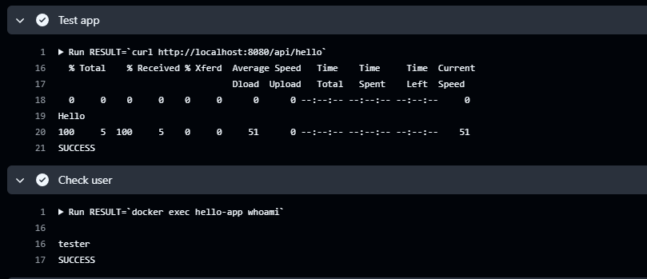
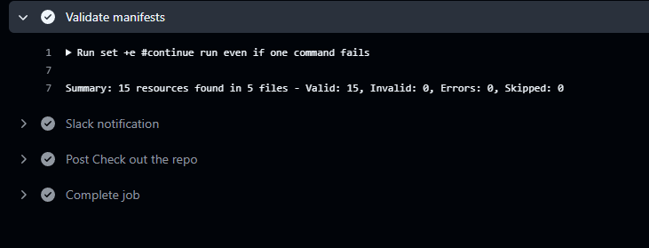
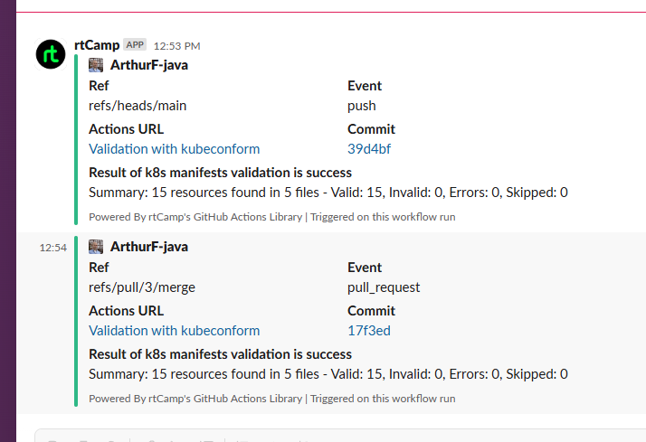

# 17. Testing

## Task 1

### Dockerfile:
```dockerfile
FROM openjdk:21-jdk-slim
RUN useradd -ms /bin/bash tester
USER tester
WORKDIR /app
COPY target/*.jar app.jar
EXPOSE 8080
ENTRYPOINT ["java", "-jar", "app.jar"]
```

### Github action deployment:
```yaml
name: Test

on:
  push:
    branches:
      - main

env:
  BUILD_NAME: "hello-app"

jobs:
  run:
    name: Test simple-app image
    runs-on: ubuntu-latest
    permissions:
      packages: write
      contents: read
      attestations: write
      id-token: write
      pages: write
    steps:
      - name: Check out the repo
        uses: actions/checkout@v4

      - name: Set up JDK 21
        uses: actions/setup-java@v3
        with:
          java-version: '21'
          distribution: 'temurin'
          cache: maven

      - name: Run app build
        run: mvn --batch-mode clean package -DskipTests

      - name: Build docker image
        run: docker build -t ${{ env.BUILD_NAME }} .

      - name: Run docker container
        run: |
          docker run --name  hello-app -d -p 8080:8080 ${{ env.BUILD_NAME }}
          sleep 30s

      - name: Test app
        run: |
          RESULT=`curl http://localhost:8080/api/hello`
          echo $RESULT
          if [ "$RESULT" == "Hello" ]
          then
            echo "SUCCESS"
          else
            echo "FAILURE"
            exit 1
          fi

      - name: Check user
        run: |
          RESULT=`docker exec hello-app whoami`
          echo $RESULT
          if [ "$RESULT" == "tester" ]
          then
            echo "SUCCESS"
          else
            echo "FAILURE"
            exit 1
          fi
```

### Action result:



## Task 2

### Github action deployment:
```yaml
name: Validation with kubeconform

on:
  pull_request:
    types: [opened, reopened]
  push:

jobs:
  kubeconform-check:
    name: Check manifests
    runs-on: ubuntu-latest
    steps:
      - name: Check out the repo
        uses: actions/checkout@v4

      - name: Install kubeconform
        uses: yokawasa/action-setup-kube-tools@v0.11.2
        with:
          kubeconform: '0.6.7'

      - name: Validate manifests
        id: validation
        run: |
          set +e
          RESULT=`kubeconform --summary -schema-location default -schema-location https://raw.githubusercontent.com/datreeio/CRDs-catalog/main/{{.Group}}/{{.ResourceKind}}_{{.ResourceAPIVersion}}.json monitoring`
          echo "$RESULT"
          echo "RESULT=$RESULT" >> $GITHUB_OUTPUT

      - name: Slack notification
        uses: rtCamp/action-slack-notify@v2
        with:
          status: ${{ job.status }}
        env:
          SLACK_CHANNEL: afon-check
          SLACK_MESSAGE: "${{ steps.validation.outputs.RESULT }} "
          SLACK_TITLE: Result of k8s manifests validation is ${{ job.status }}
          SLACK_USERNAME: rtCamp
          SLACK_WEBHOOK: ${{ secrets.SLACK_WEBHOOK }}
          SLACK_COLOR: ${{ job.status }}
```

### Action result:


### Slack result:
