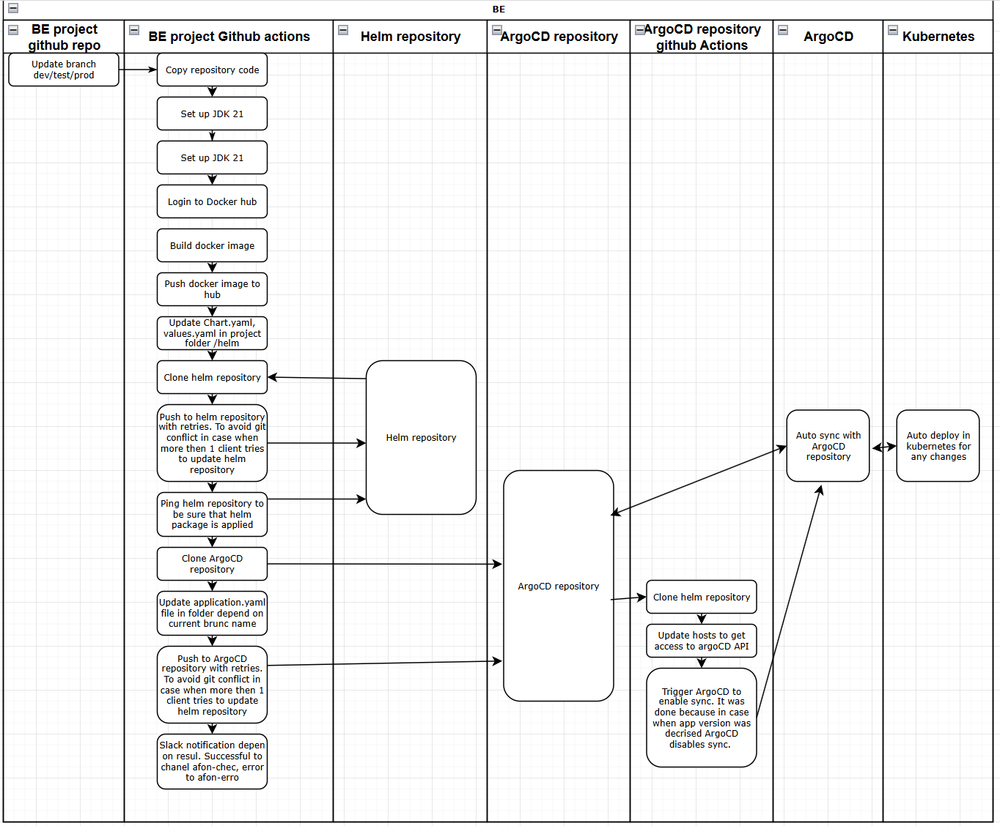
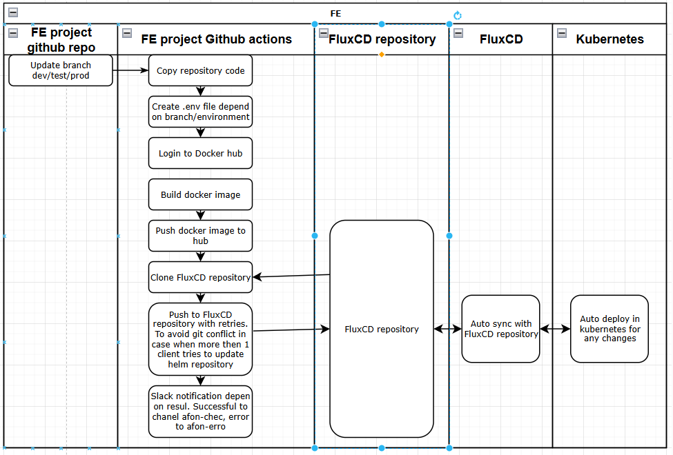

# Final project

Project's reporter: Arthur Fonichkin
Group number: m-sa2-30-24

## Description of application for deployment

* Name of application: project
* BE programming language: Java (Spring boot)
* FE programming language: JavaScript (React.js)
* BE repository: https://github.com/ArthurF-java/be-project
* FE repository: https://github.com/ArthurF-java/fe-project
* Helm repository: https://github.com/ArthurF-java/helm-be
* ArgoCD repository: https://github.com/ArthurF-java/argo-cd
* FluxCD repository: https://github.com/ArthurF-java/flux-cd

## Pipeline. High Level Design

### BE

### FE

## Technologies which were used in project

### Orchestration

#### BE
* Github actions
* Helm
* ArgoCD

#### FE
* Github actions
* FluxCD

### Deployment flows short description:

#### BE
* Update branch (dev/test/prod)
* Trigger github actions
* Add new helm package to folder (dev/test/prod) for helm repository.
* Update ArgoCD application in folder (dev/test/prod) for ArgoCD repository.
* Deployment new app version in Kubernetes with ArgoCD.

#### FE
* Update branch (dev/test/prod)
* Trigger github actions
* Update FluxCD deployment.yaml in folder (dev/test/prod) for FluxCD repository.
* Deployment new app version in Kubernetes with FluxCD.

### Rollback flow description and implementation:

#### BE
rollback with ArgoCD UI.

#### FE
rollback with FluxCD(update FluxCD repository deployment.yaml for needed environment(dev/test/prod) with expected App version image)