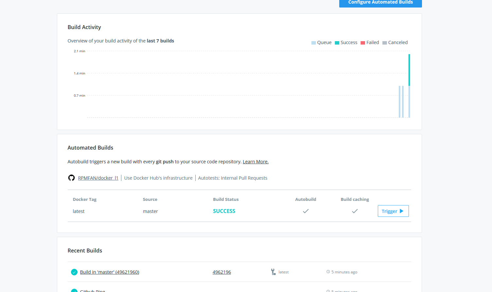

## 11. Docker. Lading
--
### Home task

- Create a Docker file of any Python application
    - As example: any API listener 
- Add automated build for that image Docker hub
- Test it
    - Send/receive API request

Your Dockerfile and links to your Dockerhub put into folder `11. Docker. Lading` add to your repository, then prepare PR (Pull Request)

--

---
 
1) Create and run a container: docker run -d -p 5000:5000 rpmfan/sa:latest

2) Navigate to http://0.0.0.0:5000/ 
