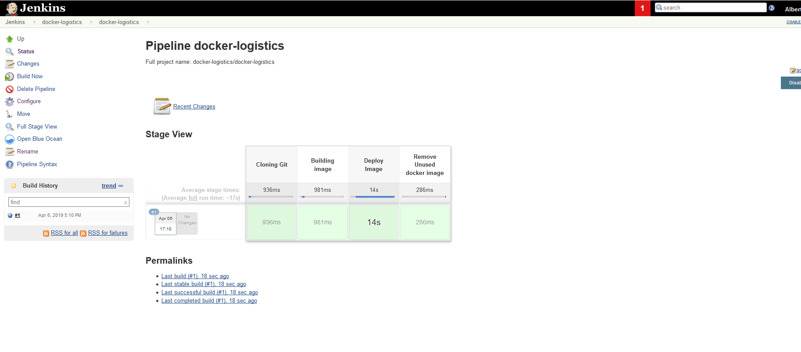
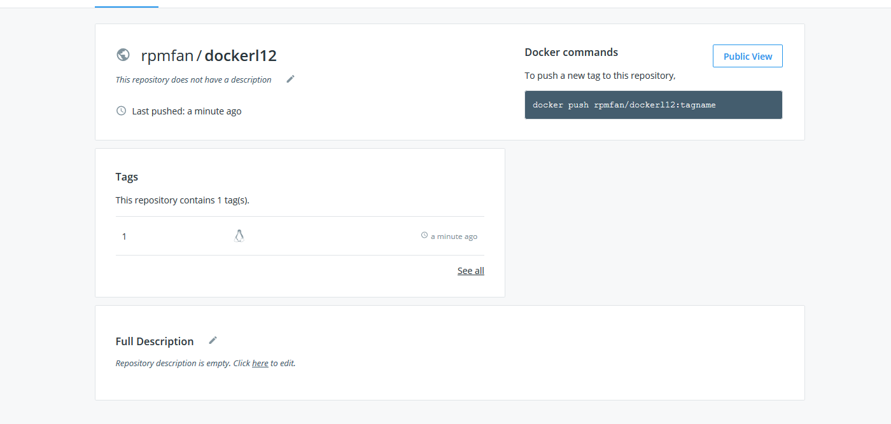

## 12. Docker. Logistics

- Automate task **11. Docker. Lading** by Jenkins
    - Use remote repo as source for build image
    - Make image locally (on Jenkins master/Slave)
    - Push image on Docker Hub
- Create docker compose file which contains the fiollowing applications:
    - Web server (with links to the another Web apps)
    - [sonarr](https://sonarr.tv/)
    - [radarr](https://radarr.video/)
    - All settings of thsi applications sould be putted during docker-compouse start from folder of project

Your Dockerfile, docker-compose files, Jenkinsfile and Jenkins output put into folder `12. Docker. Logistics` add to your repository, then prepare PR (Pull Request)

--

