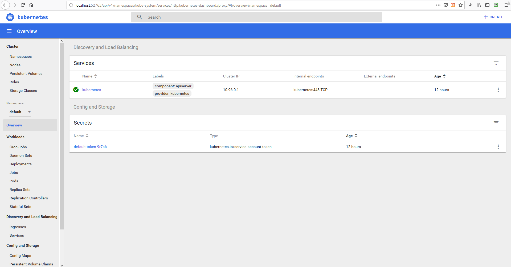

## 11. K8s. Structure
--
### Home task

    - Install minikube on your bare/virtual host
    - Provide access to the dashboard from your workstation
    - Automate it (bash/ansible/Jenkinsfile) Your code and printscreen of dachboard put into folder 13. K8s. Structure add to your repository, then prepare PR (Pull Request)t

--

