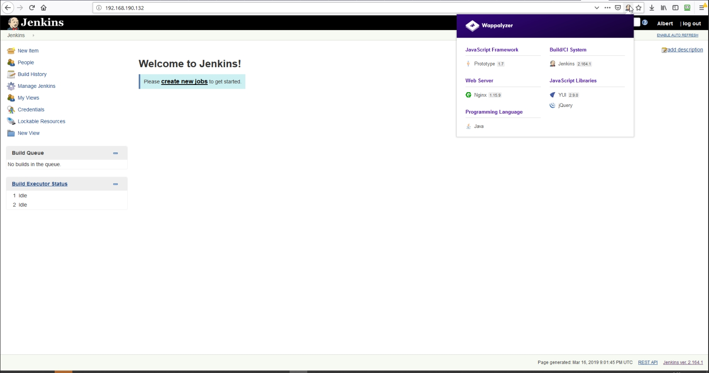

# 08. Jenkins. Start
--
#### Home task

Deploy Jenkins use home environment
Steps:

- Setup Vagrant file
- Install Jenkins
- Default settings setup (like access/plugins)
- Hide Jenkins behind the web server (Apache, Ngnix)
- Implement Ansible role for that 

---

