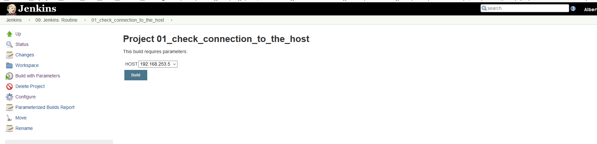
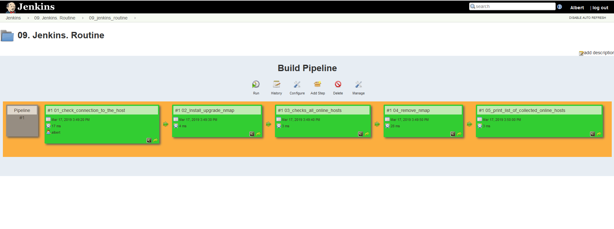
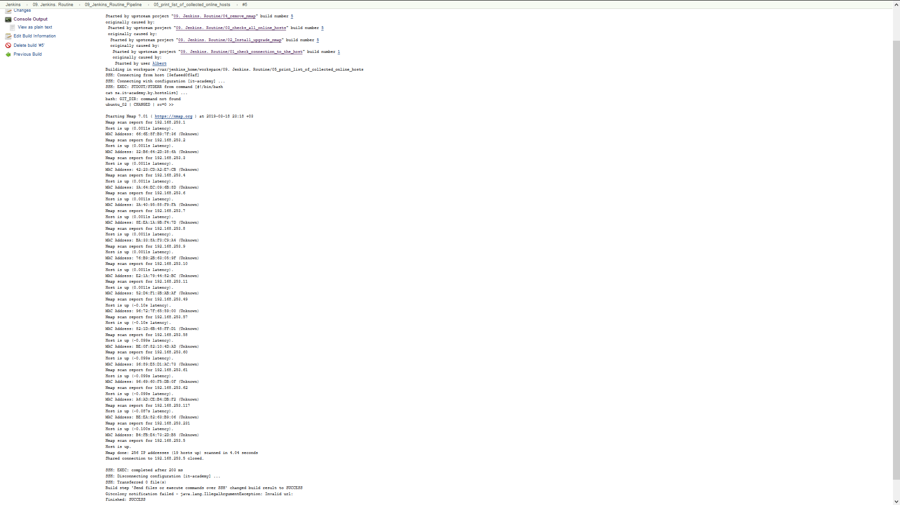

# 09. Jenkins. Route
--
### Home task
##### Implement the following Pipeline
###### Parameters: host IP and credentials  
- Check connection to the host
- Install/upgrade nmap
- Checks all online hosts
- Remove nmap
- Print list of collected online hosts
--
---

