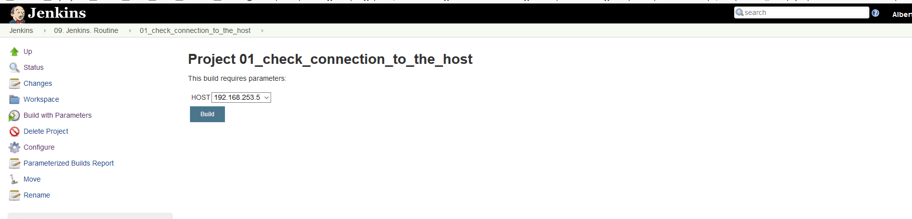
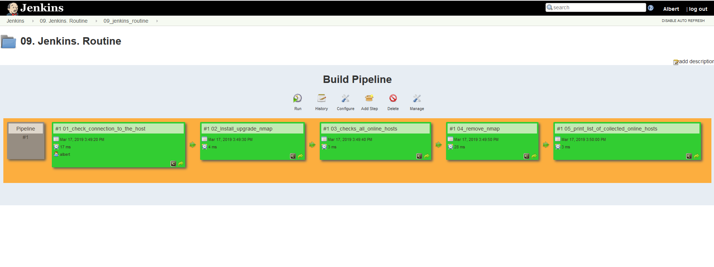
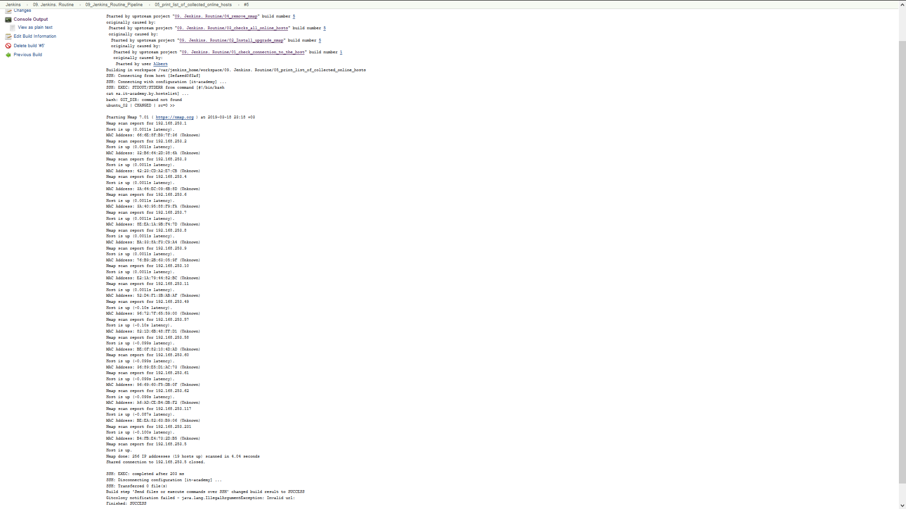

# 09. Jenkins. As code
--
### Home task
##### Create Pipeline using Jenkinsfile
###### Should be inside 
- Work with repo
- Work with files
- Publish artifacts
- Tests
- Notification
- Run it
- Put this file in your PR

--

