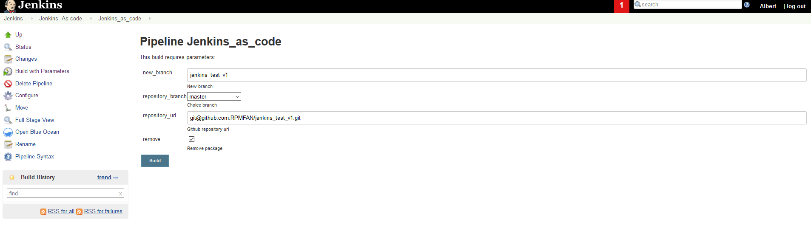

## 10. Jenkins. As code
--
### Home task

Create Pipeline using Jenkinsfile. Should be inside:
- Work with repo
- Work with files
- Publish artifacts
- Tests
- Notification

Your Jenkins file put into folder `10. Jenkins. As code` add to your repository, then prepare PR (Pull Request)

--
---

