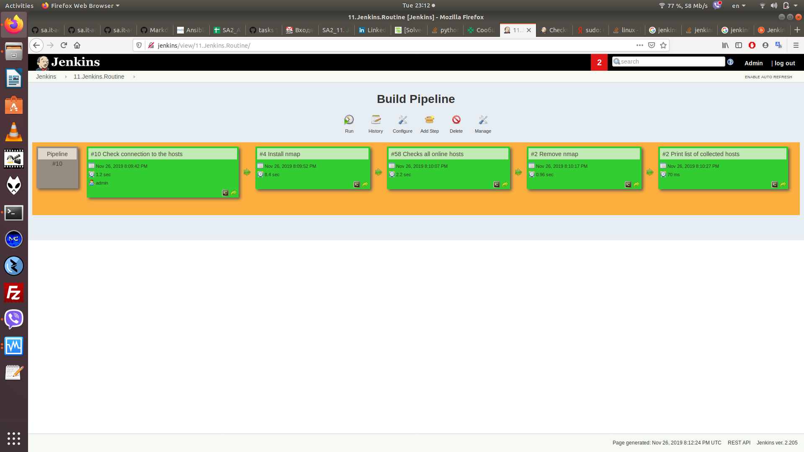

## 11.Jenkins.Routine.md

### Dmitry Shevtsov

***

### List of tasks

1. Check connection to the hosts
2. Install nmap
3. Checks all online hosts
4. Remove nmap
5. Print list of collected hosts

### Build Pipeline view




### 1st task output (Check connection to the hosts)
```
Started by user Admin
Running as SYSTEM
Building remotely on centos7 in workspace /home/vagrant/workspace/Jenkins.Routine.Tasks/Check connection to the hosts
[Check connection to the hosts] $ /bin/bash -xe /tmp/jenkins1209691640181345554.sh
+ uname -a
Linux localhost.localdomain 3.10.0-957.12.2.el7.x86_64 #1 SMP Tue May 14 21:24:32 UTC 2019 x86_64 x86_64 x86_64 GNU/Linux
[Check connection to the hosts] $ /bin/bash -xe /tmp/jenkins5560433645578768498.sh
+ ping -c 2 8.8.8.8
PING 8.8.8.8 (8.8.8.8) 56(84) bytes of data.
64 bytes from 8.8.8.8: icmp_seq=1 ttl=63 time=28.0 ms
64 bytes from 8.8.8.8: icmp_seq=2 ttl=63 time=27.0 ms

--- 8.8.8.8 ping statistics ---
2 packets transmitted, 2 received, 0% packet loss, time 1001ms
rtt min/avg/max/mdev = 27.062/27.545/28.028/0.483 ms
Triggering a new build of Jenkins.Routine.Tasks » Install nmap
Finished: SUCCESS
```

### 2nd task output (Install nmap)
```
Started by upstream project "Jenkins.Routine.Tasks/Check connection to the hosts" build number 10
originally caused by:
 Started by user Admin
Running as SYSTEM
Building remotely on centos7 in workspace /home/vagrant/workspace/Jenkins.Routine.Tasks/Install nmap
[Install nmap] $ /bin/bash -xe /tmp/jenkins6355827276259216478.sh
+ sudo yum install nmap -y
Loaded plugins: fastestmirror
Loading mirror speeds from cached hostfile
 * base: ftp.byfly.by
 * epel: mirror.vpsnet.com
 * extras: ftp.byfly.by
 * updates: ftp.pbone.net
Resolving Dependencies
--> Running transaction check
---> Package nmap.x86_64 2:6.40-19.el7 will be installed
--> Finished Dependency Resolution

Dependencies Resolved

================================================================================
 Package        Arch             Version                   Repository      Size
================================================================================
Installing:
 nmap           x86_64           2:6.40-19.el7             base           3.9 M

Transaction Summary
================================================================================
Install  1 Package

Total download size: 3.9 M
Installed size: 16 M
Downloading packages:
Running transaction check
Running transaction test
Transaction test succeeded
Running transaction
  Installing : 2:nmap-6.40-19.el7.x86_64                                    1/1 
  Verifying  : 2:nmap-6.40-19.el7.x86_64                                    1/1 

Installed:
  nmap.x86_64 2:6.40-19.el7                                                     

Complete!
Triggering a new build of Jenkins.Routine.Tasks » Checks all online hosts
Finished: SUCCESS
```

### 3rd task output (Checks all online hosts)
```
Started by upstream project "Jenkins.Routine.Tasks/Install nmap" build number 4
originally caused by:
 Started by upstream project "Jenkins.Routine.Tasks/Check connection to the hosts" build number 10
 originally caused by:
  Started by user Admin
Running as SYSTEM
Building remotely on centos7 in workspace /home/vagrant/workspace/Jenkins.Routine.Tasks/Checks all online hosts
[Checks all online hosts] $ /bin/bash /tmp/jenkins5128442169911259872.sh
[Checks all online hosts] $ /bin/bash /tmp/jenkins6553426092504027971.sh

Starting Nmap 6.40 ( http://nmap.org ) at 2019-11-26 20:10 UTC
Nmap scan report for _gateway (192.168.1.1)
Host is up (0.00095s latency).
MAC Address: BC:EE:7B:E5:42:C8 (Unknown)
Nmap scan report for R415-ZB (192.168.1.41)
Host is up (0.00020s latency).
MAC Address: C4:85:08:44:0E:A3 (Intel Corporate)
Nmap scan report for jenkins (192.168.1.211)
Host is up (0.00050s latency).
MAC Address: 08:00:27:90:75:6E (Cadmus Computer Systems)
Nmap scan report for 192.168.1.212
Host is up.
Nmap done: 256 IP addresses (4 hosts up) scanned in 2.06 seconds
Triggering a new build of Jenkins.Routine.Tasks » Remove nmap
Finished: SUCCESS
```

### 4th task output (Remove nmap)
```
Started by upstream project "Jenkins.Routine.Tasks/Checks all online hosts" build number 58
originally caused by:
 Started by upstream project "Jenkins.Routine.Tasks/Install nmap" build number 4
 originally caused by:
  Started by upstream project "Jenkins.Routine.Tasks/Check connection to the hosts" build number 10
  originally caused by:
   Started by user Admin
Running as SYSTEM
Building remotely on centos7 in workspace /home/vagrant/workspace/Jenkins.Routine.Tasks/Remove nmap
[Remove nmap] $ /bin/bash /tmp/jenkins7361664770142377438.sh
Loaded plugins: fastestmirror
Resolving Dependencies
--> Running transaction check
---> Package nmap.x86_64 2:6.40-19.el7 will be erased
--> Finished Dependency Resolution

Dependencies Resolved

================================================================================
 Package        Arch             Version                  Repository       Size
================================================================================
Removing:
 nmap           x86_64           2:6.40-19.el7            @base            16 M

Transaction Summary
================================================================================
Remove  1 Package

Installed size: 16 M
Downloading packages:
Running transaction check
Running transaction test
Transaction test succeeded
Running transaction
  Erasing    : 2:nmap-6.40-19.el7.x86_64                                    1/1 
  Verifying  : 2:nmap-6.40-19.el7.x86_64                                    1/1 

Removed:
  nmap.x86_64 2:6.40-19.el7                                                     

Complete!
Triggering a new build of Jenkins.Routine.Tasks » Print list of collected hosts
Finished: SUCCESS
```

### 5th task output (Print list of collected hosts)
```
Started by upstream project "Jenkins.Routine.Tasks/Remove nmap" build number 2
originally caused by:
 Started by upstream project "Jenkins.Routine.Tasks/Checks all online hosts" build number 58
 originally caused by:
  Started by upstream project "Jenkins.Routine.Tasks/Install nmap" build number 4
  originally caused by:
   Started by upstream project "Jenkins.Routine.Tasks/Check connection to the hosts" build number 10
   originally caused by:
    Started by user Admin
Running as SYSTEM
Building remotely on centos7 in workspace /home/vagrant/workspace/Jenkins.Routine.Tasks/Print list of collected hosts
[Print list of collected hosts] $ /bin/bash /tmp/jenkins8446093126040625522.sh
List of collected/online hosts:

Starting Nmap 6.40 ( http://nmap.org ) at 2019-11-26 20:10 UTC
Nmap scan report for _gateway (192.168.1.1)
Host is up (0.00095s latency).
MAC Address: BC:EE:7B:E5:42:C8 (Unknown)
Nmap scan report for R415-ZB (192.168.1.41)
Host is up (0.00020s latency).
MAC Address: C4:85:08:44:0E:A3 (Intel Corporate)
Nmap scan report for jenkins (192.168.1.211)
Host is up (0.00050s latency).
MAC Address: 08:00:27:90:75:6E (Cadmus Computer Systems)
Nmap scan report for 192.168.1.212
Host is up.
Nmap done: 256 IP addresses (4 hosts up) scanned in 2.06 seconds
Finished: SUCCESS
```

