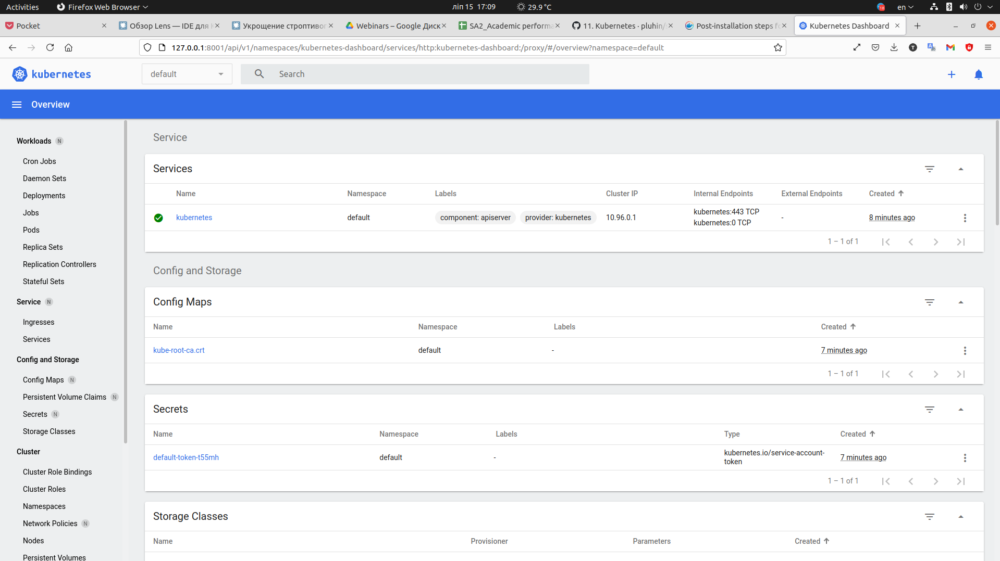

# 11.k8S

## Finish full deployment of k8s cluster

```bash
PLAY RECAP ****************************************************************************************************************************************************************************
localhost                  : ok=4    changed=0    unreachable=0    failed=0    skipped=0    rescued=0    ignored=0   
node1                      : ok=588  changed=125  unreachable=0    failed=0    skipped=1148 rescued=0    ignored=2   
node2                      : ok=368  changed=76   unreachable=0    failed=0    skipped=632  rescued=0    ignored=1   

Thursday 15 July 2021  13:55:01 +0000 (0:00:00.102)       0:26:35.223 ********* 
=============================================================================== 
download : download_container | Download image if required -------------------------------------------------------------------------------------------------------------------- 78.99s
download : download_container | Download image if required -------------------------------------------------------------------------------------------------------------------- 78.88s
kubernetes/control-plane : kubeadm | Initialize first master ------------------------------------------------------------------------------------------------------------------ 77.80s
kubernetes/preinstall : Install packages requirements ------------------------------------------------------------------------------------------------------------------------- 75.67s
download : download_container | Download image if required -------------------------------------------------------------------------------------------------------------------- 65.10s
download : download_container | Download image if required -------------------------------------------------------------------------------------------------------------------- 64.26s
download : download_container | Download image if required -------------------------------------------------------------------------------------------------------------------- 62.92s
download : download_container | Download image if required -------------------------------------------------------------------------------------------------------------------- 62.58s
download : download_container | Download image if required -------------------------------------------------------------------------------------------------------------------- 61.84s
download : download_container | Download image if required -------------------------------------------------------------------------------------------------------------------- 60.28s
download : download_container | Download image if required -------------------------------------------------------------------------------------------------------------------- 59.48s
download : download_container | Download image if required -------------------------------------------------------------------------------------------------------------------- 58.28s
container-engine/docker : ensure docker packages are installed ---------------------------------------------------------------------------------------------------------------- 57.91s
download : download_container | Download image if required -------------------------------------------------------------------------------------------------------------------- 57.22s
download : download_container | Download image if required -------------------------------------------------------------------------------------------------------------------- 56.31s
download : download_container | Download image if required -------------------------------------------------------------------------------------------------------------------- 52.98s
kubernetes/kubeadm : Join to cluster ------------------------------------------------------------------------------------------------------------------------------------------ 32.39s
download : download_file | Download item -------------------------------------------------------------------------------------------------------------------------------------- 21.89s
bootstrap-os : Assign inventory name to unconfigured hostnames (non-CoreOS, non-Flatcar, Suse and ClearLinux) ----------------------------------------------------------------- 21.08s
download : download_file | Download item -------------------------------------------------------------------------------------------------------------------------------------- 20.52s
```

## Install minikube on your bare/virtual host

```bash
1309  curl -LO https://storage.googleapis.com/kubernetes-release/release/`curl -s https://storage.googleapis.com/kubernetes-release/release/stable.txt`/bin/linux/amd64/kubectl
 1310  ls -l
 1311  chmod +x ./kubectl
 1312  ls -l
 1313  sudo mv ./kubectl /usr/local/bin/kubectl
 1314  kubectl version --client
 1315  virtualbox -v
 1316  virtualbox --version
 1317  VirtualBox -h
 1318  virtualbox --version
 1319  [200~curl -Lo minikube https://storage.googleapis.com/minikube/releases/latest/minikube-linux-amd64 \n: 1626338409:0;curl -Lo minikube https://storage.googleapis.com/minikube/releases/latest/minikube-linux-amd64 \\n  && chmod +x minikube
 1320  ls -l
 1321  sudo mkdir -p /usr/local/bin/\n
 1322  sudo install minikube /usr/local/bin/
 1323  ls -l
 1324  sudo ls -la /usr/local/bin
 1325  ls -l
 1326  rm ./minikube
 1327  minikube -v
 1328  minikube -V
 1329  minikube --version
 1330  minikube --help
 1331  minikube version
```

## Prepare command for run minikube with different HW options (RAM/CPU)

```bash
it-academy.by/11.k8s [ minikube start --memory=2000 --cpus=2                                 master * ] 4:59 
😄  minikube v1.22.0 on Ubuntu 21.04
✨  Automatically selected the docker driver. Other choices: virtualbox, none, ssh
❗  Your cgroup does not allow setting memory.
    ▪ More information: https://docs.docker.com/engine/install/linux-postinstall/#your-kernel-does-not-support-cgroup-swap-limit-capabilities
👍  Starting control plane node minikube in cluster minikube
🚜  Pulling base image ...
💾  Downloading Kubernetes v1.21.2 preload ...
    > preloaded-images-k8s-v11-v1...: 502.14 MiB / 502.14 MiB  100.00% 12.60 Mi
🔥  Creating docker container (CPUs=2, Memory=2000MB) ...
🐳  Preparing Kubernetes v1.21.2 on Docker 20.10.7 ...
    ▪ Generating certificates and keys ...
    ▪ Booting up control plane ...
    ▪ Configuring RBAC rules ...
🔎  Verifying Kubernetes components...
    ▪ Using image gcr.io/k8s-minikube/storage-provisioner:v5
🌟  Enabled addons: default-storageclass, storage-provisioner
🏄  Done! kubectl is now configured to use "minikube" cluster and "default" namespace by default
```

## Enable plugin: ingress

```bash
it-academy.by/11.k8s [ minikube addons enable ingress                                        master * ] 5:00 
    ▪ Using image docker.io/jettech/kube-webhook-certgen:v1.5.1
    ▪ Using image docker.io/jettech/kube-webhook-certgen:v1.5.1
    ▪ Using image k8s.gcr.io/ingress-nginx/controller:v0.44.0
🔎  Verifying ingress addon...
🌟  The 'ingress' addon is enabled
```

## Provide access to the dashboard from your workstation

```bash
it-academy.by/11.k8s [ minikube addons enable metrics-server                                 master * ] 5:07 
    ▪ Using image k8s.gcr.io/metrics-server/metrics-server:v0.4.2
🌟  The 'metrics-server' addon is enabled
it-academy.by/11.k8s [ kubectl proxy --address='0.0.0.0' --disable-filter=true  &            master * ] 5:08 
[1] 229650
it-academy.by/11.k8s [ W0715 17:08:38.883044  229650 proxy.go:162] Request filter disabled, your proxy is vulnerable to XSRF attacks, please be cautious
Starting to serve on [::]:8001
E0715 17:08:56.709216  229650 proxy_server.go:147] Error while proxying request: context canceled
```

