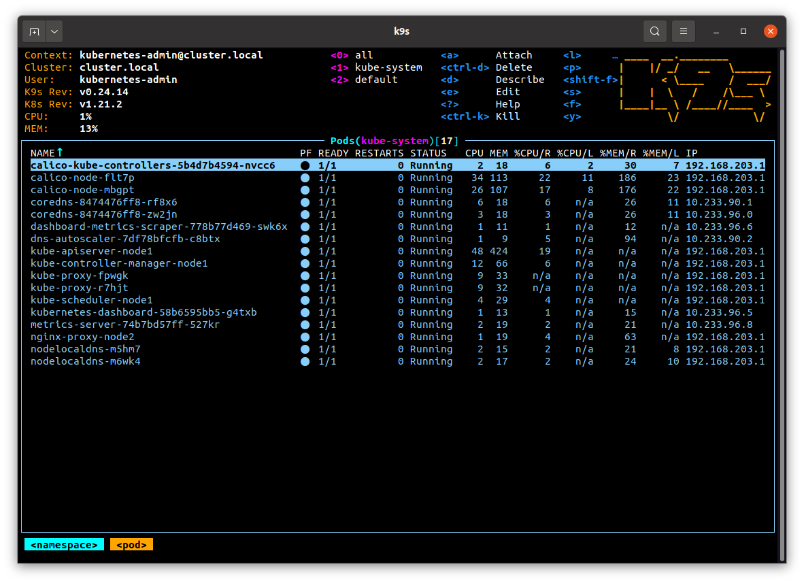

# Kubernetes installation

## Setup kubectl for local run (aliases)

```bash
alias k=kubectl
alias kdel='kubectl delete'
alias kdelf='kubectl delete -f'
alias kgpall='kubectl get pods --all-namespaces'
alias kgs='kubectl get svc'
alias kgsa='kubectl get svc --all-namespaces'
alias kgns='kubectl get namespaces'

~ [ kgpall                                                                                   ] 6:19 
NAMESPACE     NAME                                         READY   STATUS    RESTARTS   AGE
kube-system   calico-kube-controllers-5b4d7b4594-nvcc6     1/1     Running   0          2d1h
kube-system   calico-node-flt7p                            1/1     Running   0          2d1h
kube-system   calico-node-mbgpt                            1/1     Running   0          2d1h
kube-system   coredns-8474476ff8-rf8x6                     1/1     Running   0          2d1h
kube-system   coredns-8474476ff8-zw2jn                     1/1     Running   0          2d1h
kube-system   dashboard-metrics-scraper-778b77d469-swk6x   1/1     Running   0          45h
kube-system   dns-autoscaler-7df78bfcfb-c8btx              1/1     Running   0          2d1h
kube-system   kube-apiserver-node1                         1/1     Running   0          2d1h
kube-system   kube-controller-manager-node1                1/1     Running   0          2d1h
kube-system   kube-proxy-fpwgk                             1/1     Running   0          2d1h
kube-system   kube-proxy-r7hjt                             1/1     Running   0          2d1h
kube-system   kube-scheduler-node1                         1/1     Running   0          2d1h
kube-system   kubernetes-dashboard-58b6595bb5-g4txb        1/1     Running   0          45h
kube-system   metrics-server-74b7bd57ff-527kr              1/1     Running   0          45h
kube-system   nginx-proxy-node2                            1/1     Running   0          2d1h
kube-system   nodelocaldns-m5hm7                           1/1     Running   0          2d1h
kube-system   nodelocaldns-m6wk4                           1/1     Running   0          2d1h
```

## Make print-screen of k9s with pods in kube-system namespace

