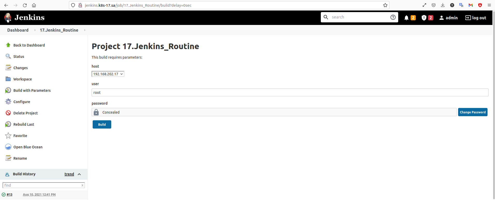

# 17.Jenkins.Routine

1. Task with the following steps:
   * Parameters: host IP and credentials
   * Check connection to the host
   * Install/upgrade nmap
   * Checks all online hosts
   * Remove nmap
   * Print list of collected/online hosts

## Screenshot of jenkins task



## Console Output
```bash
Started by user admin
Running as SYSTEM
Building in workspace /var/jenkins_home/workspace/17.Jenkins_Routine
[17.Jenkins_Routine] $ /bin/bash /tmp/jenkins2270989093858811265.sh
====================STARTIN TASK 17.Jenkins.Routine========================
PING 192.168.202.17 (192.168.202.17) 56(84) bytes of data.
64 bytes from 192.168.202.17: icmp_seq=1 ttl=63 time=1.46 ms
64 bytes from 192.168.202.17: icmp_seq=2 ttl=63 time=0.277 ms
64 bytes from 192.168.202.17: icmp_seq=3 ttl=63 time=0.244 ms
64 bytes from 192.168.202.17: icmp_seq=4 ttl=63 time=0.331 ms

--- 192.168.202.17 ping statistics ---
4 packets transmitted, 4 received, 0% packet loss, time 33ms
rtt min/avg/max/mdev = 0.244/0.577/1.458/0.509 ms
==========================CONNECTING TO THE HOST===========================
Pseudo-terminal will not be allocated because stdin is not a terminal.
Warning: Permanently added '192.168.202.17' (ECDSA) to the list of known hosts.

==========================INSTALLING nmap==================================

Loaded plugins: fastestmirror
Loading mirror speeds from cached hostfile
 * base: mirror.datacenter.by
 * epel: mirror.yandex.ru
 * extras: mirror.datacenter.by
 * updates: mirror.datacenter.by

Resolving Dependencies
--> Running transaction check
---> Package nmap.x86_64 2:6.40-19.el7 will be installed

--> Finished Dependency Resolution

Dependencies Resolved

================================================================================
 Package        Arch             Version                   Repository      Size
================================================================================
Installing:
 nmap           x86_64           2:6.40-19.el7             base           3.9 M

Transaction Summary
================================================================================
Install  1 Package

Total download size: 3.9 M
Installed size: 16 M
Downloading packages:

Running transaction check
Running transaction test

Transaction test succeeded
Running transaction

  Installing : 2:nmap-6.40-19.el7.x86_64                                    1/1 

  Verifying  : 2:nmap-6.40-19.el7.x86_64                                    1/1 

Installed:
  nmap.x86_64 2:6.40-19.el7                                                     

Complete!
==========================SCANNING PORTS===================================

==========================PORTS SCAN COMPLETE==============================
==========================REMOVING nmap====================================

Loaded plugins: fastestmirror
Resolving Dependencies
--> Running transaction check
---> Package nmap.x86_64 2:6.40-19.el7 will be erased
--> Finished Dependency Resolution

Dependencies Resolved

================================================================================
 Package        Arch             Version                  Repository       Size
================================================================================
Removing:
 nmap           x86_64           2:6.40-19.el7            @base            16 M

Transaction Summary
================================================================================
Remove  1 Package

Installed size: 16 M
Downloading packages:
Running transaction check
Running transaction test
Transaction test succeeded
Running transaction

  Erasing    : 2:nmap-6.40-19.el7.x86_64                                    1/1 

  Verifying  : 2:nmap-6.40-19.el7.x86_64                                    1/1 

Removed:
  nmap.x86_64 2:6.40-19.el7                                                     

Complete!
==========================REMOVING nmap COMPLETE===========================

Starting Nmap 6.40 ( http://nmap.org ) at 2021-08-10 12:57 UTC
Nmap scan report for local-cent.site (192.168.202.17)
Host is up (0.0000070s latency).
Not shown: 998 closed ports
PORT   STATE SERVICE
22/tcp open  ssh
80/tcp open  http

Nmap scan report for local-deb.site (192.168.202.18)
Host is up (0.000010s latency).
Not shown: 997 closed ports
PORT    STATE SERVICE
22/tcp  open  ssh
80/tcp  open  http
111/tcp open  rpcbind
MAC Address: 3A:B6:F5:27:AD:A3 (Unknown)

Nmap done: 2 IP addresses (2 hosts up) scanned in 3.90 seconds
Finished: SUCCESS

```