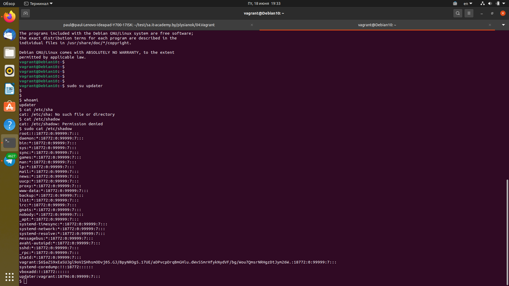
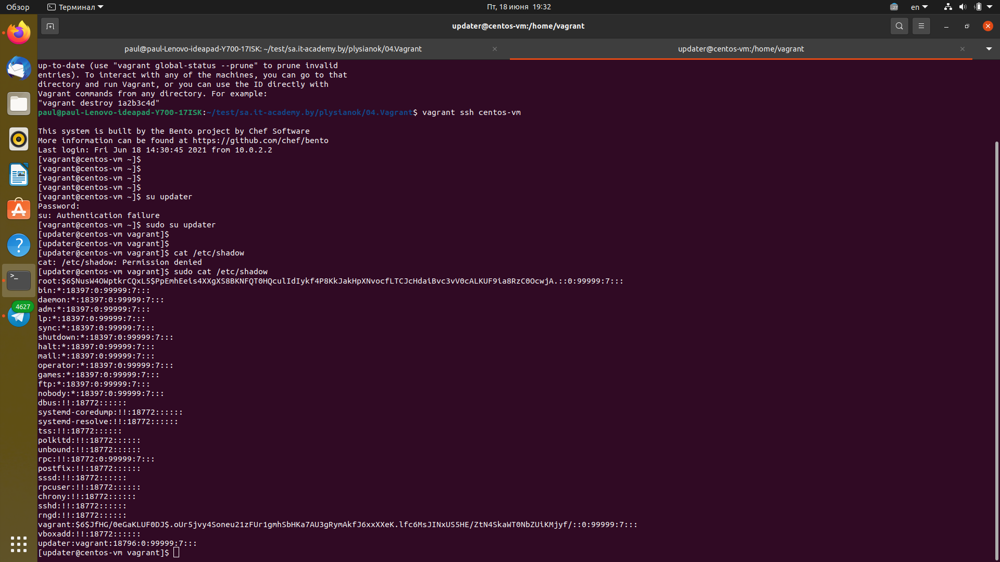

# 04 Vagrant
## Create guest hosts
---
```bash
Vagrant.configure("2") do |config|
  config.vm.define "debian-10" do |vm1|
    vm1.vm.hostname = "Debian10"
    vm1.vm.box = "bento/debian-10"
    vm1.vm.network "public_network", ip: "192.168.100.200"
    
    vm1.vm.provider "virtualbox" do |vb|
      vb.name = "debian10-vm"
      vb.gui = false
      vb.memory = "1024"
    end

    vm1.vm.provision "shell", run: "always", inline: <<-SHELL
        apt-get install -y vim git wget curl
        sudo useradd updater -p vagrant
        cat /etc/passwd | grep updater 
	sudo bash -c "echo 'updater ALL=(ALL:ALL) NOPASSWD: ALL'>> /etc/sudoers"
	echo "Added user"
	
    SHELL
  end

  config.vm.define "centos-vm" do |vm2|
    vm2.vm.hostname = "centos-vm"
    vm2.vm.box = "bento/centos-8"
    vm2.vm.network "public_network", ip: "192.168.100.201"
    
    vm2.vm.provider "virtualbox" do |vb|
      vb.name = "centos-vm"
      vb.gui = false
      vb.memory = "1024"
    end

    vm2.vm.provision "shell", run: "always", inline: <<-SHELL
        yum install -y vim git wget curl
	adduser updater -p vagrant
	echo "updater ALL=(ALL:ALL) NOPASSWD: ALL" >> /etc/sudoers
    SHELL
  end
  
end
```
---
## Create user in Debian 10

---
```bash
sudo useradd updater -p vagrant
```
## Create user in CentOS
---
```bash
adduser updater -p vagrant
```
---
## User updater able to run any SUDO command without password:
### Debian10
---
```bash
sudo bash -c "echo 'updater ALL=(ALL:ALL) NOPASSWD: ALL'>> /etc/sudoers"
```

---
### CentOS
---
```bash
echo "updater ALL=(ALL:ALL) NOPASSWD: ALL" >> /etc/sudoers
```


---
## Install packages: vim, wget, curl

---
```bash
yum install -y vim git wget curl
apt-get install -y vim git wget curl
```
---
## Push boxes to Vagrant cloud

---
```bash
# Create box CentOS8
vagrant package centos-vm --output centos8_nosudo.box
# Create box Debian10
vagrant package debian-10 --output debian10_nosudo.box
# Login from cli in Vagrant Cloud
# Enter token description
# Push in Cloud Vagrant
vagrant cloud publish --release WESTnik/debian-10 1.0.0 virtualbox debian10_nosudo.box
#
vagrant cloud publish --release WESTnik/centos-vm 1.0.0 virtualbox centos8_nosudo.box
```

[Debian10](https://app.vagrantup.com/WESTnik/boxes/debian-10)

[CentOS8](https://app.vagrantup.com/WESTnik/boxes/centos-vm)

---