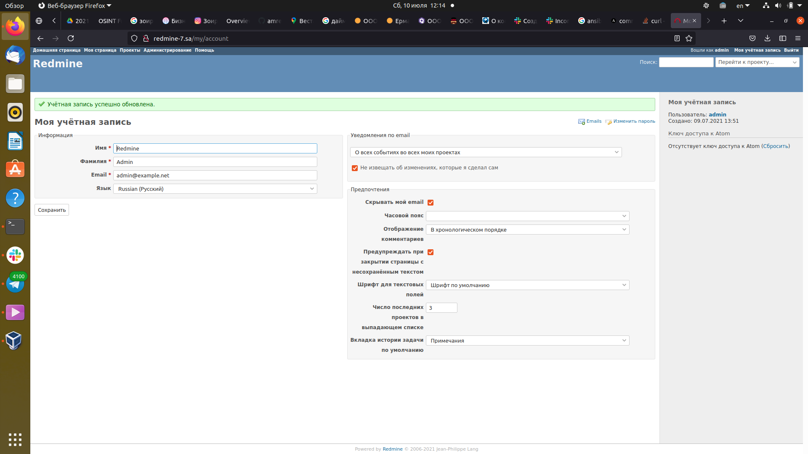
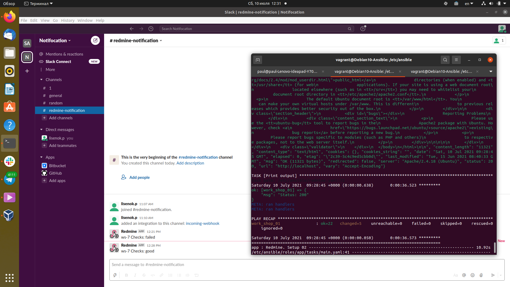

# 08.Ansible.Workshop
---
## Results Ansible playbook
```bash
vagrant@Debian10-Ansible:/etc/ansible$ ansible-playbook redmine.yaml -v
Using /etc/ansible/ansible.cfg as config file
[WARNING]: An error occurred while calling ansible.utils.display.initialize_locale (unsupported locale setting). This may result in incorrectly calculated text widths that can cause Display to print
incorrect line lengths

PLAY [work_shop_01] **********************************************************************************************************************************************

TASK [Gathering Facts] ***********************************************************************

Saturday 10 July 2021  09:34:23 +0000 (0:00:00.017)       0:00:00.017 ********* 
ok: [work_shop_01]

TASK [debug] ***********************************************************************

Saturday 10 July 2021  09:34:26 +0000 (0:00:02.953)       0:00:02.971 ********* 
ok: [work_shop_01] => {
    "msg": "192.168.201.7"
}

TASK [Output hostname] ***********************************************************************

Saturday 10 July 2021  09:34:26 +0000 (0:00:00.050)       0:00:03.021 ********* 
changed: [work_shop_01] => {"changed": true, "cmd": "hostname", "delta": "0:00:00.002829", "end": "2021-07-10 09:34:27.211753", "rc": 0, "start": "2021-07-10 09:34:27.208924", "stderr": "", "stderr_lines": [], "stdout": "ws-7", "stdout_lines": ["ws-7"]}

TASK [debug] ***********************************************************************

Saturday 10 July 2021  09:34:27 +0000 (0:00:00.643)       0:00:03.664 ********* 
ok: [work_shop_01] => {
    "msg": "ws-7"
}

TASK [Install packages for db and application] ***********************************************************************

Saturday 10 July 2021  09:34:27 +0000 (0:00:00.032)       0:00:03.696 ********* 
ok: [work_shop_01] => {"cache_update_time": 1625907455, "cache_updated": false, "changed": false}

TASK [mysql_db : mysql_db] ***********************************************************************

Saturday 10 July 2021  09:34:29 +0000 (0:00:01.895)       0:00:05.592 ********* 
ok: [work_shop_01] => {"changed": false, "db": "redmine", "db_list": ["redmine"], "executed_commands": []}

TASK [mysql_db : mysql_user] ***********************************************************************

Saturday 10 July 2021  09:34:29 +0000 (0:00:00.731)       0:00:06.323 ********* 
ok: [work_shop_01] => {"censored": "the output has been hidden due to the fact that 'no_log: true' was specified for this result", "changed": false}

TASK [mysql_db : Config database] ***********************************************************************

Saturday 10 July 2021  09:34:30 +0000 (0:00:00.744)       0:00:07.068 ********* 
ok: [work_shop_01] => {"changed": false, "checksum": "e8e28ec062537929883ba0db4af3e80b32f38a48", "dest": "/opt/redmine/config/database.yml", "gid": 0, "group": "root", "mode": "0644", "owner": "root", "path": "/opt/redmine/config/database.yml", "size": 128, "state": "file", "uid": 0}

TASK [app : Redmine. Clone repository] ***********************************************************************

Saturday 10 July 2021  09:34:31 +0000 (0:00:01.182)       0:00:08.250 ********* 
ok: [work_shop_01] => {"after": "88b8aee5ef69fc95f523ae7a31fe7c6070584365", "before": "88b8aee5ef69fc95f523ae7a31fe7c6070584365", "changed": false}

TASK [app : Redmine. Change permissions] ***********************************************************************

Saturday 10 July 2021  09:34:32 +0000 (0:00:00.715)       0:00:08.966 ********* 
ok: [work_shop_01] => {"changed": false, "gid": 33, "group": "www-data", "mode": "0755", "owner": "www-data", "path": "/opt/redmine/public", "size": 4096, "state": "directory", "uid": 33}

TASK [app : Redmine. Change permissions] ***********************************************************************

Saturday 10 July 2021  09:34:33 +0000 (0:00:00.702)       0:00:09.668 ********* 
ok: [work_shop_01] => {"changed": false, "gid": 0, "group": "root", "mode": "0777", "owner": "root", "path": "/opt/redmine/tmp", "size": 4096, "state": "directory", "uid": 0}

TASK [app : Redmine. Setup 01] ***********************************************************************

Saturday 10 July 2021  09:34:33 +0000 (0:00:00.619)       0:00:10.288 ********* 
changed: [work_shop_01] => {"changed": true, "cmd": "gem install bundler\nbundle update   \n", ""]}

TASK [app : Session store secret generation] ***********************************************************************

Saturday 10 July 2021  09:34:44 +0000 (0:00:10.403)       0:00:20.692 ********* 
ok: [work_shop_01] => {"changed": false, "cmd": "rake generate_secret_token", "rc": 0, "stdout": "skipped, since /opt/redmine/config/initializers/secret_token.rb exists", "stdout_lines": ["skipped, since /opt/redmine/config/initializers/secret_token.rb exists"]}

TASK [app : Redmine. Setup 02] ***********************************************************************

Saturday 10 July 2021  09:34:44 +0000 (0:00:00.573)       0:00:21.266 ********* 
changed: [work_shop_01] => {"changed": true, "cmd": "bundle exec rake db:migrate RAILS_ENV=production \nbundle exec rake redmine:plugins:migrate RAILS_ENV=production\nbundle install --without development test\nRAILS_ENV=production rake db:migrate\nRAILS_ENV=production REDMINE_LANG='ru' rake redmine:load_default_data\n"]}

TASK [app : Configuration files for virtualhost] ***********************************************************************

Saturday 10 July 2021  09:34:55 +0000 (0:00:11.029)       0:00:32.295 ********* 
ok: [work_shop_01] => {"changed": false, "checksum": "52053fd86fa9ff265548eebb37e710e734d0ea5c", "dest": "/etc/apache2/sites-enabled/redmine.site.conf", "gid": 0, "group": "root", "mode": "0644", "owner": "root", "path": "/etc/apache2/sites-enabled/redmine.site.conf", "size": 227, "state": "file", "uid": 0}

TASK [app : meta] ***********************************************************************

Saturday 10 July 2021  09:34:56 +0000 (0:00:00.968)       0:00:33.263 ********* 

TASK [Add redmine-7.sa to host file] ***********************************************************************

Saturday 10 July 2021  09:34:56 +0000 (0:00:00.056)       0:00:33.320 ********* 
changed: [work_shop_01] => {"changed": true, "cmd": "echo \"127.0.0.1       redmine-7.sa\" >> /etc/hosts", "delta": "0:00:00.002532", "end": "2021-07-10 09:34:57.467400", "rc": 0, "start": "2021-07-10 09:34:57.464868", "stderr": "", "stderr_lines": [], "stdout": "", "stdout_lines": []}

TASK [uri] ***********************************************************************

Saturday 10 July 2021  09:34:57 +0000 (0:00:00.618)       0:00:33.938 ********* 
ok: [work_shop_01] => {"cache_control": "max-age=0, private, must-revalidate", "changed": false, "connection": "close", "content": "<!DOCTYPE html>\n<html lang=\"en\">\n<head>\n<meta charset=\"utf-8\" />\n<meta http-equiv=\"X-UA-Compatible\."}

TASK [lineinfile] ***********************************************************************

Saturday 10 July 2021  09:34:58 +0000 (0:00:00.758)       0:00:34.696 ********* 
changed: [work_shop_01] => {"backup": "", "changed": true, "found": 1, "msg": "1 line(s) removed"}

TASK [Check connection to host] ***********************************************************************

Saturday 10 July 2021  09:34:59 +0000 (0:00:00.678)       0:00:35.375 ********* 
ok: [work_shop_01] => {"changed": false, "elapsed": 0, "match_groupdict": {}, "match_groups": [], "path": null, "port": 80, "search_regex": null, "state": "started"}

TASK [Slack notofocation] ***********************************************************************

Saturday 10 July 2021  09:34:59 +0000 (0:00:00.639)       0:00:36.014 ********* 
ok: [work_shop_01] => {"changed": false, "msg": "OK"}

TASK [Test] ***********************************************************************

Saturday 10 July 2021  09:35:00 +0000 (0:00:01.180)       0:00:37.195 ********* 
ok: [work_shop_01] => {"accept_ranges": "bytes", "changed": false, "connection": "close", "content": "\n<!DOCTYPE html PUBLIC \"-//W3C//DTD XHTML 1.0 Transitional//EN\" \"http://www.w3.org/TR/xhtml1/DTD/xhtml1-transitional.dtd\">\n<html xmlns=\"http://www.w3.org/1999/xhtml\">\n  <!--\n    Modified from the Debian original for Ubuntu\n    Last updated: 2014-03-19\n    See: https://launchpad.net/bugs/1288690\n  -->\n  <head>\n    the\n                Apache2 package with Ubuntu. However, check <a\n                href=\"https://bugs.launchpad.net/ubuntu/+source/apache2\">existing\n                bug reports</a> before reporting a new bug.\n          </p>\n          <p>\n                Please report bugs specific to modules (such as PHP and others)\n                to respective packages, not to the web server itself.\n          </p>\n        </div>\n\n\n\n\n      </div>\n    </div>\n    <div class=\"validator\">\n    </div>\n  </body>\n</html>\n\n", "content_length": "11321", "content_type": "text/html", "cookies": {}, "cookies_string": "", "date": "Sat, 10 Jul 2021 09:35:01 GMT", "elapsed": 0, "etag": "\"2c39-5c4c9ed5cbb0d\"", "last_modified": "Tue, 15 Jun 2021 08:40:33 GMT", "msg": "OK (11321 bytes)", "redirected": false, "server": "Apache/2.4.18 (Ubuntu)", "status": 200, "url": "http://localhost", "vary": "Accept-Encoding"}

TASK [Print output] ***********************************************************************

Saturday 10 July 2021  09:35:01 +0000 (0:00:00.606)       0:00:37.801 ********* 
ok: [work_shop_01] => {
    "msg": "Status: 200"
}

PLAY RECAP ***********************************************************************

work_shop_01               : ok=22   changed=5    unreachable=0    failed=0    skipped=0    rescued=0    ignored=0   

Saturday 10 July 2021  09:35:01 +0000 (0:00:00.048)       0:00:37.850 ********* 
=============================================================================== 
app : Redmine. Setup 02 ----------------------------------------- 11.03s
app : Redmine. Setup 01 ----------------------------------------- 10.40s
Gathering Facts --------------------------------  ---------------- 2.95s
Install packages for db and application -------------------------- 1.90s
mysql_db : Config database --------------------------------------- 1.18s
Slack notofocation ----------------------------------------------- 1.18s
app : Configuration files for virtualhost ------------------------ 0.97s
uri ---------------------------------------------------------------0.76s
mysql_db : mysql_user -------------------------------------------- 0.74s
mysql_db : mysql_db ---------------------------------------------- 0.73s
app : Redmine. Clone repository ---------------------------------- 0.72s
app : Redmine. Change permissions -------------------------------- 0.70s
lineinfile ------------------------------------------------------- 0.68s
Output hostname -------------------------------------------------- 0.64s
Check connection to host ----------------------------------------- 0.64s
app : Redmine. Change permissions -------------------------------- 0.62s
Add redmine-7.sa to host file ------------------------------------ 0.62s
Test ------------------------------------------------------------- 0.61s
app : Session store secret generation ---------------------------- 0.57s
app : meta ------------------------------------------------------- 0.06s
Playbook run took 0 days, 0 hours, 0 minutes, 37 seconds
```
---
## Screenshots:
---
### Installed Redmine


---
### Slack notification
---


---