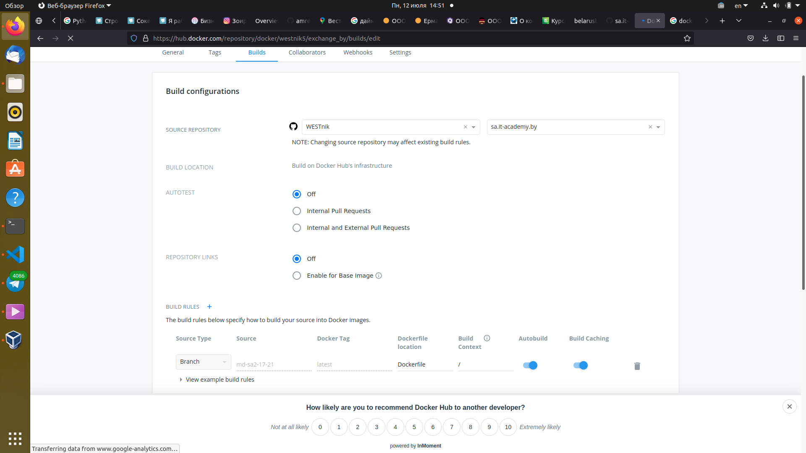

# 09.Docker
## Create Dockerfile
---
```bash
FROM python:3.8-alpine3.13

RUN pip install requests

RUN apk add --update --no-cache netcat-openbsd

COPY exchange.py /

CMD [ "python", "./exchange.py" ]

EXPOSE 2021
```
### Run docker: 
```bash
docker run -it -d --network host exchange:v.1.0
```
---
Create python application - any port listener from API ASB Belarusbank for exchange rate in the entered city on Russian

```bash
#exchange.py
import socket
import requests
serv_sock = socket.socket(socket.AF_INET, socket.SOCK_STREAM, proto=0)
serv_sock.bind(('localhost', 2021))
serv_sock.listen(10)

while True:
    # Wait connection
    client_sock, client_addr = serv_sock.accept()
    print('Currency exchange rate on today. Please enter you city in Russian')

    while True:
        # While client connected, read receive city and responce rate from bank
        data = client_sock.recv(1024)
        URL = 'https://belarusbank.by/api/kursExchange?city=' + data.decode('utf-8').strip()
        r = requests.get(URL).text.encode('utf-8')
        if not data:
            # Client disabled
            break
        client_sock.sendall(r)

    client_sock.close()
```
---
## Run image as container and test it 
---


---

## Add automated build for that image to Dockerhub using Github <=> Dockerhub integration

---
### Settings




---
[Docker Hub](https://hub.docker.com/repository/docker/westnik5/exchange_by)

