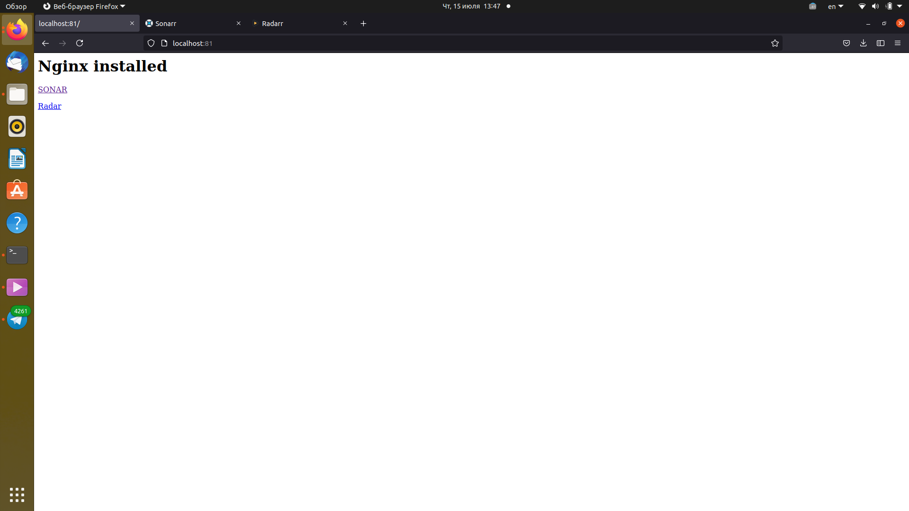

# 10. Docker-compose, terraform
## Create docker compose file which contains the following applications:
---
    Web server (with links to the Web apps, see below)
    sonarr
    radarr
    All settings for this applications should be added during docker-compose start from folder of project
---
## docker-compose.yaml
```bash
version: "3.4"
services:
  nginx:
    image: nginx:latest
    container_name: nginx
    depends_on:
      - sonarr
      - radarr
    volumes:
      - ./:/usr/share/nginx/html
    ports:
      - 81:80
    restart: always
  sonarr:
    image: ghcr.io/linuxserver/sonarr
    container_name: sonarr
    environment:
      - PUID=1000
      - PGID=1000
      - TZ=Europe/London
    volumes:
      - ./sonarr/data:/config
      - ./sonarr/tvseries:/tv
      - ./sonarr/downloadclient-downloads:/downloads
    ports:
      - 8989:8989
    restart: unless-stopped
  radarr:
    image: ghcr.io/linuxserver/radarr
    container_name: radarr
    environment:
      - PUID=1000
      - PGID=1000
      - TZ=Europe/London
    volumes:
      - ./radarr/data:/config
      - ./radarr/movies:/movies
      - ./radarr/downloadclient-downloads:/downloads
    ports:
      - 7878:7878
    restart: unless-stopped
```
---
## Use terraform approach, convert your docker compose file to terraform infrastructure code
```bash
terraform {
  required_providers {
    docker = {
      source  = "kreuzwerker/docker"
      ##version = "2.14.0"
    }
  }
}

provider "docker" {}

resource "docker_image" "nginx" {
  name = "nginx:latest"
}

resource "docker_image" "sonarr" {
  name = "ghcr.io/linuxserver/sonarr"
}

resource "docker_image" "radarr" {
  name = "ghcr.io/linuxserver/radarr"
}

resource "docker_volume" "sonarr_config" {
  name = "sonarr_config"
}
resource "docker_volume" "sonarr_tv" {
  name = "sonarr_tv"
}
resource "docker_volume" "sonarr_downloads" {
  name = "sonarr_downloads"
}
resource "docker_volume" "radarr_config" {
    name = "radarr_config"
}
resource "docker_volume" "radarr_movies" {
    name = "radarr_movies"
}
resource "docker_volume" "radarr_downloads" {
    name = "radarr_download"
}

resource "docker_container" "nginx" {
    image = "${docker_image.nginx.latest}"
    name = "nginx"
    restart = "always"
    depends_on = [docker_container.sonarr, docker_container.radarr]
    ports {
      internal = 80
      external = 81
  }
    volumes {
      host_path      = "/home/paul/work/it-academy/New_version/sa.it-academy.by/plysianok/10.Docker_compose_terraform/"
      container_path = "/usr/share/nginx/html"
      read_only      = false
  }  
}

resource "docker_container" "sonarr" {
    image = "${docker_image.sonarr.latest}"
    name = "sonarr"
    restart = "unless-stopped"
    ports {
      internal = 8989
      external = 8989
  }
    volumes {
      volume_name    = docker_volume.sonarr_config.name
      host_path = "/home/paul/work/it-academy/New_version/sa.it-academy.by/plysianok/10.Docker_compose_terraform/sonarr/data"
      container_path = "/config"
      read_only      = false
  }
    volumes {
      volume_name    = docker_volume.sonarr_tv.name
      host_path = "/home/paul/work/it-academy/New_version/sa.it-academy.by/plysianok/10.Docker_compose_terraform/sonarr/tvseries"
      container_path = "/tv" #optional
      read_only      = false
  }
    volumes {
      volume_name    = docker_volume.sonarr_downloads.name
      host_path = "/home/vit/Work/10.Docker.Compose/sonarr/downloadclient-downloads"
      container_path = "/downloads"
      read_only      = false
  }
}

resource "docker_container" "radarr" {
    image = "${docker_image.radarr.latest}"
    name = "radarr"
    restart = "unless-stopped"
    ports {
      internal = 7878
      external = 7878
  }
    volumes {
      volume_name    = docker_volume.radarr_config.name
      host_path = "/home/paul/work/it-academy/New_version/sa.it-academy.by/plysianok/10.Docker_compose_terraform/radarr/data"
      container_path = "/config"
      read_only      = false
  }
    volumes {
      volume_name    = docker_volume.radarr_movies.name
      host_path = "/home/paul/work/it-academy/New_version/sa.it-academy.by/plysianok/10.Docker_compose_terraform/movies"
      container_path = "/tv"
      read_only      = false
  }
    volumes {
      volume_name    = docker_volume.radarr_downloads.name
      host_path = "/home/paul/work/it-academy/New_version/sa.it-academy.by/plysianok/10.Docker_compose_terraform/radarr/downloadclient-downloads"
      container_path = "/downloads"
      read_only      = false
  }
}

```
---

## Screenshots
### Deploy Nginx


---
### Deploy Sonarr


---
### Deploy Radarr


---