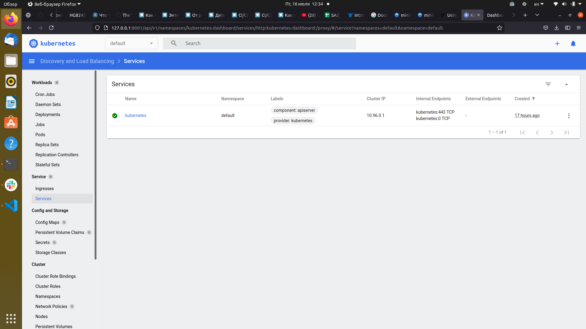

# 11. Kubernetes
## Minikube shell history
---
```bash

sudo curl -LO https://storage.googleapis.com/minikube/releases/latest/minikube-linux-amd64
sudo install minikube-linux-amd64 /usr/local/bin/minikube
minikube start
minikube status

minikube
type: Control Plane
host: Running
kubelet: Running
apiserver: Running
kubeconfig: Configured


minikube addons list
minikube addons enable dashboard
    ▪ Using image kubernetesui/metrics-scraper:v1.0.4
    ▪ Using image kubernetesui/dashboard:v2.1.0
💡  Some dashboard features require the metrics-server addon. To enable all features please run:

	minikube addons enable metrics-server	
🌟  The 'dashboard' addon is enabled

minikube addons enable ingress
    ▪ Using image k8s.gcr.io/ingress-nginx/controller:v0.44.0
    ▪ Using image docker.io/jettech/kube-webhook-certgen:v1.5.1
    ▪ Using image docker.io/jettech/kube-webhook-certgen:v1.5.1
🔎  Verifying ingress addon...
🌟  The 'ingress' addon is enabled
minikube addons enable metrics-server
    ▪ Using image k8s.gcr.io/metrics-server/metrics-server:v0.4.2
🌟  The 'metrics-server' addon is enabled

sudo snap install kubectl --classic
kubectl 1.21.1 от Canonical✓ установлен

kubectl proxy --address='0.0.0.0' --disable-filter=true
W0715 18:56:24.150857  658227 proxy.go:162] Request filter disabled, your proxy is vulnerable to XSRF attacks, please be cautious
Starting to serve on [::]:8001

minikube start --cpus=1 --memory=1024
minikube stop
minikube start --cpus=2 --memory=1024
minikube stop
minikube start --cpus=max --memory=max
minikube stop
minikube delete
```
## Minikube dashboard
---


---