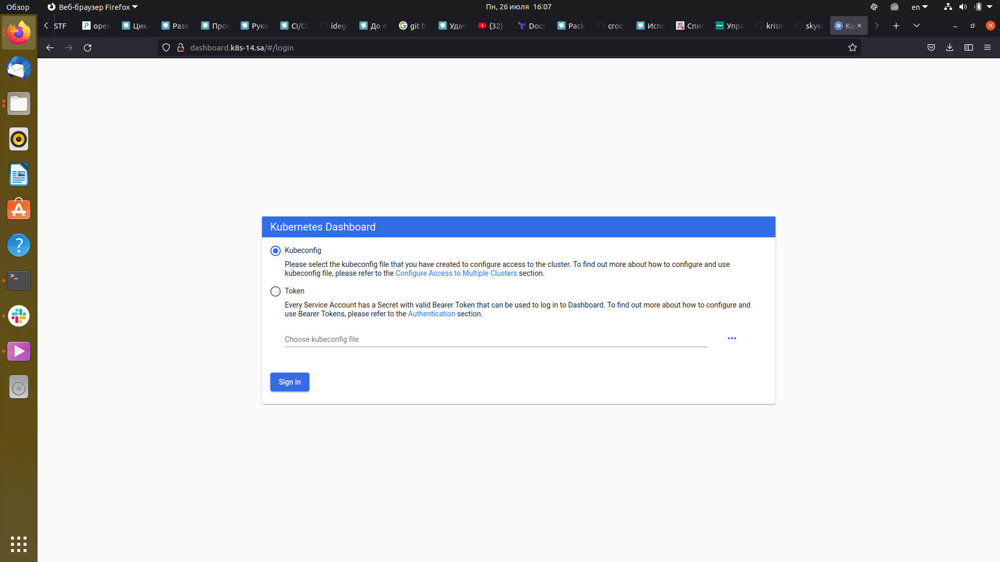
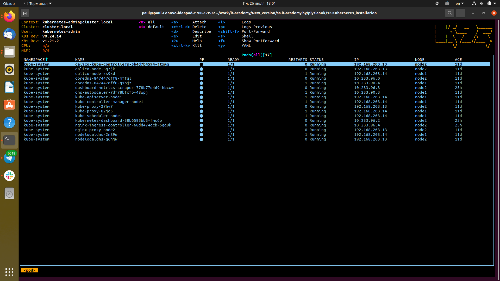

# 12.Kubernetes installation

---



---
### K8s alias
---
```bash
paul@paul-Lenovo-ideapad-Y700-17ISK:~/work/it-academy/New_version/sa.it-academy.by/plysianok/12.Kubernetes_installation$ alias
alias alert='notify-send --urgency=low -i "$([ $? = 0 ] && echo terminal || echo error)" "$(history|tail -n1|sed -e '\''s/^\s*[0-9]\+\s*//;s/[;&|]\s*alert$//'\'')"'
alias egrep='egrep --color=auto'
alias fgrep='fgrep --color=auto'
alias grep='grep --color=auto'
alias k='kubectl'
alias kdn='kubectl describe nodes'
alias kdp='kubectl describe pods --all-namespaces'
alias kga='kubectl get all'
alias kgn='kubectl get nodes --all-namespaces'
alias kgp='kubectl get pods --all-namespaces'
alias kgs='kubectl get services --all-namespaces'
```
---

### K9s

---


---