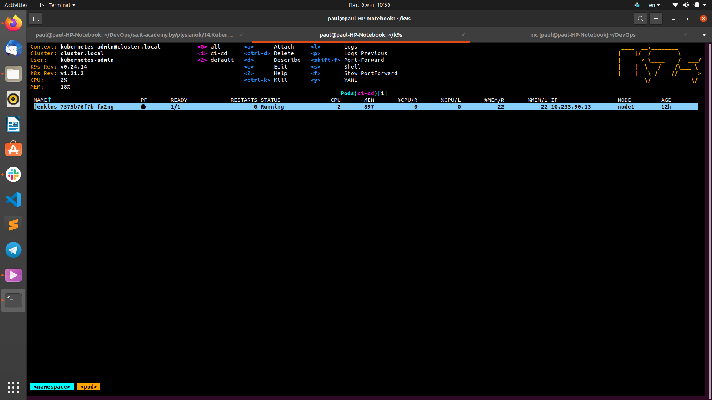
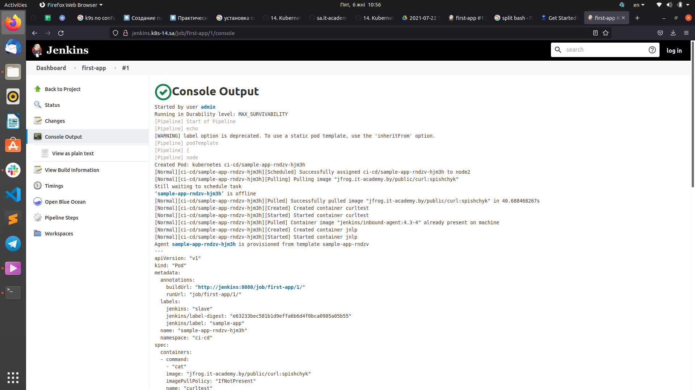

# 14.Kubernetes application deployment
---
## Jenkins deployment
---


---


---

## Console output runnig job

```bash
Started by user admin
Running in Durability level: MAX_SURVIVABILITY
[Pipeline] Start of Pipeline
[Pipeline] echo
[WARNING] label option is deprecated. To use a static pod template, use the 'inheritFrom' option.
[Pipeline] podTemplate
[Pipeline] {
[Pipeline] node
Created Pod: kubernetes ci-cd/sample-app-rndzv-hjm3h
[Normal][ci-cd/sample-app-rndzv-hjm3h][Scheduled] Successfully assigned ci-cd/sample-app-rndzv-hjm3h to node2
[Normal][ci-cd/sample-app-rndzv-hjm3h][Pulling] Pulling image "jfrog.it-academy.by/public/curl:spishchyk"
Still waiting to schedule task
‘sample-app-rndzv-hjm3h’ is offline
[Normal][ci-cd/sample-app-rndzv-hjm3h][Pulled] Successfully pulled image "jfrog.it-academy.by/public/curl:spishchyk" in 40.688468267s
[Normal][ci-cd/sample-app-rndzv-hjm3h][Created] Created container curltest
[Normal][ci-cd/sample-app-rndzv-hjm3h][Started] Started container curltest
[Normal][ci-cd/sample-app-rndzv-hjm3h][Pulled] Container image "jenkins/inbound-agent:4.3-4" already present on machine
[Normal][ci-cd/sample-app-rndzv-hjm3h][Created] Created container jnlp
[Normal][ci-cd/sample-app-rndzv-hjm3h][Started] Started container jnlp
Agent sample-app-rndzv-hjm3h is provisioned from template sample-app-rndzv
---
apiVersion: "v1"
kind: "Pod"
metadata:
  annotations:
    buildUrl: "http://jenkins:8080/job/first-app/1/"
    runUrl: "job/first-app/1/"
  labels:
    jenkins: "slave"
    jenkins/label-digest: "e63233bec581b1d9effa6b6d4f0bca0985a05b55"
    jenkins/label: "sample-app"
  name: "sample-app-rndzv-hjm3h"
  namespace: "ci-cd"
spec:
  containers:
  - command:
    - "cat"
    image: "jfrog.it-academy.by/public/curl:spishchyk"
    imagePullPolicy: "IfNotPresent"
    name: "curltest"
    tty: true
    volumeMounts:
    - mountPath: "/home/jenkins/agent"
      name: "workspace-volume"
      readOnly: false
  - env:
    - name: "JENKINS_SECRET"
      value: "********"
    - name: "JENKINS_AGENT_NAME"
      value: "sample-app-rndzv-hjm3h"
    - name: "JENKINS_NAME"
      value: "sample-app-rndzv-hjm3h"
    - name: "JENKINS_AGENT_WORKDIR"
      value: "/home/jenkins/agent"
    - name: "JENKINS_URL"
      value: "http://jenkins:8080/"
    image: "jenkins/inbound-agent:4.3-4"
    name: "jnlp"
    resources:
      limits: {}
      requests:
        memory: "256Mi"
        cpu: "100m"
    volumeMounts:
    - mountPath: "/home/jenkins/agent"
      name: "workspace-volume"
      readOnly: false
  nodeSelector:
    kubernetes.io/os: "linux"
  restartPolicy: "Always"
  volumes:
  - emptyDir:
      medium: ""
    name: "workspace-volume"

Running on sample-app-rndzv-hjm3h in /home/jenkins/agent/workspace/first-app
[Pipeline] {
[Pipeline] stage
[Pipeline] { (Test)
[Pipeline] container
[Pipeline] {
[Pipeline] sh
+ curl --version
curl 7.77.0 (x86_64-alpine-linux-musl) libcurl/7.77.0 OpenSSL/1.1.1k zlib/1.2.11 brotli/1.0.9 nghttp2/1.43.0
Release-Date: 2021-05-26
Protocols: dict file ftp ftps gopher gophers http https imap imaps mqtt pop3 pop3s rtsp smb smbs smtp smtps telnet tftp 
Features: alt-svc AsynchDNS brotli HSTS HTTP2 HTTPS-proxy IPv6 Largefile libz NTLM NTLM_WB SSL TLS-SRP UnixSockets
[Pipeline] }
[Pipeline] // container
[Pipeline] }
[Pipeline] // stage
[Pipeline] }
[Pipeline] // node
[Pipeline] }
[Pipeline] // podTemplate
[Pipeline] End of Pipeline
Finished: SUCCESS
```


