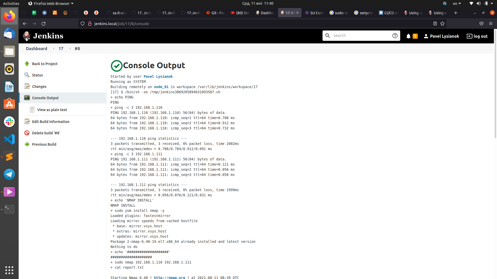

# 17.Jenkins.Routine

1. Task with the following steps:
   * Parameters: host IP and credentials
   * Check connection to the host
   * Install/upgrade nmap
   * Checks all online hosts
   * Remove nmap
   * Print list of collected/online hosts

## Screen runnin job
---


## Console uotput Jenkins job

```bash
Started by user Pavel Lysianok
Running as SYSTEM
Building remotely on node_01 in workspace /var/lib/jenkins/workspace/17
[17] $ /bin/sh -xe /tmp/jenkins3869205894631093507.sh
+ echo PING
PING
+ ping -c 3 192.168.1.110
PING 192.168.1.110 (192.168.1.110) 56(84) bytes of data.
64 bytes from 192.168.1.110: icmp_seq=1 ttl=64 time=0.708 ms
64 bytes from 192.168.1.110: icmp_seq=2 ttl=64 time=0.912 ms
64 bytes from 192.168.1.110: icmp_seq=3 ttl=64 time=0.732 ms

--- 192.168.1.110 ping statistics ---
3 packets transmitted, 3 received, 0% packet loss, time 2002ms
rtt min/avg/max/mdev = 0.708/0.784/0.912/0.091 ms
+ ping -c 3 192.168.1.111
PING 192.168.1.111 (192.168.1.111) 56(84) bytes of data.
64 bytes from 192.168.1.111: icmp_seq=1 ttl=64 time=0.121 ms
64 bytes from 192.168.1.111: icmp_seq=2 ttl=64 time=0.056 ms
64 bytes from 192.168.1.111: icmp_seq=3 ttl=64 time=0.058 ms

--- 192.168.1.111 ping statistics ---
3 packets transmitted, 3 received, 0% packet loss, time 1999ms
rtt min/avg/max/mdev = 0.056/0.078/0.121/0.031 ms
+ echo 'NMAP INSTALL'
NMAP INSTALL
+ sudo yum install nmap -y
Loaded plugins: fastestmirror
Loading mirror speeds from cached hostfile
 * base: mirror.vsys.host
 * extras: mirror.vsys.host
 * updates: mirror.vsys.host
Package 2:nmap-6.40-19.el7.x86_64 already installed and latest version
Nothing to do
+ echo '####################'
####################
+ sudo nmap 192.168.1.110 192.168.1.111
+ cat report.txt

Starting Nmap 6.40 ( http://nmap.org ) at 2021-08-11 08:39 UTC
Nmap scan report for jenkins.local (192.168.1.110)
Host is up (0.00063s latency).
Not shown: 996 closed ports
PORT     STATE SERVICE
22/tcp   open  ssh
80/tcp   open  http
111/tcp  open  rpcbind
8080/tcp open  http-proxy
MAC Address: 08:00:27:27:CC:16 (Cadmus Computer Systems)

Nmap scan report for 192.168.1.111 (192.168.1.111)
Host is up (0.000014s latency).
Not shown: 998 closed ports
PORT    STATE SERVICE
22/tcp  open  ssh
111/tcp open  rpcbind

Nmap done: 2 IP addresses (2 hosts up) scanned in 3.25 seconds
+ echo 'Uninstall nmap from node'
Uninstall nmap from node
+ sudo yum remove nmap -y
Loaded plugins: fastestmirror
Resolving Dependencies
--> Running transaction check
---> Package nmap.x86_64 2:6.40-19.el7 will be erased
--> Finished Dependency Resolution

Dependencies Resolved

================================================================================
 Package        Arch             Version                  Repository       Size
================================================================================
Removing:
 nmap           x86_64           2:6.40-19.el7            @base            16 M

Transaction Summary
================================================================================
Remove  1 Package

Installed size: 16 M
Downloading packages:
Running transaction check
Running transaction test
Transaction test succeeded
Running transaction
  Erasing    : 2:nmap-6.40-19.el7.x86_64                                    1/1 
  Verifying  : 2:nmap-6.40-19.el7.x86_64                                    1/1 

Removed:
  nmap.x86_64 2:6.40-19.el7                                                     

Complete!
Finished: SUCCESS
```

---