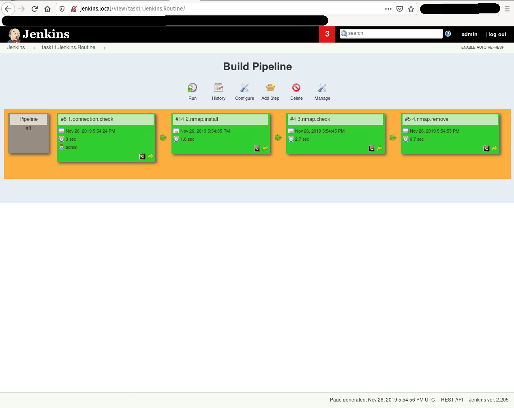

# 11. Jenkins. Routine
## Virtual environment (VirtualBox internal network)
host 1: hq, 192.168.6.9 (from task 05)
host 2: slave1, 192.168.6.10 (from task 05, has firewall enabled)
host 3: slave2, 192.168.6.11 (from task 05)
host 4: jenkins_master, 192.168.6.12 (from task 10)
host 5: jenkins_node, 192.168.6.13 (from task 10)
## Task pipeline view

## 1.connection.check log
```
Started by user admin
Running as SYSTEM
Building on master in workspace /var/lib/jenkins/workspace/1.connection.check
[1.connection.check] $ /bin/sh -xe /tmp/jenkins5847895921744024686.sh
+ ping -c 4 192.168.6.13
PING 192.168.6.13 (192.168.6.13) 56(84) bytes of data.
64 bytes from 192.168.6.13: icmp_seq=1 ttl=64 time=0.230 ms
64 bytes from 192.168.6.13: icmp_seq=2 ttl=64 time=0.192 ms
64 bytes from 192.168.6.13: icmp_seq=3 ttl=64 time=0.218 ms
64 bytes from 192.168.6.13: icmp_seq=4 ttl=64 time=0.203 ms

--- 192.168.6.13 ping statistics ---
4 packets transmitted, 4 received, 0% packet loss, time 2999ms
rtt min/avg/max/mdev = 0.192/0.210/0.230/0.022 ms
Triggering a new build of 2.nmap.install
Finished: SUCCESS
```
## 2.nmap.install log
```
Started by upstream project "1.connection.check" build number 8
originally caused by:
 Started by user admin
Running as SYSTEM
Building remotely on Jenkins_node_01 (node) in workspace /var/lib/jenkins/workspace/2.nmap.install
[2.nmap.install] $ /bin/sh -xe /tmp/jenkins3292811156317207251.sh
+ sudo yum install nmap -y --nogpgcheck
Loaded plugins: fastestmirror
Loading mirror speeds from cached hostfile
 * base: centos.colocall.net
 * extras: centos.colocall.net
 * updates: centos.colocall.net
Resolving Dependencies
--> Running transaction check
---> Package nmap.x86_64 2:6.40-19.el7 will be installed
--> Finished Dependency Resolution

Dependencies Resolved

================================================================================
 Package        Arch             Version                   Repository      Size
================================================================================
Installing:
 nmap           x86_64           2:6.40-19.el7             base           3.9 M

Transaction Summary
================================================================================
Install  1 Package

Total download size: 3.9 M
Installed size: 16 M
Downloading packages:
Running transaction check
Running transaction test
Transaction test succeeded
Running transaction
  Installing : 2:nmap-6.40-19.el7.x86_64                                    1/1 
  Verifying  : 2:nmap-6.40-19.el7.x86_64                                    1/1 

Installed:
  nmap.x86_64 2:6.40-19.el7                                                     

Complete!
Triggering a new build of 3.nmap.check
Finished: SUCCESS
```
## 3.nmap.check log
```
Started by upstream project "2.nmap.install" build number 14
originally caused by:
 Started by upstream project "1.connection.check" build number 8
 originally caused by:
  Started by user admin
Running as SYSTEM
Building remotely on Jenkins_node_01 (node) in workspace /var/lib/jenkins/workspace/3.nmap.check
[3.nmap.check] $ /bin/sh -xe /tmp/jenkins7162994681537383981.sh
+ nmap -n -sn 192.168.6.12/24 -oG -
# Nmap 6.40 scan initiated Tue Nov 26 17:54:45 2019 as: nmap -n -sn -oG - 192.168.6.12/24
Host: 192.168.6.9 ()	Status: Up
Host: 192.168.6.11 ()	Status: Up
Host: 192.168.6.12 ()	Status: Up
Host: 192.168.6.13 ()	Status: Up
# Nmap done at Tue Nov 26 17:54:48 2019 -- 256 IP addresses (4 hosts up) scanned in 2.71 seconds
Triggering a new build of 4.nmap.remove
Finished: SUCCESS
```
## 4.nmap.remove log
```
Started by upstream project "3.nmap.check" build number 4
originally caused by:
 Started by upstream project "2.nmap.install" build number 14
 originally caused by:
  Started by upstream project "1.connection.check" build number 8
  originally caused by:
   Started by user admin
Running as SYSTEM
Building remotely on Jenkins_node_01 (node) in workspace /var/lib/jenkins/workspace/4.nmap.remove
[4.nmap.remove] $ /bin/sh -xe /tmp/jenkins9206558373241167856.sh
+ sudo yum remove nmap -y --nogpgcheck
Loaded plugins: fastestmirror
Resolving Dependencies
--> Running transaction check
---> Package nmap.x86_64 2:6.40-19.el7 will be erased
--> Finished Dependency Resolution

Dependencies Resolved

================================================================================
 Package        Arch             Version                  Repository       Size
================================================================================
Removing:
 nmap           x86_64           2:6.40-19.el7            @base            16 M

Transaction Summary
================================================================================
Remove  1 Package

Installed size: 16 M
Downloading packages:
Running transaction check
Running transaction test
Transaction test succeeded
Running transaction
  Erasing    : 2:nmap-6.40-19.el7.x86_64                                    1/1 
  Verifying  : 2:nmap-6.40-19.el7.x86_64                                    1/1 

Removed:
  nmap.x86_64 2:6.40-19.el7                                                     

Complete!
Finished: SUCCESS
```
